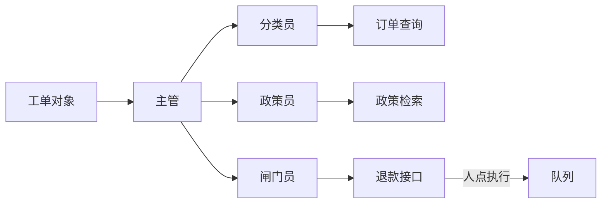
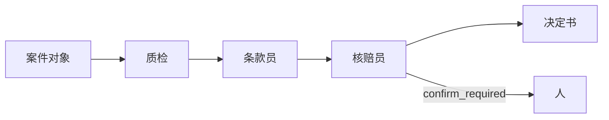

# Agent学堂 · From Zero to Hired

**没有引用，就先不答**

> **今天只打开这三个文件**
>
> 1. 本 README（先跑 30 分钟无 Key）
> 2. [docs/weeks/00-setup.md](docs/weeks/00-setup.md)（桌子）
> 3. [docs/weeks/README.md](docs/weeks/README.md)（工期目录）
>
> [跟学：30 分钟点哪里](docs/walkthrough.md)（本仓截图，代替还没有的录屏）
>
> 看不懂「抽取式 / 队列」先跑通演示，第 1 周再解释循环。

教材就是仓库。两个毕业作品是队列，不是聊天皮。
A Chinese-first apprenticeship: nine weeks (0–8), two ops desks, one conversation you can defend.

## 今天就跑通（约 30 分钟）

不需要 Key。你会看到引用芯片，或看到红条拒绝。

1. 克隆并进入仓库

```bash
git clone https://github.com/SabreKeyZ/agent-xuetang.git
cd agent-xuetang
```

2. 建虚拟环境，装两个毕业作品

```bash
python3 -m venv .venv
source .venv/bin/activate          # Windows PowerShell: .venv\Scripts\Activate.ps1
# Windows cmd: .venv\Scripts\activate
python -m pip install -U pip pytest
python -m pip install -e projects/ticketdesk -e projects/claimdesk
```

3. 跑两句演示。终端里应当出现芯片或红条：

```bash
python -m ticketdesk demo
# [ticketdesk] llm=off (extractive)
# 引用: docs/policy/promo-2026-summer.md:…
# 红条: 没有引用，就先不答  /  退款超 ¥200 · 只许草稿

python -m claimdesk demo
# [claimdesk] llm=off (extractive)
# 引用: 条款 3.2 · docs/policy/qingtu-bao-v2.md:…
# 红条: 没有引用，就先不答
```

4. 打开两张脸。8000 常被占用，工单台请显式指定 8010（FAQ 同条）：

```bash
python -m ticketdesk serve --port 8010
# http://127.0.0.1:8010
python -m claimdesk serve
# http://127.0.0.1:8001
```

两台都是抽取式，**不需要 Key**。第 0 周的 Key 只为可选的 `hello_chat.py`。没填也能学完夹具和引用芯片。需要模型时：`cp .env.example .env`，按 [第 0 周](docs/weeks/00-setup.md) 填国内 Key。

> 这不是就业保证。两周能讲清循环和评测；九周（含第 0 周）有两个可演示的队列。

## 两张脸：工单台 | 理赔台

左边是虚构店铺「青匣记」的售后队列，右边是虚构「青途保」的初审队列。同一条规矩：没有引用，就先不答。人点执行。演示不打款。

<table>
<tr>
<td width="50%" valign="top">

**工单台 · 青匣记 · Inbox**


分类员 / 政策员 / 闸门员。浅色会话：顾客灰气泡、客服白气泡。芯片贴在气泡下：`docs/policy/promo-2026-summer.md`。退款接口只回 `confirm_required`。


</td>
<td width="50%" valign="top">

**理赔台 · 青途保 · Payments**


材料质检 / 条款员 / 核赔员。支付表 + 巨型 ¥ + blurple。通过案（C-2009）贴条款芯片。易碎拒赔必须点名 `条款 3.2`。无命中亮红条。


截图若仍印「建议赔付：¥40」，以当场 CLI 为准：拒赔决定书写「建议拒赔，不予赔付」。试算式可以留。

</td>
</tr>
</table>

[工单台说明](projects/ticketdesk/README.md) · [理赔台说明](projects/claimdesk/README.md)

## 学徒工期

默认给**有一点 Python 的小白**：一到两个月，每周 5–6 小时。做不完就停在当周验收，不要跳周。

**[只有 2 小时](docs/weeks/two-hour.md)**

| 做什么 | 然后 |
| --- | --- |
| 按 [120 分钟脚本](docs/weeks/two-hour.md) 走完：两台 demo → Inbox 三张单 → Payments 通过/拒赔 → 第 0 周失败对照 + 一条 FAQ | 按脚本走完再停。不申请 Key，不跳第 1 周。 |

**默认 9 周（第 0 周摆桌子 + 第 1–8 周）**

| 0<br>5h | 1<br>5h | 2<br>6h | 3<br>5h | 4<br>5h | 5<br>5h | 6<br>6h | 7<br>6h | 8<br>5h |
| :---: | :---: | :---: | :---: | :---: | :---: | :---: | :---: | :---: |
| [环境](docs/weeks/00-setup.md) | [循环](docs/weeks/01-what-is-an-agent.md) | [ReAct](docs/weeks/02-tools-and-react.md) | [引用](docs/weeks/03-memory-rag.md) | [MCP](docs/weeks/04-mcp-and-skills.md) | [多角色](docs/weeks/05-multi-agent.md) | [工单台](docs/weeks/06-ticketdesk.md) | [理赔台](docs/weeks/07-claimdesk.md) | [上线](docs/weeks/08-ship-and-job.md) |
| 芯片或红条 | JSON 日志 | `--eval` 3 条 | `path:line` | 二十行 stdio | 何时不加角色 | 售后队列 | 初审队列 | 作品集谈话 |

**压缩 6 格**（合并 1+2、3+4；第 0 周并进第一格）。小时按周表相加，不压缩成「8–10h 塞进 16h 的课」。

| 工期 1<br>16h | 工期 2<br>10h | 工期 3<br>5h | 工期 4<br>6h | 工期 5<br>6h | 工期 6<br>5h |
| :---: | :---: | :---: | :---: | :---: | :---: |
| 0 + 1 + 2 | 3 + 4 | 5 | 6 | 7 | 8 |
| 循环写完就能评测 | 检索引用 + 小 MCP | 主管分流 | 工单台收口 | 理赔台收口 | 求职谈话 |

视频只放核对过的链接：[docs/videos.md](docs/videos.md)。踩坑：[docs/faq.md](docs/faq.md)。周目录：[docs/weeks/README.md](docs/weeks/README.md)。词表 / 一页纸：[docs/glossary.md](docs/glossary.md) · [docs/cheatsheet.md](docs/cheatsheet.md)。练习先做再看 [docs/weeks/answers](docs/weeks/answers)。

第 5 周写完小脚本、第 6 周走读工单台之前，有一份可选插页：[对着助手搭最小工单台](docs/weeks/vibe.md)。不需要 Key，不要从 `projects/ticketdesk` 开写。

转行、在校、后端转 Agent 都从第 0 周进。已经独立用过 LangGraph 上线的人，这份工期会偏慢，去文末结构参考即可。

## 两个工位怎么协作

工单台是**主管教练售后**：结构化工单进门，分类 → 政策 → 闸门。不做成五人互叫的网。



理赔台是**初审流水**：材料质检 → 条款（出险日版本）→ 核赔建议。角色不回头互聊，payout 永不自动成功。



第 1–4 周的循环、工具、引用、MCP **不依赖** LangChain。能用原始 Python 写清楚，再决定要不要上框架。

## 国内模型

默认 OpenAI 兼容协议。根目录 [`.env.example`](.env.example) 写了 DeepSeek / 智谱 / 通义 / Ollama 的 `OPENAI_BASE_URL`。
没有 GPU 也能学完：笔记本发 JSON、写日志、跑测试。

## 和现有教程有何不同

定位，不是排名。我们吃自己的 `docs/`，作业是两个队列，不是旅行助手或问数大屏。

| | **Agent学堂（本仓）** | [hello-agents](https://github.com/datawhalechina/hello-agents) | [HF Agents Course](https://huggingface.co/learn/agents-course/unit0/introduction) | [吴恩达 Agentic AI](https://www.deeplearning.ai/courses/agentic-ai) | [multi-agent-education](https://github.com/bcefghj/multi-agent-education) | [shopkeeper-agent](https://github.com/didilili/shopkeeper-agent) |
| --- | --- | --- | --- | --- | --- | --- |
| 给谁 | 9 周中文小白学徒（含第 0 周），国内 Key 可选 | 系统教材 + 自研框架 | 英文课 + 证书 | 英文短课，四种模式 | 面试包装项目，三语言 / Mesh | LangGraph 问数全栈 |
| 作业长什么样 | 工单台引用芯片 + 理赔台决定书 | 旅行助手、赛博小镇等 | 单元作业 | Notebook | 五人教育 Mesh、BKT/SM-2 | SQL / Qdrant / ES 流水线 |
| 求职 | [岗位/作品集/面试](docs/jobs/roles.md) 分册，首页不堆题库 | 不是主线 | 不是主线 | 没有 | 简历/STAR 写在首页 | 工程履历 |
| 评测 | 第 2 周三条 `--eval`；两台闸门夹具 | 后续引入 | 观测作加分 | 课内强调 eval | 常写量化数字 | 问数链路 |
| 默认供应商 | DeepSeek / 智谱 / 通义 / Ollama | 多供应商 | HF 与云 | 偏国际云 | 视实现 | 硅基流动等 |
| 2026 接口 | 第 4 周自己写 MCP + 一段 Skill | 有进阶章 | 工具加分 | 工具是模式之一 | 视实现 | LangGraph 节点 |

我们不造 HelloAgents 式框架，不重做旅行助手，不教 Qdrant/ES 问数，不提供三语言对照作业。

## 这套不覆盖什么

- 就业承诺、薪资数字、并发或「准确率百分之几」。
- 向量库、混合检索、NL2SQL、电商数仓。
- Java / Go 第二实现。
- 五人 Mesh、苏格拉底导师、BKT、SM-2。
- 生产权限、多租户、监控平台。

这些去别人的仓或进阶课。本仓先把循环、引用和两个队列做硬。

## 仓库怎么拆

```
agent-xuetang/
  docs/weeks/            工期 0–8（9 周）
  docs/jobs/             岗位 · 作品集 · 面试（STAR 在这里）
  code/week0–5/          无框架小脚本；第 5 周是可选教室实验
  projects/ticketdesk/   青匣记工单台
  projects/claimdesk/    青途保理赔台
  labs/week5/            问学堂 / 值班台降级说明
  labs/vibe-minidesk/    第 5→6 周可选：助手搭最小工单台（评测自跑）
```

## 求职材料

简历三条和 STAR 四行写在作品自己的 README，以及 [docs/jobs](docs/jobs/roles.md)。首页不贴题库。
[岗位地图](docs/jobs/roles.md) · [作品集](docs/jobs/portfolio.md) · [面试问法](docs/jobs/interview.md)

## 如何贡献

读 [CONTRIBUTING.md](CONTRIBUTING.md)。补坑、补图、补验收。不要搬别人的课文或别人的 README 骨架。

## 许可证

[MIT](LICENSE) © SabreKeyZ

## 结构参考（不是课文来源）

我们看过别人**怎么排版和带学**，用来检查密度：该有截图、该有工期、该有边界。正文、练习、两个工位和面试题是本仓库写的。

延伸阅读集中在 [docs/resources.md](docs/resources.md)。其中：

- 吴恩达 [Agentic AI](https://www.deeplearning.ai/courses/agentic-ai)
- [Hugging Face Agents Course](https://huggingface.co/learn/agents-course/unit0/introduction)
- Datawhale [hello-agents](https://github.com/datawhalechina/hello-agents)
- 结构密度参考（产品不同）：[multi-agent-education](https://github.com/bcefghj/multi-agent-education)、[shopkeeper-agent](https://github.com/didilili/shopkeeper-agent)

CiteKit（可选引用伙伴）：<https://github.com/SabreKeyZ/citekit>
