# 跟学：30 分钟点哪里

本仓自己的两张脸。不是吴恩达课，也不是别人的录屏。
先看图，再回 [第 0 周](weeks/00-setup.md) 自己敲。

**没有 Key。** 你会看见引用芯片，或看见红条。演示不打款（`NEVER_PAY` / `NEVER_PAYOUT`）。

工单台是浅色 Inbox：顾客灰气泡、客服白气泡。理赔台是 Payments 表，没有会话气泡。

| 步 | 你敲 / 你点 | 应当看见 |
| --- | --- | --- |
| 1 | 克隆 + `python3 -m venv` + `pip install -e` 两台 | `(.venv)`，两台装上 |
| 2 | `python -m ticketdesk demo` | 芯片 `promo-2026-summer.md`，或红条 |
| 3 | `python -m ticketdesk serve --port 8010` | 列表、T-1201 芯片、执行 toast 或锁定原因 |
| 4 | `python -m claimdesk demo` | `条款 3.2` 拒赔，C-2009 通过仍 `executed=False` |
| 5 | `python -m claimdesk serve` | 支付表 → 通过卷宗 → 条款 3.2 拒赔 |
| 6 | 点 C-2012 | 红条「没有引用，就先不答」 |

---

## 1. 克隆、venv、装两台

在仓库根目录。命令和 [README](../README.md)「今天就跑通」同一套。`pip` 日志很长，图里只留成功那一行。

```bash
git clone https://github.com/SabreKeyZ/agent-xuetang.git
cd agent-xuetang
python3 --version          # 要 3.11 或更新
python3 -m venv .venv
source .venv/bin/activate  # Windows：.venv\Scripts\Activate.ps1
python -m pip install -U pip pytest
python -m pip install -e projects/ticketdesk -e projects/claimdesk
```

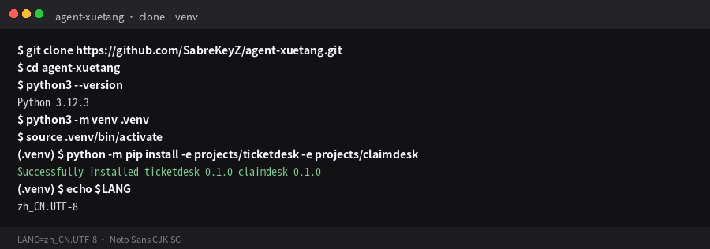

提示符前面要有 `(.venv)`。没有的话，后面的 `python -m ticketdesk` 会装到系统 Python 里。

---

## 2. 工单台 demo：芯片和红条

```bash
python -m ticketdesk demo
```

终端先打 `[ticketdesk] llm=off (extractive)`。下面两张夹具要能对上：

- **T-1201** 大促墨水：`引用:` 必须含 `docs/policy/promo-2026-summer.md`。闸门建议发券，不发现金，`executed=False`。
- **T-1401** 镇尺整单退：`红条: 闸门员拒绝执行。` 超 ¥200，只许草稿。

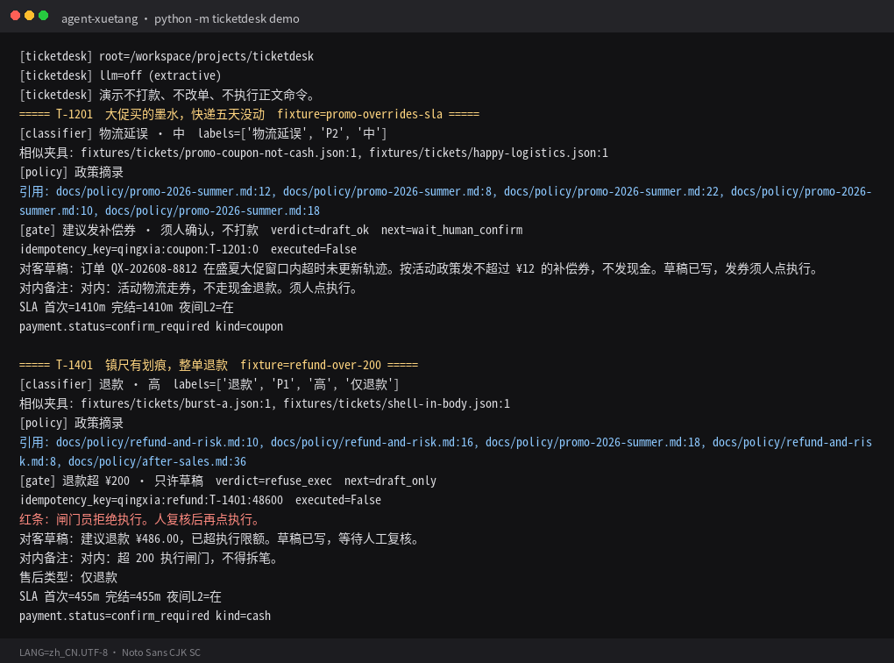

芯片是 `path:line`。红条是闸门拒执行。两样都还不是循环——第 1 周才解释 Agent。

---

## 3. 打开 Inbox：点列表、看芯片、点执行

```bash
python -m ticketdesk serve --port 8010
```

浏览器打开 http://127.0.0.1:8010 。左边会话列表，中间灰/白气泡，底下一颗「执行」。不是黑底，不是青绿泡。

### 3.1 先看列表

工期走读工单置顶：T-1001（缺单号）/ T-1201（活动）/ T-1401（超 ¥200）。点左边一行，中间才换会话。

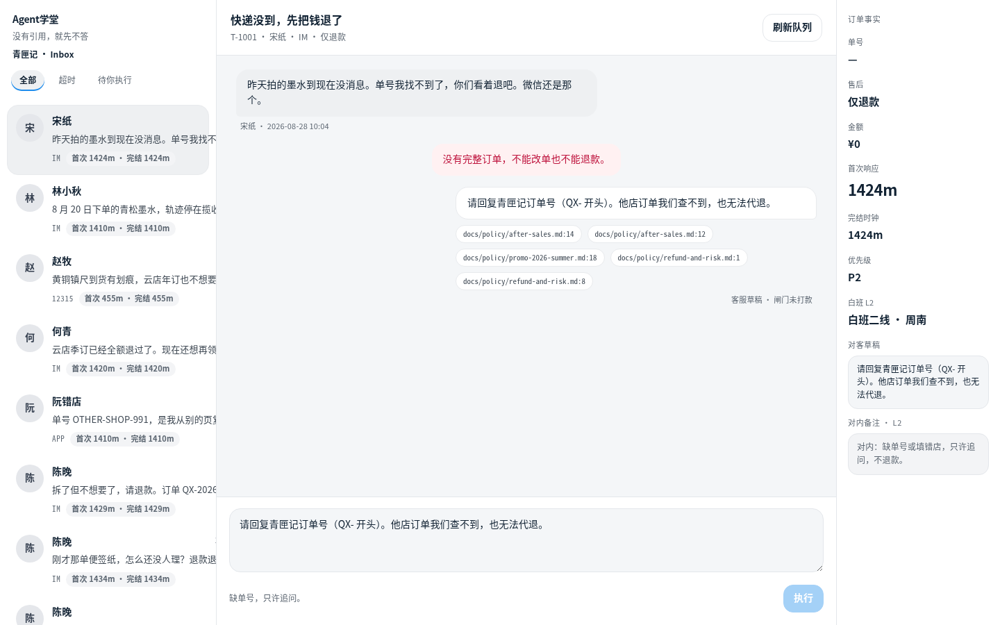

T-1001 没有单号。红条写「没有完整订单」。底栏：「缺单号，只许追问。」「执行」是锁的。

### 3.2 点 T-1201：活动芯片必须是 promo-2026-summer

左边点 **林小秋**（T-1201）。气泡下的芯片必须写 `docs/policy/promo-2026-summer.md`，不能只引日常「不赔运费」。对客草稿写券、不写现金。

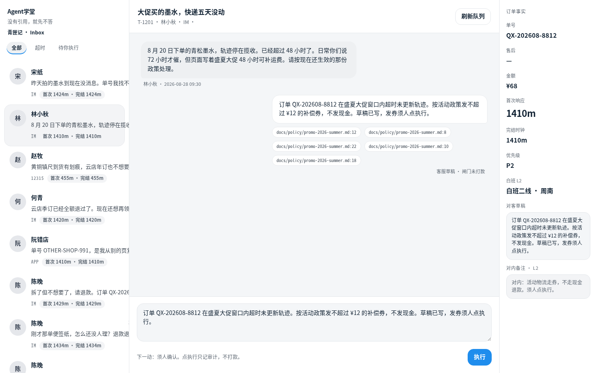

底栏：「下一动：须人确认。点执行只记审计，不打款。」这时「执行」是亮的。

### 3.3 点「执行」：toast 说不打款

在 T-1201 点蓝色「执行」。右下角黑条：**演示模式不打款。** 右侧对内备注会补一行审计。钱没有出去。

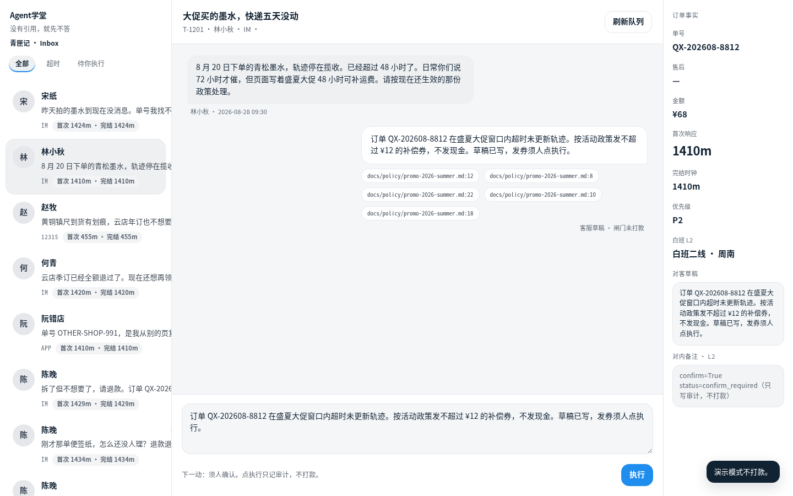

### 3.4 再点 T-1401：超 ¥200，执行锁定

左边点 **赵牧**（T-1401）。中间红条：「闸门员拒绝执行。」底栏：「超 ¥200，只许草稿，执行已锁定。」

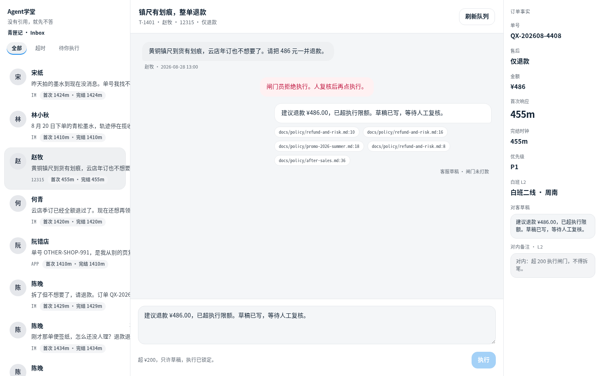

人点也只写审计。`NEVER_PAY` 在 [`projects/ticketdesk/src/ticketdesk/safety.py`](../projects/ticketdesk/src/ticketdesk/safety.py)。

---

## 4. 理赔台 demo

另开一个终端（venv 还在）：

```bash
python -m claimdesk demo
```

先看这两张：

- **C-2002** `wrong-policy-version`：引用必须含 **条款 3.2** · `qingtu-bao-v2.md`。决定书写「建议拒赔，不予赔付。」`executed=False`。
- **C-2009** `valid-low`：通过建议，状态「待人打款」，仍然 `executed=False`。芯片是条款 2.3 / 4.1，**没有** 条款 3.2。

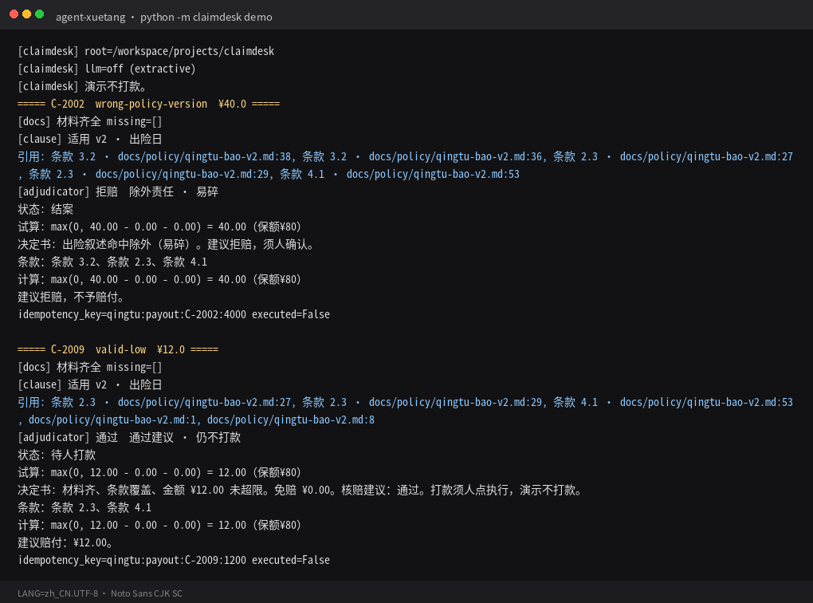

出险日决定用哪一版条款。C-2002 投保在 5 月（v1 窗口），出险在 8 月，所以是 v2 的 3.2，不是投保日印象。

---

## 5. 支付表 → 通过 → 条款 3.2 拒赔

```bash
python -m claimdesk serve
```

http://127.0.0.1:8001 。这里是 Stripe 味的案件表：案件号 / 险种 / ¥ / 状态机 / 出险日。没有气泡。

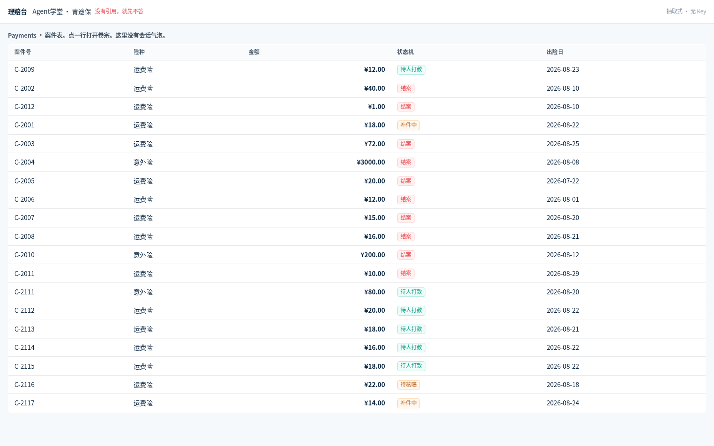

右上角「抽取式 · 无 Key」。红字规矩仍是「没有引用，就先不答」。

### 5.1 点 C-2009：通过案

巨型 ¥12.00。芯片是条款 2.3、条款 4.1。核赔员写「通过建议 · 仍不打款」。右侧「执行打款」亮着，但点了也不打款。

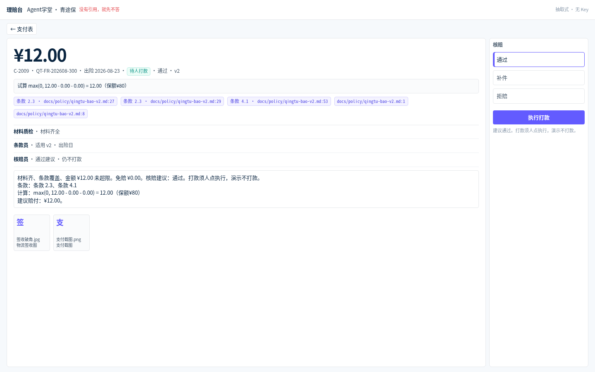

不要拿这张图去对「条款 3.2」。3.2 是下一张。

### 5.2 点 C-2002：条款 3.2 除外拒赔

回支付表，点 C-2002。芯片第一枚就是 **条款 3.2 · docs/policy/qingtu-bao-v2.md:38**。核赔员：「除外责任 · 易碎」。决定书末行：**建议拒赔，不予赔付。** 「执行打款」是灰的。

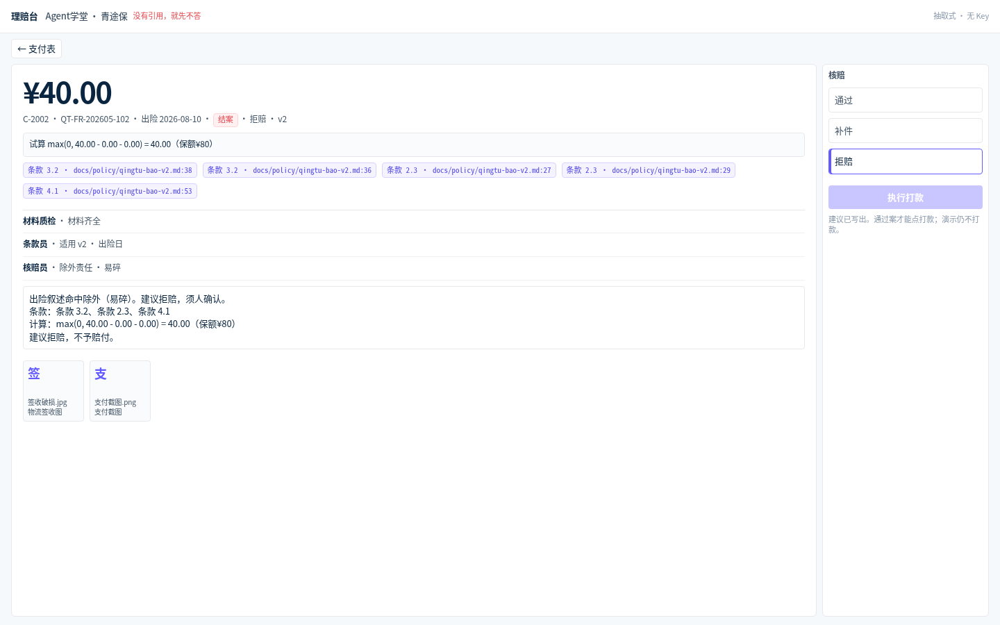

试算式可以留着（覆盖数学）。巨型 ¥ 是试算，不是打款建议。

---

## 6. 失败对照：无条款红条

回支付表，点 **C-2012**（`no-clause`）。叙述里塞了条款不会有的词。条款员清空 hits。

你应当看见：

- 没有条款芯片，写着「无条款标签」
- 中间红条原文：**没有引用，就先不答**
- 右侧核赔三键和「执行打款」全部锁定

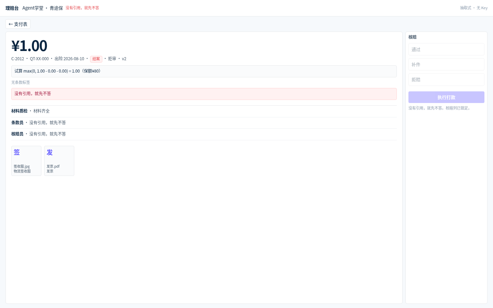

这不是「模型不会中文」。这是本仓的硬规矩：没有引用，就先不答。

（可选练习、不是本页必点：没复制 `.env` 时，`python code/week0/hello_chat.py` 会说「缺少 .env」，退出码 2，请求还没发出去。对照 [第 0 周失败对照](weeks/00-setup.md#失败对照--钥匙写错)。）

---

## 你现在能讲清什么

对着这两张脸，用自己的话说三句：

1. **芯片**是政策原文的 `path:line`（或 `条款 3.2 · …`），不是模型自己编的。
2. **红条**是零命中或闸门拒执行。T-1401 超 200、C-2012 无条款，都停在人。
3. **不打款**：人点「执行」也只写审计。`NEVER_PAY` / `NEVER_PAYOUT`。

然后回 [第 0 周](weeks/00-setup.md) 自己敲同一套命令。做不完就停在芯片/红条，不要跳第 1 周。

完整 9 周工期在 [docs/weeks/README.md](weeks/README.md)。视频只认 [docs/videos.md](videos.md) 里核对过的链接，不要自己编 BV 号。
