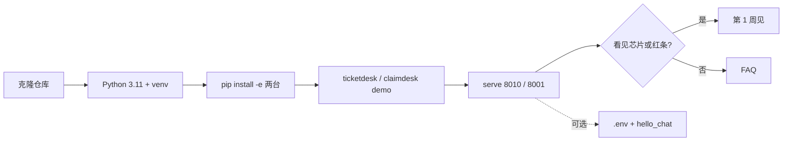
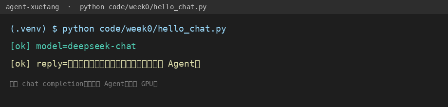

# 第 0 周 · 把桌子摆好

你现在不需要理解 Transformer。
默认路径：电脑上有 Python 3.11、一个虚拟环境、两句 demo。你会看见引用芯片，或看见红条拒绝。

**没有 Key 也能学完第 0–7 周抽取式。** Key 只为两件事：本周可选的 `hello_chat.py`，以及以后「让模型自己选工具」。

## 本周你要带走什么

- [ ] venv 里 `python --version` 是 3.11+，提示符有 `(.venv)`。
- [ ] `python -m ticketdesk demo` 和 `python -m claimdesk demo` 打出芯片或红条。
- [ ] 打开工单台（默认 8000；被占用则 `python -m ticketdesk serve --port 8010` → http://127.0.0.1:8010 ），你应当看见芯片或红条（顾客灰气泡、客服白气泡）。
- [ ] （可选）根目录有 `.env`，且 `git status` 不把它列成已跟踪的密钥文件。
- [ ] （可选）`hello_chat.py` 打出 `[ok] reply=`，或你留下了缺 Key / 401 的诚实输出。
- [ ] 你能说出：这次成功**还不是 Agent**。

## 目标

- 用 Git 把本仓库放到自己机器上。
- 建虚拟环境，不污染系统 Python。
- 无 Key 跑通两台 demo，打开工单台（8000 或 `--port 8010`）/ 理赔台 8001。两台是抽取式，Key 可选。
- （可选）用 OpenAI 兼容协议打通一次 chat completion。
- 确认：**没有 GPU 也能学后面七周**。

## 先修 / 预计时间 / 对应视频

**先修。** 会在终端里 `cd`、复制命令。不会 Git 的同学先装 Git，不必先学分支。

| 块 | 时间 | 做什么 |
| --- | --- | --- |
| 装环境 | 1 小时 | Git、Python、venv |
| 跑演示 | 1 小时 | `pip install -e` 两台，demo + serve |
| （可选）申请 Key | 1 小时 | DeepSeek / 智谱 / 通义 三选一，或装 Ollama |
| （可选）hello_chat | 1 小时 | 改 `.env`，看返回 |
| 缓冲 | 1–3 小时 | 代理、镜像、Windows 编码，见 [FAQ](../faq.md) |

卡在 Key 上很正常——也可以先不申请。本周默认验收是「芯片或红条」，不是「理解计费公式」。

**对应视频**（先做命令，再听口播）：[docs/videos.md](../videos.md)「第 0–1 周」

- 李宏毅 2025 春主页（官方）：https://speech.ee.ntu.edu.tw/~hylee/ml/2025-spring.php
- 吴恩达 Agentic AI（官方）：https://www.deeplearning.ai/courses/agentic-ai
- Hugging Face Agents Course 导论：https://huggingface.co/learn/agents-course/unit0/introduction

第 0 周不必看完李宏毅。模块1-3 自主性（合集第 3 分 P）留给第 1 周。

## 概念：定义 + 一个反例

**定义。** 聊天补全 = 对兼容口发一条 messages，拿回一句 `choices[0].message.content`。没有工具、没有观察值回到下一步、没有步数上限。两台 demo 打出的芯片或红条，也还不是循环——那是抽取式夹具，第 1 周才解释循环。

**反例。** 你打通了 DeepSeek，终端里出现一句中文，就在简历上写「我会 Agent」。那是第 0 周可选练习，不是第 1 周。`hello_chat.py` 文件头写着：还不是 Agent。

## 图文步骤



### 1. 克隆

```bash
git clone https://github.com/SabreKeyZ/agent-xuetang.git
cd agent-xuetang
git --version
```

`git` 不存在：macOS 用 Xcode CLT 或 brew；Windows 用 Git for Windows；Linux 用发行版的 `git` 包。

### 2. Python 版本

```bash
python3 --version
```

要 **3.11 或更新**。只有 3.9 的同学请另装 3.11，不要用系统自带的 3.8 硬撑。
敲 `python3.11 -m venv` 报 `command not found` 很正常：正文要的是版本，命令用 `python3`。见 [FAQ](../faq.md)。

```bash
python3 -m venv .venv
source .venv/bin/activate
# Windows PowerShell: .venv\Scripts\Activate.ps1
# Windows cmd: .venv\Scripts\activate
python -m pip install -U pip pytest
```

提示符前面出现 `(.venv)` 再往下走。

### 3. 装两个毕业作品，跑演示

不需要 Key。终端里应当出现芯片或红条。

```bash
python -m pip install -e projects/ticketdesk -e projects/claimdesk

python -m ticketdesk demo
# [ticketdesk] llm=off (extractive)
# 引用: docs/policy/promo-2026-summer.md:…
# 红条: 没有引用，就先不答  /  退款超 ¥200 · 只许草稿

python -m claimdesk demo
# [claimdesk] llm=off (extractive)
# 引用: 条款 3.2 · docs/policy/qingtu-bao-v2.md:…
# 红条: 没有引用，就先不答
```

### 4. 打开两张脸

```bash
python -m ticketdesk serve --port 8010
```

浏览器打开 http://127.0.0.1:8010 。**你应当看见芯片或红条。** 工单台是浅色会话：顾客灰气泡、客服白气泡。8000 常被占用，命令写成 `--port 8010`（[FAQ](../faq.md) 同条）。另开一个终端：

```bash
python -m claimdesk serve
```

http://127.0.0.1:8001 是理赔台支付表。两台都不要黑底。

演示不打款（`NEVER_PAY` / `NEVER_PAYOUT`）。人点「执行」也只写审计。

### 5. （可选）国内 Key，或本地模型

Key **不是**本周默认作业。没有它也能学完第 0–7 周抽取式。
只有当你想跑 `hello_chat.py`，或以后让模型自己选工具时，才走这一节。

```bash
cp .env.example .env
```

打开 `.env`，只改这两类值：

```
OPENAI_API_KEY=你的钥匙
OPENAI_BASE_URL=https://api.deepseek.com/v1
OPENAI_MODEL=deepseek-chat
```

Key 和 Base URL 必须成对。智谱、通义、Ollama 写在 `.env.example` 注释里。
没有云端 Key：Ollama 拉一个 7B 聊天模型，`OPENAI_BASE_URL=http://localhost:11434/v1`，`OPENAI_API_KEY=ollama`。

### 6. （可选）对着我们的脚本看

`hello_chat.py` 是可选练习，不是本周第一条命令。只用标准库。请按行看，不要先装 `openai` 包。

| 行 | 它在干什么 |
| --- | --- |
| [`16:26:code/week0/hello_chat.py`](../../code/week0/hello_chat.py) | `load_dotenv`：读仓库根的 `.env`，不覆盖已有环境变量 |
| [`47:57:code/week0/hello_chat.py`](../../code/week0/hello_chat.py) | 缺 `.env` 和「文件在、钥匙空」说两句不同的话，退出码 2 |
| [`59:78:code/week0/hello_chat.py`](../../code/week0/hello_chat.py) | 拼 `BASE_URL/chat/completions`，POST 一条中文 user |
| [`82:85:code/week0/hello_chat.py`](../../code/week0/hello_chat.py) | HTTP 错误把响应体打到 stderr，不装成成功 |
| [`97:98:code/week0/hello_chat.py`](../../code/week0/hello_chat.py) | 成功只印两行：`[ok] model=` 和 `[ok] reply=` |

```bash
python code/week0/hello_chat.py
```

### 7. （可选）本机实录 · 成功长这样

我们在本机跑通（DeepSeek 兼容口，模型名 `deepseek-chat`）时，终端是：

```text
[ok] model=deepseek-chat
[ok] reply=你好，我是一次普通的聊天补全，还不是 Agent。
```

对照图（两行 `[ok]`，不是堆栈）：



没建 `.env` 时脚本说「缺少 .env」；复制了但钥匙还空时说「OPENAI_API_KEY 是空的」。两句都是退出码 `2`。`pytest code/week0` 覆盖这两条，不打网。

```text
缺少 .env。复制 .env.example 为 .env，再填入 OPENAI_API_KEY。
只有 Ollama 时：OPENAI_API_KEY=ollama 且 BASE_URL 指向本地。
```

```text
OPENAI_API_KEY 是空的。打开 .env 填入 Key 后再跑。复制 .env.example 只是建文件，不会自动带钥匙。
只有 Ollama 时：OPENAI_API_KEY=ollama 且 BASE_URL 指向本地。
```

「缺少 .env」和「钥匙是空的」不是同一句话。FAQ 也把这两条分开。

## 没有 GPU 意味着什么

后面的循环、检索、两个工位，默认都在 CPU 上跑逻辑。
模型在云端或在 Ollama 里。你的笔记本负责发 JSON、写日志、跑测试。
没有 GPU，也不申请 Key，照样能学完抽取式。

## 失败对照 · 钥匙写错

这一节给可选的 `hello_chat`。没申请 Key 的同学读一遍即可，知道 401 长什么样。

**现场。** `.env` 里 `OPENAI_API_KEY=sk-wrong`，Base URL 仍指向兼容口。

```text
$ python code/week0/hello_chat.py
[fail] HTTP 401 http://127.0.0.1:8765/chat/completions
{"error": {"message": "Authentication Fails, Your api key: ****wrong is invalid", "type": "authentication_error", "code": "invalid_request_error"}}
```

（你连的是厂商地址时，URL 会是 `https://api.deepseek.com/v1/chat/completions`，正文同样是 401 + invalid key。）

**原因。** [`82:85:code/week0/hello_chat.py`](../../code/week0/hello_chat.py) 把 HTTPError 原样打印。Key 无效就是 401，不是「模型不会中文」。

**修复。** 核对三件事：Key 是那一家的、`OPENAI_BASE_URL` 是那一家的、没有把 DeepSeek 的 Key 配到 `api.openai.com`。改完再跑，直到出现 `[ok] reply=`。

## 厂商 × BASE_URL × 假 Key

只记我们亲手见过的状态，不编「成功率」。没有 Key 的同学可以先跳过本表。

| 厂商口 | `OPENAI_BASE_URL` | Key | 本机状态 |
| --- | --- | --- | --- |
| （无文件） | 任意 | 未复制 `.env` | **退出码 2**，「缺少 .env」 |
| （空钥匙） | 任意 | `.env` 在、`OPENAI_API_KEY=` | **退出码 2**，「OPENAI_API_KEY 是空的」 |
| DeepSeek | `https://api.deepseek.com/v1` | `sk-wrong` | **HTTP 401** `authentication_error` |
| 任意国内 Key | `https://api.openai.com/v1` | 国内那把 | **HTTP 401**（钥匙和口不是一家）。测验见练习 4 |
| 智谱 | `https://open.bigmodel.cn/api/paas/v4` | 空 | 同「缺 Key」，脚本先拦，不发请求 |
| 通义兼容 | `https://dashscope.aliyuncs.com/compatible-mode/v1` | 空 | 同上 |
| Ollama | `http://localhost:11434/v1` | `ollama` 但没起服务 | **网络错误**（`URLError`），FAQ「代理和网络」 |

脚本拼 URL 的方式：[`59:59:code/week0/hello_chat.py`](../../code/week0/hello_chat.py) `f"{base}/chat/completions"`。Base 不要重复写 `/chat/completions`。

## 练习

下面四题都要碰 `.env` 或故意制造缺 Key。没有 Key、只跑演示的同学，本周验收停在芯片/红条即可。`hello_chat` 不是第一条命令。

1. 把 `.env` 里的模型名故意写错，再跑脚本。把报错原文贴进笔记。
2. 把用户那句话改成「用一句话解释什么是工作目录」，确认你知道请求体在哪改（`hello_chat.py` 约 63–67 行）。
3. （可选）换一家国内厂商的 Base URL，同一份脚本再跑通。
4. **配错口。** 把 DeepSeek 的 Key 配到 `OPENAI_BASE_URL=https://api.openai.com/v1`。先在纸上写你预测的 HTTP 状态，再跑。对照 [answers/00.md](answers/00.md) 的希望听到。

参考提纲在 `answers/`，正文不写选项对错。

## 本周词汇表

| 词 | 一句话 |
| --- | --- |
| 抽取式 | 没 Key 时只摘录夹具和政策原文，不打云端 |
| 芯片 | `docs/policy/…:行号` 或 `条款 3.2 · …` |
| 聊天补全 | 一问一答，程序结束 |
| 兼容口 | 同一套 `/chat/completions` JSON，换 BASE_URL |
| `.env` | 本地密钥，不进 Git；本周可选 |
| `[ok]` | 可选练习的成功形状 |

更多：[../glossary.md](../glossary.md)

## 面试追问

「你们第 0 周就接通模型了，为什么还不叫 Agent？」

希望听到：默认路径是两台 demo 的芯片或红条，还没有循环。若跑了 [`code/week0/hello_chat.py:59`](../../code/week0/hello_chat.py) 只 POST 一次，没有 `MAX_STEPS`，没有把工具结果喂回下一步。对比第 1 周 [`echo_agent.py:47`](../../code/week1/echo_agent.py)。

## 常见坑

- 把 DeepSeek 的 Key 配到 `api.openai.com`。
- 用记事本保存 `.env` 存成 UTF-16。
- 激活了 venv 却用 `pip install` 装到外面。永远写 `python -m pip`。
- 敲 `python3.11 -m venv` 报 `command not found`：正文要的是 3.11 或更新，命令用 `python3`。见 [FAQ](../faq.md)。
- 「缺少 .env」和「OPENAI_API_KEY 是空的」是两句不同的话，都是退出码 2，都还没发出去。见 [FAQ](../faq.md)。
- 其余见 [FAQ](../faq.md) 的「Key 填错」「代理和网络」。还不行按 [卡住了](../../.github/ISSUE_TEMPLATE/stuck.yml) 开 Issue。

## 延伸阅读

- 吴恩达 Agentic AI：https://www.deeplearning.ai/courses/agentic-ai
- Hugging Face Agents Course 导论：https://huggingface.co/learn/agents-course/unit0/introduction
- hello-agents 仓库（先读他们怎么介绍 Agent，勿抄正文）：https://github.com/datawhalechina/hello-agents
- DeepSeek OpenAI 兼容说明：https://api-docs.deepseek.com
- 本仓库 FAQ：[docs/faq.md](../faq.md)
