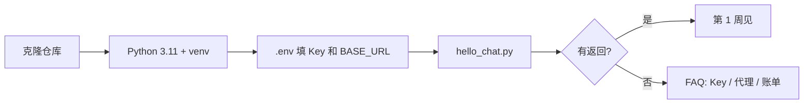

# 第 0 周 · 把桌子摆好

你现在不需要理解 Transformer。
你只需要：电脑上有 Python 3.11、一个虚拟环境、一把国内厂商的 Key（或本地 Ollama），以及一次你亲眼看见的返回值。

## 目标

- 用 Git 把本仓库放到自己机器上。
- 建虚拟环境，不污染系统 Python。
- 用 OpenAI 兼容协议打通一次 chat completion。
- 确认：**没有 GPU 也能学后面七周**。

## 你将做出的东西

一段能打印模型回复的脚本：`code/week0/hello_chat.py`。
成功时终端里会出现一句中文，而不是堆栈。

## 预计 4–6 小时

| 块 | 时间 | 做什么 |
| --- | --- | --- |
| 装环境 | 1 小时 | Git、Python、venv |
| 申请 Key | 1 小时 | DeepSeek / 智谱 / 通义 三选一，或装 Ollama |
| 跑通脚本 | 1 小时 | 改 `.env`，看返回 |
| 缓冲 | 1–3 小时 | 代理、镜像、Windows 编码，见 [FAQ](../faq.md) |

卡在 Key 上很正常。这周的验收是「请求出去又回来」，不是「理解计费公式」。

## 图文步骤



### 1. 克隆

```bash
git clone https://github.com/SabreKeyZ/agent-xuetang.git
cd agent-xuetang
git --version
```

`git` 不存在：macOS 用 Xcode CLT 或 brew；Windows 用 Git for Windows；Linux 用发行版的 `git` 包。

### 2. Python 版本

```bash
python3 --version
```

要 **3.11 或更新**。只有 3.9 的同学请另装 3.11，不要用系统自带的 3.8 硬撑。

```bash
python3.11 -m venv .venv
source .venv/bin/activate
# Windows PowerShell: .venv\Scripts\Activate.ps1
python -m pip install -U pip
```

提示符前面出现 `(.venv)` 再往下走。

### 3. 国内 Key，或本地模型

复制环境文件：

```bash
cp .env.example .env
```

打开 `.env`，只改这两类值：

```
OPENAI_API_KEY=你的钥匙
OPENAI_BASE_URL=https://api.deepseek.com/v1
OPENAI_MODEL=deepseek-chat
```

默认示例是 DeepSeek，因为它提供 OpenAI 兼容的 `/chat/completions`。
智谱、通义、Ollama 的地址写在 `.env.example` 注释里，**Key 和 Base URL 必须成对**。

没有条件申请云端 Key：安装 [Ollama](https://ollama.com)，拉一个 7B 级聊天模型，把 Base URL 指到 `http://localhost:11434/v1`，`OPENAI_API_KEY` 填 `ollama` 即可。

### 4. 跑一次

本周脚本只用标准库读环境变量、发 HTTP，不强制你先装 `openai` 包。

```bash
python code/week0/hello_chat.py
```

你应该看到类似：

```
[ok] model=deepseek-chat
[ok] reply=你好，我是一次普通的聊天补全，还不是 Agent。
```

ASCII 示意（这就是「成功」长什么样）：

```
+----------------------------------------------+
| $ python code/week0/hello_chat.py            |
| POST {BASE_URL}/chat/completions             |
| { "messages": [ { "role": "user", ... } ] }  |
|                                              |
| 200  {"choices":[{"message":{"content":...}}]}|
| [ok] reply=...                               |
+----------------------------------------------+
```

### 5. 没有 GPU 意味着什么

后面的循环、检索、两个产品，默认都在 CPU 上跑逻辑。
模型在云端或在 Ollama 里。你的笔记本负责发 JSON、写日志、跑测试。
不要因为没有显卡就停在这周。

## 对应视频

先看课表里「第 0–1 周」那几行，挑一个口播听 20 分钟即可：
[docs/videos.md](../videos.md)

- 李宏毅 2025 春主页（官方）：用来确认学期结构，不必从第一秒看到最后一秒。
- 吴恩达 Agentic AI 官方页：本周只打开，知道有这门课。作业放到第 1–2 周。
- Hugging Face Agents Course 导论：感受「每周 3–4 小时」的节奏，和我们的 4–6 小时接近。

## 练习

1. 把 `.env` 里的模型名故意写错，再跑脚本。把报错原文贴进自己的笔记。你会在第 8 周感谢这份笔记。
2. 把用户那句话改成「用一句话解释什么是工作目录」，确认你知道请求体在哪改。
3. （可选）换一家国内厂商的 Base URL，同一份脚本再跑通。这就是「供应商中立」的最小体验。

## 验收标准

- [ ] `python --version` 在 venv 里显示 3.11+。
- [ ] `.env` 存在且未被 git 跟踪（`git status` 不应列出已填 Key 的文件）。
- [ ] `hello_chat.py` 打印 `[ok] reply=`。
- [ ] 你能指着终端说：哪一行是 URL，哪一行是模型名，哪一行是用户句子。

## 常见坑

- 把 DeepSeek 的 Key 配到 `api.openai.com`。
- 用记事本保存 `.env` 存成 UTF-16，脚本读到一个奇怪的键名。
- 系统装了三个 Python，你激活了 venv 却用 `pip install` 装到了外面。永远写 `python -m pip`。
- 其余见 [FAQ](../faq.md) 的「Key 填错」「代理和网络」。

## 延伸阅读

- 吴恩达 Agentic AI：https://www.deeplearning.ai/courses/agentic-ai
- Hugging Face Agents Course 导论：https://huggingface.co/learn/agents-course/unit0/introduction
- DeepSeek OpenAI 兼容说明（以官网当前文档为准）：https://api-docs.deepseek.com
- 本仓库 FAQ： [docs/faq.md](../faq.md)
