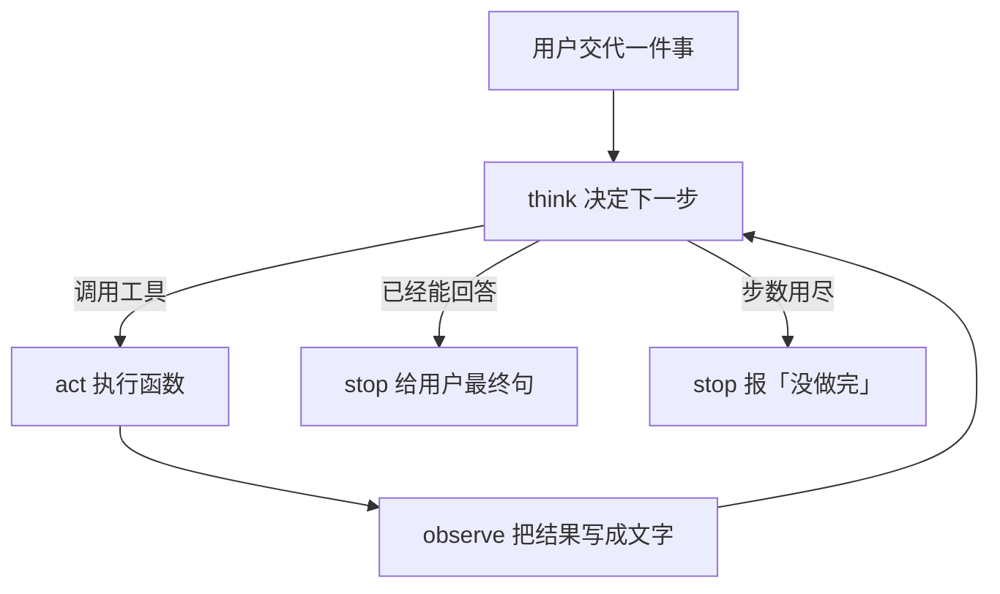
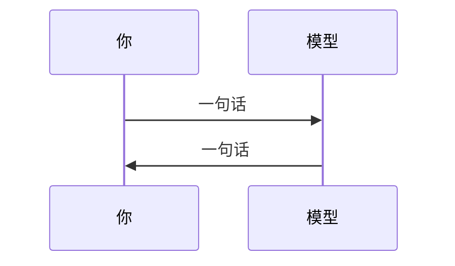

# 第 1 周 · Agent 是一个会停下来的循环

上周你把桌子摆好了：看见了芯片或红条。若你还跑了 `hello_chat`，那是一次聊天补全——一问一答，程序结束。
这周要换一种形状。模型可以**先想、再动手、再看结果**，然后决定是继续还是停。

如果你觉得「不就是多调用几次 API 吗」——对，物理上就是。
难的是：谁决定调用、什么时候停、失败了记什么日志。

## 本周你要带走什么

- [ ] 白纸上画出 think → act → observe，并标出两处停止条件。
- [ ] `echo_agent.py` 对「今天星期几」至少调用一次 `weekday`。
- [ ] 日志是一行一条 JSON：`step` / `thought` / `action` / `observation`。
- [ ] 你见过 `error:unknown_tool` 和「没做完：步数用尽」。
- [ ] `pytest code/week1` 离线绿。

## 目标

- 用自己的话区分「聊天」和「Agent 循环」。
- 画出 think → act → observe，并知道箭头在哪里会断。
- 跑通 `code/week1/echo_agent.py`，读懂每一行 JSON 日志。
- 接受一件事：自主程度是一条谱，不是开关。

## 先修 / 预计时间 / 对应视频

**先修。** 第 0 周桌子摆好。本周默认**不打网**，规则脑即可交差。

读本文 + 跑脚本 2 小时；改一个新工具 1 小时；对着日志解释给同学听 1 小时；剩下的时间留给「我以为它会停但它没有」。

**对应视频：** [docs/videos.md](../videos.md)「第 0–1 周」

- 吴恩达 Agentic AI：https://www.deeplearning.ai/courses/agentic-ai
- 中文搬运 · 模块1-3 自主性（第 3 分 P）：https://www.bilibili.com/video/BV11Y49zCEuk/?p=3
- HF Agents Course 导论：https://huggingface.co/learn/agents-course/unit0/introduction
- HF unit1（循环字段）：https://huggingface.co/learn/agents-course/unit1/introduction

## 概念：定义 + 一个反例

**定义。** Agent = 一个会停下来的循环。每一步：Thought（为什么）→ Action（哪只手）→ Observation（看见什么）。能答或步数用尽就 `finish`。

**反例。** 聊天机器人：你说一句，模型回一句，进程结束。那是第 0 周。给聊天机器人加一句「遇到不会的就搜索」但没有把搜索结果喂回下一步、也没有上限——仍是聊天，只是提示词更长。

## 图文步骤



聊天是这样：



循环是这样：中间多了「手」和「眼睛」。

### 自主谱（先填空，再对答案）

```
完全听喝                         完全撒手
  |--------|--------|--------|--------|
  A        B        C        D
  按钮      每次确认   工具自选   过夜跑
  脚本      人在回路   有上限     无上限
```

把本周 `echo_agent.py`、工单台闸门、以及「无限循环改生产」分别标到 A–D。希望听到在 [answers/01.md](answers/01.md)。

- 最左：你写死 `if`，模型只负责润色。那是带 L 的脚本。
- 中间：模型选工具，你限制次数和权限。本周站在这里。
- 最右：循环自己开浏览器改生产。本仓库不教。

### 对着我们的代码走一圈

先跑，再对行号。默认走规则脑，不打网。

```bash
source .venv/bin/activate
python code/week1/echo_agent.py
python code/week1/echo_agent.py --query "今天星期几"
python -m pytest code/week1 -q
```

## 本机实录 · weekday 带批注

今天是 Monday 时：

```text
{"step": 1, "thought": "问的是星期，调用工具。", "action": "weekday", "observation": "Monday"}
{"step": 2, "thought": "已经有观察值。", "action": "finish", "observation": "工具返回：Monday"}
[final] 工具返回：Monday
```

字段怎么读（不要背 ReAct 三个音节，指着这一行）：

```text
Thought      →  "问的是星期，调用工具。"     为什么动手
Action       →  weekday                      哪只手（TOOLS 里的名字）
Action Input →  ""                           weekday 不吃参数
Observation  →  Monday                       工具返回，喂回下一步
Final        →  [final] 工具返回：Monday      第二步 action=finish
```

`observation` 里的星期名跟你机器的 locale / 当天有关。字段名必须仍是这四个。

请只盯三处：

| 行 | 为什么重要 |
| --- | --- |
| [`18:18:code/week1/echo_agent.py`](../../code/week1/echo_agent.py) | `MAX_STEPS = 6`。没有这一行，就没有「会停下来」 |
| [`30:33:code/week1/echo_agent.py`](../../code/week1/echo_agent.py) | `TOOLS`：模型（或规则）只能看见这些名字 |
| [`47:88:code/week1/echo_agent.py`](../../code/week1/echo_agent.py) | `EchoAgent.run`：think / act / observe 写成普通函数 |
| [`63:65:code/week1/echo_agent.py`](../../code/week1/echo_agent.py) | 未知工具变成 `error:unknown_tool:…` |
| [`78:87:code/week1/echo_agent.py`](../../code/week1/echo_agent.py) | `for/else`：步数用尽承认没做完 |
| [`91:105:code/week1/echo_agent.py`](../../code/week1/echo_agent.py) | `rule_brain`：看见「星期」就调用 `weekday` |
| [`108:110:code/week1/echo_agent.py`](../../code/week1/echo_agent.py) | 一行一条 JSON，不是散文 |

有 Key 也不要急着改 brain。作业默认不打网。不要急着抽象 `BaseAgent`。

## 失败对照 · 未知工具

脑子点了不在 `TOOLS` 里的名字。本机：

```text
{"step": 1, "thought": "试试飞天", "action": "fly", "observation": "error:unknown_tool:fly"}
{"step": 2, "thought": "停", "action": "finish", "observation": "error:unknown_tool:fly"}
[final] error:unknown_tool:fly
```

复现（在仓库根）：

```bash
python - <<'PY'
import sys
sys.path.insert(0, "code/week1")
from echo_agent import EchoAgent, Decision, dump_log
def bad(obs, log):
    if log:
        return Decision("停", "finish", log[-1]["observation"])
    return Decision("试试飞天", "fly", "")
r = EchoAgent(bad).run("hi")
dump_log(r["log"])
print("[final]", r["final"])
PY
```

**原因。** [`63:65:code/week1/echo_agent.py`](../../code/week1/echo_agent.py) `TOOLS.get` 为 `None` 时写成观察值，不抛堆栈，也不假装成功。

## 失败对照 · 步数上限为 1（以及「没有 MAX_STEPS」）

**现场 A。** `--max-steps 1` 再问星期几：

```text
$ python code/week1/echo_agent.py --query "今天星期几" --max-steps 1
{"step": 1, "thought": "问的是星期，调用工具。", "action": "weekday", "observation": "Monday"}
{"step": 1, "thought": "hard stop", "action": "finish", "observation": "没做完：步数用尽。"}
[final] 没做完：步数用尽。
```

第一步只够调用工具，还没轮到 `finish`。

**现场 B。** 脑子永远不说 finish（模拟你删掉上限、提示里写「再试一次」）：

```text
{"step": 1, "thought": "再试一次", "action": "weekday", "observation": "Monday"}
{"step": 2, "thought": "再试一次", "action": "weekday", "observation": "Monday"}
{"step": 3, "thought": "再试一次", "action": "weekday", "observation": "Monday"}
{"step": 3, "thought": "hard stop", "action": "finish", "observation": "没做完：步数用尽。"}
[final] 没做完：步数用尽。
```

没有 [`18:18`](../../code/week1/echo_agent.py) 和 [`78:87`](../../code/week1/echo_agent.py) 的硬停，这一段会刷到你按 Ctrl+C。提示词不是刹车。

作业里请把 `--max-steps` 改回默认（6）。留下「没做完」的截图，不要把上限偷偷调大装成功。

## 练习

1. 再写一个工具 `echo_upper`，句子里出现 `大写` 就调用。仓库里已经有函数，缺的是你自己的测试。
2. 把 `MAX_STEPS` 改成 `1`，用「今天星期几」跑。应当承认没做完。
3. 用自己的话写五句：聊天、脚本、Agent、人在回路、无限循环。
4. 填完整自主谱 A–D（上面那张 ASCII）。
5. 用未知工具那段脚本跑一遍，把 `error:unknown_tool` 抄进笔记。

## 本周词汇表

| 词 | 一句话 |
| --- | --- |
| Thought | 为什么动手 |
| Action | 工具名或 finish |
| Observation | 工具返回的文字 |
| MAX_STEPS | 硬刹车 |

[字段纸](../cheatsheets/react-fields.md) 下周转完整 ReAct。

## 面试追问

「搜索每次都返回空，循环会怎样？日志哪一字段两分钟能看出来？」

希望听到：指 [`echo_agent.py:75`](../../code/week1/echo_agent.py) 的 `observation`。空结果必须写成明确错误；没有上限就会重复同一 `action`。工单台政策零命中是同一纪律，见第 6 周红条。

## 常见坑

- 系统提示很长，却不写步数上限。
- 工具报错时把同样的话再喂回去。
- 一上来 `pip install` 全家桶框架。本周禁止。

## 延伸阅读

- 吴恩达 Agentic AI：https://www.deeplearning.ai/courses/agentic-ai
- Hugging Face Agents Course unit1：https://huggingface.co/learn/agents-course/unit1/introduction
- hello-agents（Agent 定义章，勿抄）：https://github.com/datawhalechina/hello-agents
- shareAI-lab/learn-claude-code（循环+工具+权限，不克隆）：https://github.com/shareAI-lab/learn-claude-code
- 下一周：[工具与 ReAct](02-tools-and-react.md)
