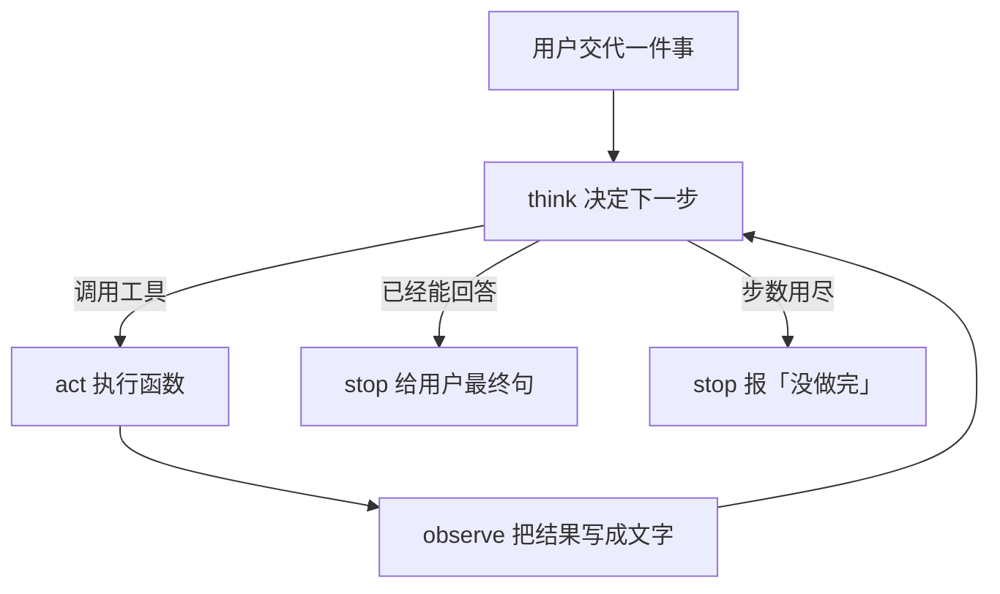
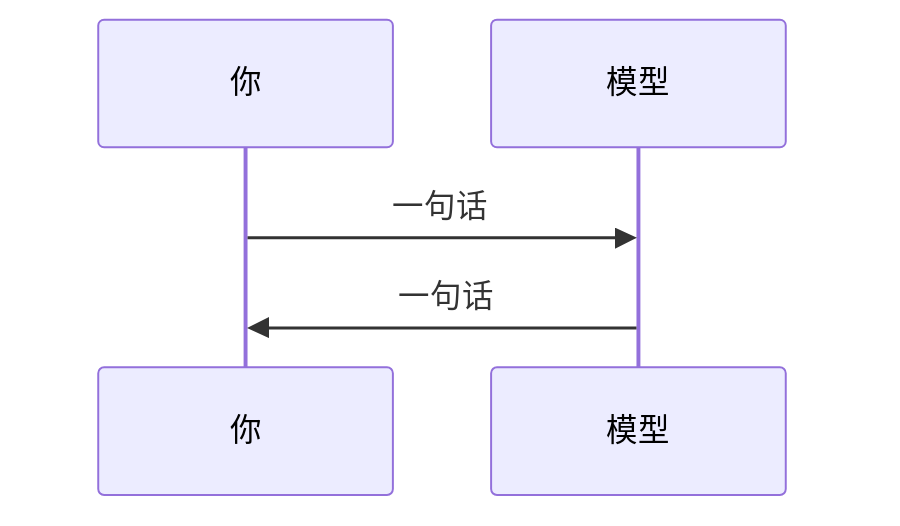

# 第 1 周 · Agent 是一个会停下来的循环

上周你完成了一次聊天补全：一问一答，程序结束。
这周要换一种形状。模型可以**先想、再动手、再看结果**，然后决定是继续还是停。

如果你觉得「不就是多调用几次 API 吗」——对，物理上就是。
难的是：谁决定调用、什么时候停、失败了记什么日志。

## 目标

- 用自己的话区分「聊天」和「Agent 循环」。
- 画出 think → act → observe，并知道箭头在哪里会断。
- 跑通 `code/week1/echo_agent.py`，读懂每一行 JSON 日志。
- 接受一件事：自主程度是一条谱，不是开关。

## 你将做出的东西

一个不依赖任何 Agent 框架的小循环。
它有一个会算星期几的工具。脑子可以是规则（无 Key），也可以是兼容接口的模型。

每次运行会在终端打出结构化日志，字段固定为：`step` / `thought` / `action` / `observation`。

## 预计 4–6 小时

读本文 + 跑脚本 2 小时；改一个新工具 1 小时；对着日志解释给同学听 1 小时；剩下的时间留给「我以为它会停但它没有」。

## 图文步骤



聊天是这样：



循环是这样：中间多了「手」和「眼睛」。

### 自主程度（请对着生活理解）

```
完全听喝                         完全撒手
  |--------|--------|--------|--------|
  按钮      每次确认   工具自选   过夜跑
  脚本      人在回路   有上限     无上限
```

- 最左：你写死 `if`，模型只负责把结果润色。那是带 L 的脚本。
- 中间：模型选工具，你限制次数和权限。本周站在这里。
- 最右：循环自己开浏览器改生产。本仓库不教这个，第 4 周会把「权限」单独拎出来。

### 对着我们的代码走一圈

先跑，再对行号。默认走规则脑，不打网。

```bash
source .venv/bin/activate
python code/week1/echo_agent.py
python code/week1/echo_agent.py --query "今天星期几"
python -m pytest code/week1 -q
```

我们在本机跑第一条（今天是 Monday）时，终端是：

```text
{"step": 1, "thought": "问的是星期，调用工具。", "action": "weekday", "observation": "Monday"}
{"step": 2, "thought": "已经有观察值。", "action": "finish", "observation": "工具返回：Monday"}
[final] 工具返回：Monday
```

`observation` 里的星期名跟你机器的 locale / 当天有关。字段名必须仍是这四个。

请只盯三处：

| 行 | 为什么重要 |
| --- | --- |
| [`18:18:code/week1/echo_agent.py`](../../code/week1/echo_agent.py) | `MAX_STEPS = 6`。没有这一行，就没有「会停下来」 |
| [`30:33:code/week1/echo_agent.py`](../../code/week1/echo_agent.py) | `TOOLS`：模型（或规则）只能看见这些名字 |
| [`47:88:code/week1/echo_agent.py`](../../code/week1/echo_agent.py) | `EchoAgent.run`：think / act / observe 写成普通函数 |
| [`91:105:code/week1/echo_agent.py`](../../code/week1/echo_agent.py) | `rule_brain`：看见「星期」就调用 `weekday`，有观察值就 `finish` |
| [`108:110:code/week1/echo_agent.py`](../../code/week1/echo_agent.py) | 一行一条 JSON，不是散文 |

有 Key 也不要急着改 brain。作业默认不打网，避免账单。两种路径打出的字段相同。

不要急着抽象 `BaseAgent`。八行重复的 `print` 比一个过早的基类更适合小白。

## 失败对照 · 步数上限为 1

**现场。** 练习 2：把上限拧到 1，再问星期几。

```text
$ python code/week1/echo_agent.py --query "今天星期几" --max-steps 1
{"step": 1, "thought": "问的是星期，调用工具。", "action": "weekday", "observation": "Monday"}
{"step": 1, "thought": "hard stop", "action": "finish", "observation": "没做完：步数用尽。"}
[final] 没做完：步数用尽。
```

**原因。** [`78:87:code/week1/echo_agent.py`](../../code/week1/echo_agent.py) 的 `for/else`：第一步只够调用工具，还没轮到 `finish` 收口，循环走完就承认没做完。

**修复。** 作业里请把 `--max-steps` 改回默认（6）。你要留下的是这张「没做完」的截图，不是把上限偷偷调大装成功。

## 对应视频

[视频课表 · 第 0–1 周](../videos.md)

- 吴恩达 Agentic AI 官方课：用它校对「模式名字」，本周只关心循环，不关心四模式背诵。
- 中文搬运（标明搬运）：https://www.bilibili.com/video/BV11Y49zCEuk/
- HF Agents Course 导论：感受课前测验的节奏。我们的测验是脚本和 pytest。

## 练习

1. 再写一个工具 `echo_upper`，把用户句子变成大写。给规则脑加一条：句子里出现 `大写` 就调用它。补一条测试。（仓库里已经有函数，缺的是你自己的测试。）
2. 把 `MAX_STEPS` 改成 `1`，用「今天星期几」跑。你应当看到循环承认没做完，而不是假装成功。
3. 用自己的话写五句：聊天、脚本、Agent、人在回路、无限循环。发给同学，看对方能不能指出你混用的词。

## 验收标准

- [ ] 你能在白纸上画出 think → act → observe，并标出两处停止条件。
- [ ] `echo_agent.py` 对「今天星期几」至少调用一次 `weekday`。
- [ ] 日志是一行一条 JSON，不是散文。
- [ ] `pytest code/week1` 通过（不需要网络）。

## 常见坑

- 把系统提示写得很长，却不写步数上限。提示不是刹车。
- 工具报错时把同样的话再喂回去。观察值要带错误类型。
- 一上来 `pip install` 某全家桶框架。本周禁止。理由：你还没有自己的循环，装了也只是换一种聊天。

## 延伸阅读

- 吴恩达 Agentic AI：https://www.deeplearning.ai/courses/agentic-ai
- Hugging Face Agents Course：https://huggingface.co/learn/agents-course/unit0/introduction
- shareAI-lab/learn-claude-code（看它如何把循环+工具+权限当成一套，不要克隆代码）：https://github.com/shareAI-lab/learn-claude-code
- 下一周：[工具与 ReAct](02-tools-and-react.md)
