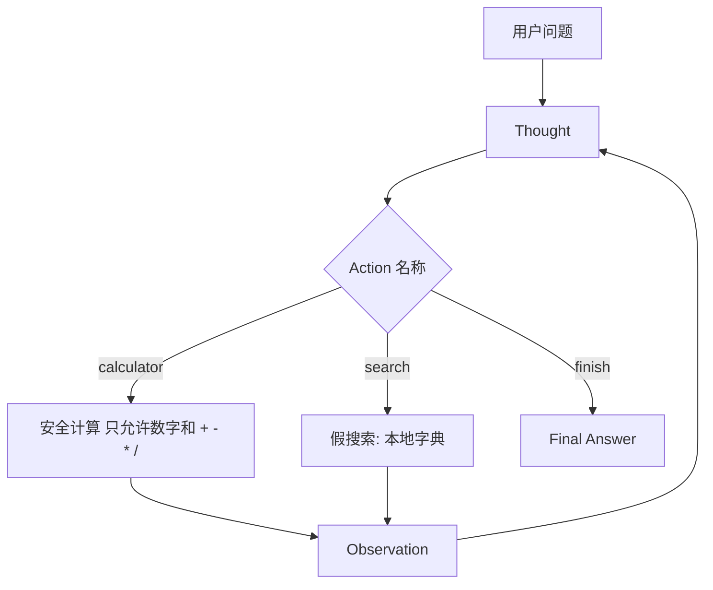
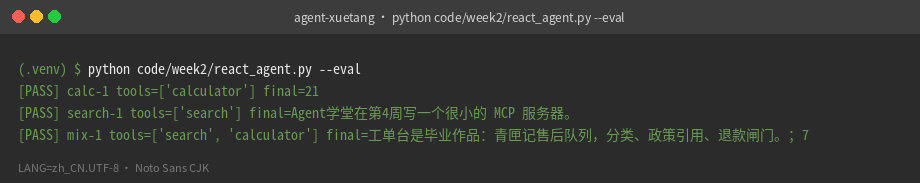
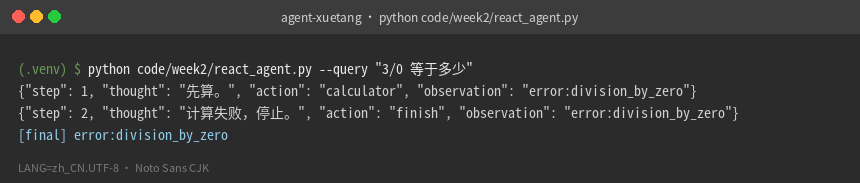

# 第 2 周 · 工具，以及你手写的 ReAct

第 1 周的循环只有一种「手」。
这周你要让脑子在**两种手**之间选择，并把选择过程写成可以评测的轨迹。

业界常把这种「想一想、做一下、看一眼」的写法规成一种提示格式，名叫 ReAct。
名字不重要。重要的是：Thought / Action / Action Input / Observation 对你来说是**字段**，不是信仰。

## 本周你要带走什么

- [ ] 无网络时 `pytest code/week2` 绿。
- [ ] 三条官方用例 `--eval` 全 PASS，退出码 0。
- [ ] 你能指出解析器哪一行抠出 `Action Input`，以及全角冒号为什么能过。
- [ ] 你亲手打出过 `error:parse` 和 `error:division_by_zero`。
- [ ] 你能解释：假搜索为什么比真搜索适合当周作业。

## 目标

- 自己实现函数调用：模型（或规则）吐出工具名和参数，你的 Python 去执行。
- 手写 ReAct 解析，不引入框架。
- 提供计算器 + 假搜索。假搜索是为了让评测稳定，不是为了爬网。
- 用 3 条 JSON 用例判定「选对工具、答到点子上」。

## 先修 / 预计时间 / 对应视频

**先修。** 第 1 周 JSON 日志能读。本周仍可不打网。

读 + 跑 2 小时；读懂解析器 1 小时；改评测或加第四条用例 1 小时；看视频补直觉 1–2 小时。

**对应视频：** [docs/videos.md](../videos.md)「第 2 周」

- 李宏毅 HW2 Agent（YouTube，林毓翔 / Ulin Sanga，非官方课）：https://youtu.be/o4AT86nLcd0
- 吴恩达 Agentic AI：https://www.deeplearning.ai/courses/agentic-ai
- 模块3 工具（第 14 分 P）：https://www.bilibili.com/video/BV11Y49zCEuk/?p=14
- 模块4-1 evals（第 19 分 P）：https://www.bilibili.com/video/BV11Y49zCEuk/?p=19

看 HW2 之前，先让本仓库三条评测变绿。

## 概念：定义 + 一个反例

**定义。** 工具 = 当前进程里的函数。ReAct = 用固定字段让脑子选工具。评测 = 对轨迹查 `expect_tool` 和 `expect_contains`，不是看文采。

**反例。** 「我让模型 chain-of-thought 想清楚再答 3*7」——那是 CoT，没有手。工单台政策员如果只 CoT、不跑 `search_policy`，芯片不会出现。见文末对照纸。

## 图文步骤



### 工具写在哪

计算器不要 `eval` 任意字符串。[`25:40:code/week2/react_agent.py`](../../code/week2/react_agent.py) 只允许数字和四则；`3/0` 走 `ZeroDivisionError` → `error:division_by_zero`。

假搜索在 [`17:22:code/week2/react_agent.py`](../../code/week2/react_agent.py) 的 `SEARCH_TABLE`。真实搜索会让三条评测今天过、明天挂。

解析器在 [`131:148:code/week2/react_agent.py`](../../code/week2/react_agent.py)：兼容全角冒号。失败时 `--parse` 打印 `error:parse`。无 Key 时走 [`156:179`](../../code/week2/react_agent.py) 的规则脑。

评测在 [`225:251:code/week2/react_agent.py`](../../code/week2/react_agent.py)：读 `eval_cases.json`。

全角冒号纸：[../cheatsheets/react-fields.md](../cheatsheets/react-fields.md)

## 本机实录

```bash
python code/week2/react_agent.py --query "3 * 7 等于多少"
python code/week2/react_agent.py --eval
python -m pytest code/week2 -q
```

`--query "3 * 7 等于多少"`：

```text
{"step": 1, "thought": "先算。", "action": "calculator", "observation": "21"}
{"step": 2, "thought": "材料齐了。", "action": "finish", "observation": "21"}
[final] 21
```

`--eval`（三条官方用例，退出码 0）：

```text
[PASS] calc-1 tools=['calculator'] final=21
[PASS] search-1 tools=['search'] final=Agent学堂在第4周写一个很小的 MCP 服务器。
[PASS] mix-1 tools=['search', 'calculator'] final=工单台是毕业作品：青匣记售后队列，分类、政策引用、退款闸门。；7
```



你应当看见：三条都是 `[PASS]`：`calc-1` 的 `final=21`，`search-1` 提到第 4 周 MCP，`mix-1` 两种工具都在；退出码 0。

第三条最容易写砸。`mix-1` 的轨迹必须两种工具都在。

既有课程名词又有算式时：

```text
{"step": 1, "thought": "先查课程表。", "action": "search", "observation": "工单台是毕业作品：青匣记售后队列，分类、政策引用、退款闸门。"}
{"step": 2, "thought": "还需要算一下。", "action": "calculator", "observation": "7"}
{"step": 3, "thought": "材料齐了。", "action": "finish", "observation": "工单台是毕业作品：青匣记售后队列，分类、政策引用、退款闸门。；7"}
[final] 工单台是毕业作品：青匣记售后队列，分类、政策引用、退款闸门。；7
```

本机墙钟（抽取式规则脑，无 Key）：`--eval` 约 0.17s，stdout 193B。没有「准确率百分之几」。



你应当看见：`observation` 和 `[final]` 都是 `error:division_by_zero`，没有编造数字。

## 失败对照 · `--eval` 写反与除零

**现场 A。** 把 `eval_cases.json` 里的期望写反：计算器那条改成 `expect_tool: search`，检索那条改成 `calculator`，混合题的 `expect_contains` 改成 `"999"`。再跑 `--eval`：

```text
[FAIL] calc-1 tools=['calculator'] final=21
[FAIL] search-1 tools=['search'] final=Agent学堂在第4周写一个很小的 MCP 服务器。
[FAIL] mix-1 tools=['search', 'calculator'] final=工单台是毕业作品：青匣记售后队列，分类、政策引用、退款闸门。；7
```

三条全红，退出码 1。评测自己不会说话，退出码会。改完用例记得还原。

**现场 B。** 计算器接到 `3/0`：

```text
$ python code/week2/react_agent.py --query "3/0 等于多少"
{"step": 1, "thought": "先算。", "action": "calculator", "observation": "error:division_by_zero"}
{"step": 2, "thought": "计算失败，停止。", "action": "finish", "observation": "error:division_by_zero"}
[final] error:division_by_zero
```

**原因。** [`32:35`](../../code/week2/react_agent.py) 捕获除零；[`166:167`](../../code/week2/react_agent.py) 看见 `error:` 就停，不编一个数字。

## 失败对照 · `error:parse`

忘了字段名：

```text
$ python code/week2/react_agent.py --parse "我想算一下但是忘了字段"
error:parse
```

退出码 1。

全角冒号能过：

```text
$ python code/week2/react_agent.py --parse $'Thought：要算一下\nAction：calculator\nAction Input：1+1'
{"thought": "要算一下", "action": "calculator", "action_input": "1+1"}
```

**原因。** [`131:142`](../../code/week2/react_agent.py) 抠不到 Action 且没有 Final Answer 就返回 `None`；`--parse` 把它印成 `error:parse`。有 Key 的路径也应当把观察值写成这一句，不要死循环。

## 调试五条（对着 `react_agent.py`）

卡住时按这个顺序，不要先换框架。

1. **打印即将送给脑子的 query。** `ReactAgent.run` 第 190 行：每一步 `self.brain(...)` 的第一个参数。规则脑用的是原始 query，不是上一轮 observation。
2. **打印脑子的原始 Decision。** 在 `decision = self.brain(...)` 下一行临时 `print(decision)`。看 `action` 是不是落在 `TOOLS`。
3. **单独喂解析器。** `python code/week2/react_agent.py --parse '…模型原文…'`。先确认是 `error:parse` 还是选错工具。
4. **单独喂工具。** 在 REPL：`from react_agent import calculator, search`；`calculator("3/0")`、`search("MCP")`。
5. **看评测差在哪一列。** `--eval` 的 `tools=` 和 `final=`。`tool_ok` 与 `text_ok` 在 [`234:240`](../../code/week2/react_agent.py)。不要只看最终散文。

调试完把 print 删掉。第 8 周要的是结构化日志，不是满屏 prompt。

## ReAct vs CoT vs 工具调用（用工单台，一页）

同一张盛夏物流单 `promo-overrides-sla`：

| 写法 | 工单台里实际发生 | 芯片？ |
| --- | --- | --- |
| 只 CoT | 模型在草稿里「想」日常不赔运费 | 无 `path:line`，闸门应拒 |
| ReAct 字段 | Thought=活动期要检索；Action=政策检索；Observation=摘录 | 有芯片 |
| 进程内 tool-call | 政策员直接 `search_policy(...)`，不经过 Thought 字符串 | 同样有芯片；工单台 v1 就是这样 |

工单台政策员走的是第三列：[`agents/policy.py`](../../projects/ticketdesk/src/ticketdesk/agents/policy.py) 调 `search_policy`，不是先生成一段 ReAct 散文。第 2 周手写解析，是为了你看见字段；第 6 周产品把 Action 收成函数名。

不要在这周上 LangGraph，也不要做问数 SQL。

## 练习

1. 给假搜索加第 4 条评测「理赔台」（表里已有条目，缺的是你的 JSON）。
2. 计算器输入 `3/0`，最终答案不得编数字。
3. 故意把 `expect_tool` 写错，确认 `--eval` 非零退出。
4. 用 `--parse` 打出 `error:parse`，再打一条全角冒号成功。
5. 对着工单台那张对照表，用三句话向同学区分 CoT / ReAct / tool-call。

## 本周词汇表

| 词 | 一句话 |
| --- | --- |
| ReAct | 字段，不是框架 |
| `error:parse` | 原文对不上 Thought/Action |
| `error:division_by_zero` | 工具比模型偏执 |
| `--eval` | 三条夹具，退出码说话 |

## 面试追问

「现场演示改成当场问一个聪明问题，你为什么还要坚持 `--eval`？」

希望听到：指 [`react_agent.py:225`](../../code/week2/react_agent.py) 和 `eval_cases.json`。老板鼓掌的那句不进回归。第 8 周 `evals/set8.json` 同一纪律。

## 常见坑

- 用 `eval` 做计算器。
- 解析器只认半角冒号。
- 把轨迹打成漂亮表格却不保存 JSON。

## 延伸阅读

- 吴恩达 Agentic AI：https://www.deeplearning.ai/courses/agentic-ai
- 李宏毅 HW2（YouTube，非官方课）：https://youtu.be/o4AT86nLcd0
- HF unit1：https://huggingface.co/learn/agents-course/unit1/introduction
- hello-agents（工具章，勿抄）：https://github.com/datawhalechina/hello-agents
- 下一周：[记忆与 RAG](03-memory-rag.md)
