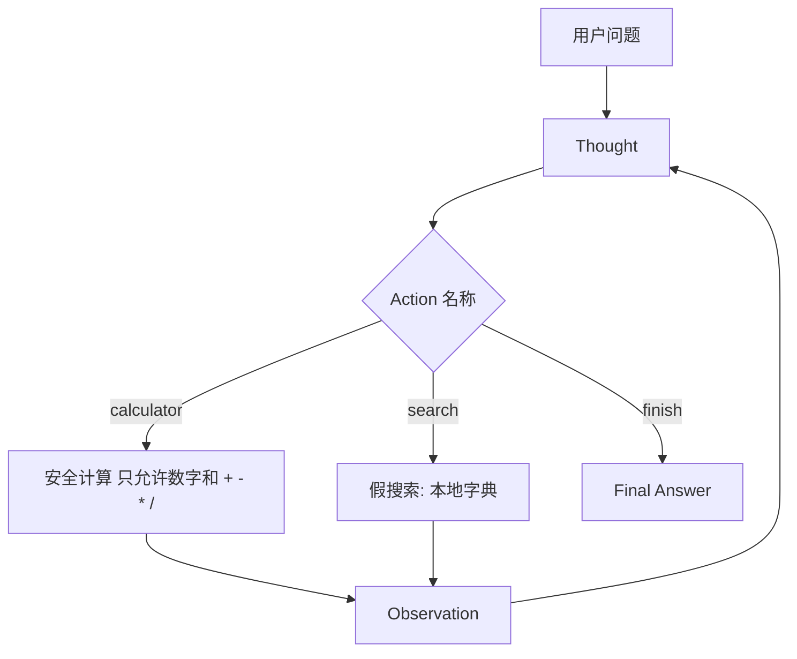

# 第 2 周 · 工具，以及你手写的 ReAct

第 1 周的循环只有一种「手」。
这周你要让脑子在**两种手**之间选择，并把选择过程写成可以评测的轨迹。

业界常把这种「想一想、做一下、看一眼」的写法规成一种提示格式，名叫 ReAct。
名字不重要。重要的是：Thought / Action / Action Input / Observation 对你来说是**字段**，不是信仰。

## 目标

- 自己实现函数调用：模型（或规则）吐出工具名和参数，你的 Python 去执行。
- 手写 ReAct 解析，不引入框架。
- 提供计算器 + 假搜索。假搜索是为了让评测稳定，不是为了爬网。
- 用 3 条 JSON 用例判定「选对工具、答到点子上」。

## 你将做出的东西

```
code/week2/
  react_agent.py      # 循环 + 两个工具
  eval_cases.json     # 三条用例
  test_react_agent.py
```

## 预计 4–6 小时

读 + 跑 2 小时；读懂解析器 1 小时；改评测或加第四条用例 1 小时；看视频补直觉 1–2 小时。

## 图文步骤



### 工具写在哪

计算器不要 `eval` 任意字符串。[`25:40:code/week2/react_agent.py`](../../code/week2/react_agent.py) 只允许数字和四则；`3/0` 走 `ZeroDivisionError` → `error:division_by_zero`。这是你第一次体会「工具比模型更需要偏执」。

假搜索在 [`17:22:code/week2/react_agent.py`](../../code/week2/react_agent.py) 的 `SEARCH_TABLE`。真实搜索会让三条评测今天过、明天挂。

解析器在 [`131:148:code/week2/react_agent.py`](../../code/week2/react_agent.py)：`Thought` / `Action` / `Action Input` / `Final Answer`，兼容全角冒号。解析失败时（有 Key 的路径）观察值应是 `error:parse`，不要死循环。无 Key 时走 [`156:179:code/week2/react_agent.py`](../../code/week2/react_agent.py) 的规则脑。

评测在 [`225:251:code/week2/react_agent.py`](../../code/week2/react_agent.py)：读 `eval_cases.json`，查 `expect_tool(s)` 和 `expect_contains`。

### 跑起来（本机实录）

```bash
python code/week2/react_agent.py --query "3 * 7 等于多少"
python code/week2/react_agent.py --eval
python -m pytest code/week2 -q
```

`--query "3 * 7 等于多少"`：

```text
{"step": 1, "thought": "先算。", "action": "calculator", "observation": "21"}
{"step": 2, "thought": "材料齐了。", "action": "finish", "observation": "21"}
[final] 21
```

`--eval`（三条官方用例，退出码 0）：

```text
[PASS] calc-1 tools=['calculator'] final=21
[PASS] search-1 tools=['search'] final=Agent学堂在第4周写一个很小的 MCP 服务器。
[PASS] mix-1 tools=['search', 'calculator'] final=工单台是毕业作品：青匣记售后队列，分类、政策引用、退款闸门。；7
```

第三条最容易写砸——规则可能算对了却没去搜，或搜了对却算错。`mix-1` 的轨迹必须两种工具都在。

既有课程名词又有算式时，本机是：

```text
{"step": 1, "thought": "先查课程表。", "action": "search", "observation": "工单台是毕业作品：青匣记售后队列，分类、政策引用、退款闸门。"}
{"step": 2, "thought": "还需要算一下。", "action": "calculator", "observation": "7"}
{"step": 3, "thought": "材料齐了。", "action": "finish", "observation": "工单台是毕业作品：青匣记售后队列，分类、政策引用、退款闸门。；7"}
[final] 工单台是毕业作品：青匣记售后队列，分类、政策引用、退款闸门。；7
```

## 失败对照 · `--eval` 3/0 与除零

**现场 A。** 把 `eval_cases.json` 里的期望写反：计算器那条改成 `expect_tool: search`，检索那条改成 `calculator`，混合题的 `expect_contains` 改成一个轨迹里没有的 `"999"`。再跑 `--eval`：

```text
[FAIL] calc-1 tools=['calculator'] final=21
[FAIL] search-1 tools=['search'] final=Agent学堂在第4周写一个很小的 MCP 服务器。
[FAIL] mix-1 tools=['search', 'calculator'] final=工单台是毕业作品：青匣记售后队列，分类、政策引用、退款闸门。；7
```

三条全红，退出码 1。评测自己不会说话，退出码会。改完用例记得还原。

**现场 B。** 计算器真的接到 `3/0`：

```text
$ python code/week2/react_agent.py --query "3/0 等于多少"
{"step": 1, "thought": "先算。", "action": "calculator", "observation": "error:division_by_zero"}
{"step": 2, "thought": "计算失败，停止。", "action": "finish", "observation": "error:division_by_zero"}
[final] error:division_by_zero
```

**原因。** [`32:35:code/week2/react_agent.py`](../../code/week2/react_agent.py) 捕获除零；[`166:167:code/week2/react_agent.py`](../../code/week2/react_agent.py) 看见 `error:` 就停，不编一个数字。

**修复。** 作业要的是这句 `error:division_by_zero`。若你改成了 `eval()` 还返回 `inf`，测例会打你。

## 对应视频

[视频课表 · 第 2 周](../videos.md)

- 李宏毅 HW2 Agent（YouTube 官方）：https://youtu.be/o4AT86nLcd0
- 吴恩达 Agentic AI（官方）：https://www.deeplearning.ai/courses/agentic-ai
- 上述课程的中文搬运（搬运）：https://www.bilibili.com/video/BV11Y49zCEuk/

看 HW2 之前，先让本仓库的三条评测变绿。顺序反了，你会抄作业结构。

## 练习

1. 给假搜索加一个条目：「理赔台」。写第 4 条评测，确认能命中。（表里已经有「理赔台」，缺的是你的第四条 JSON。）
2. 把计算器输入改成 `3/0`，观察值必须是明确错误，最终答案不得编造一个数字。
3. 故意把 `expect_tool` 写错，确认 `--eval` 会以非零退出码失败。

## 验收标准

- [ ] 无网络时 `pytest code/week2` 绿。
- [ ] 三条官方用例都被脚本判定通过。
- [ ] 你能指出解析器在哪一行把 `Action Input` 抠出来。
- [ ] 你能解释：为什么假搜索比真搜索适合当周作业。

## 常见坑

- 用 `eval` 做计算器，然后在群里说「只是作业」。作业也会被 clone。
- 模型输出中英混杂的 `Action`，解析器只认一种写法。兼容 `action` / `Action` / 全角冒号。
- 把轨迹打印成漂亮表格却不保存。第 8 周的十行评测需要你这周就习惯 JSON。

## 延伸阅读

- 吴恩达 Agentic AI：https://www.deeplearning.ai/courses/agentic-ai
- 李宏毅 HW2：https://youtu.be/o4AT86nLcd0
- Datawhale hello-agents（延伸，勿抄正文）：https://github.com/datawhalechina/hello-agents
- 下一周：[记忆与 RAG](03-memory-rag.md)
