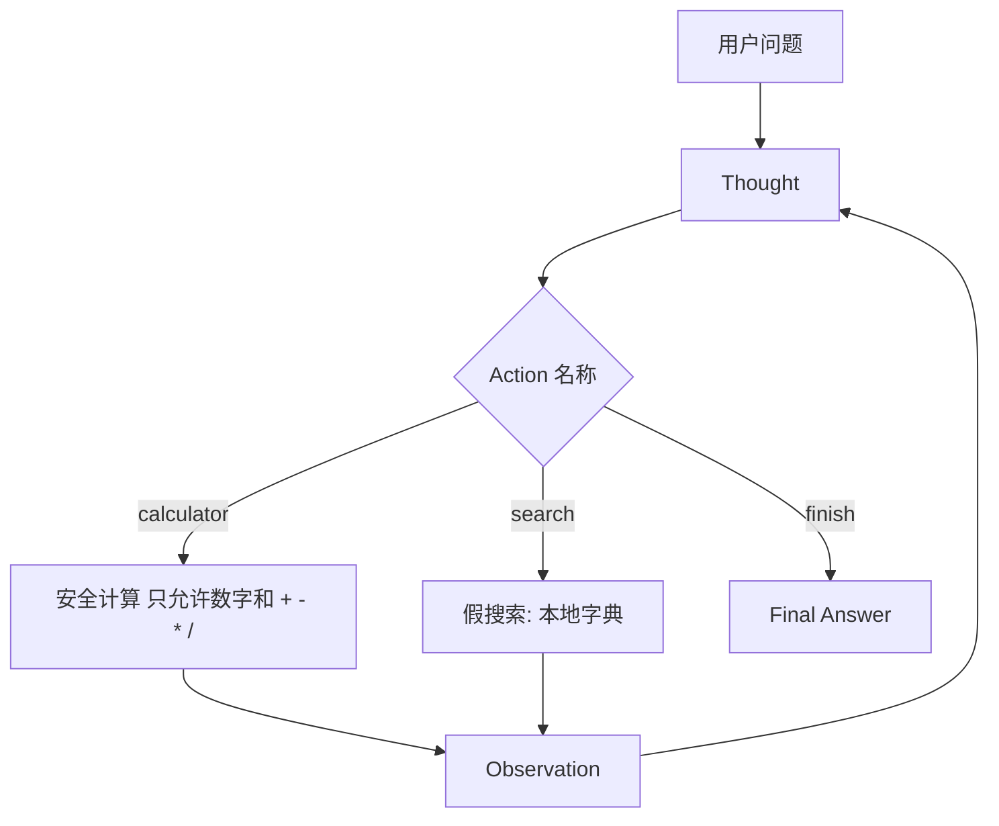

# 第 2 周 · 工具，以及你手写的 ReAct

第 1 周的循环只有一种「手」。
这周你要让脑子在**两种手**之间选择，并把选择过程写成可以评测的轨迹。

业界常把这种「想一想、做一下、看一眼」的写法规成一种提示格式，名叫 ReAct。
名字不重要。重要的是：Thought / Action / Action Input / Observation 对你来说是**字段**，不是信仰。

## 目标

- 自己实现函数调用：模型（或规则）吐出工具名和参数，你的 Python 去执行。
- 手写 ReAct 解析，不引入框架。
- 提供计算器 + 假搜索。假搜索是为了让评测稳定，不是为了爬网。
- 用 3 条 JSON 用例判定「选对工具、答到点子上」。

## 你将做出的东西

```
code/week2/
  react_agent.py      # 循环 + 两个工具
  eval_cases.json     # 三条用例
  test_react_agent.py
```

## 本周时间 · 6 小时（日历第 3 周）

工作日 / 周末怎么拆：两晚各 1.5 小时（读、跑通两条工具）；周末 3 小时钉死三条评测。视频放到通勤，不要占满周末。

## 图文步骤



### 工具 1：计算器

不要 `eval` 任意字符串。只允许数字和四则运算。
`2 ** 10`、`__import__`、名字查找，一律拒绝。观察值写成 `error:invalid_expression`。

这是你第一次体会「工具比模型更需要偏执」。

### 工具 2：假搜索

本地一张小表，例如：

| 关键字 | 固定返回 |
| --- | --- |
| MCP | Agent学堂在第 4 周写一个很小的 MCP 服务器 |
| 问学堂 | 毕业作品，吃本仓库文档当知识库 |
| ReAct | 一种把思考和行动写成字段的循环写法 |

真实搜索引擎会让三条评测今天过、明天挂。练习阶段先买稳定。

### 跑起来

```bash
python code/week2/react_agent.py --query "3 * 7 等于多少"
python code/week2/react_agent.py --eval
python -m pytest code/week2 -q
```

`--eval` 会读 `eval_cases.json`，对每条检查：

- `expect_tool`：轨迹里是否出现过这个工具名。
- `expect_contains`：最终答案是否包含这几个字。

三条用例覆盖：纯计算、纯检索、一句里既有数字又有课程名词。
第三条最容易写砸——模型（或规则）可能算对了却没去搜，或搜了对却算错。

### 规则脑也要写

没有 Key 时，脚本用关键字分流：

- 出现算式或「等于多少」→ 计算器。
- 出现「第几周」「问学堂」「MCP」→ 搜索。
- 两者都有 → 先搜再算，或先算再搜，但两条工具都要留下轨迹。

有 Key 时，把工具说明发给模型，解析它的 `Action:` 行。解析失败算一次观察值 `error:parse`，不要死循环。

### 评测为什么从这周就出现

因为演示会骗人。
你会下意识问它擅长的问题，然后觉得「Agent 已经会了」。
三条冷冰冰的 JSON 比十次愉快聊天更接近上班以后的日子。

吴恩达的课把评测放得很早；我们用文件落地，而不是用感觉。

## 对应视频

[视频课表 · 第 2 周](../videos.md)

- 李宏毅 HW2 Agent（YouTube 官方）：https://youtu.be/o4AT86nLcd0
- 吴恩达 Agentic AI（官方）：https://www.deeplearning.ai/courses/agentic-ai
- 上述课程的中文搬运（搬运）：https://www.bilibili.com/video/BV11Y49zCEuk/

看 HW2 之前，先让本仓库的三条评测变绿。顺序反了，你会抄作业结构。

## 练习

1. 给假搜索加一个条目：「值班台」。写第 4 条评测，确认能命中。
2. 把计算器输入改成 `3/0`，观察值必须是明确错误，最终答案不得编造一个数字。
3. 故意把 `expect_tool` 写错，确认 `--eval` 会以非零退出码失败。评测自己不会说话，退出码会。

## 验收标准

- [ ] 无网络时 `pytest code/week2` 绿。
- [ ] 三条官方用例都被脚本判定通过。
- [ ] 你能指出解析器在哪一行把 `Action Input` 抠出来。
- [ ] 你能解释：为什么假搜索比真搜索适合当周作业。

## 常见坑

- 用 `eval` 做计算器，然后在群里说「只是作业」。作业也会被 clone。
- 模型输出中英混杂的 `Action`，解析器只认一种写法。兼容 `action` / `Action` / 全角冒号。
- 把轨迹打印成漂亮表格却不保存。第 8 周的十行评测需要你这周就习惯 JSON。

## 延伸阅读

- 吴恩达 Agentic AI：https://www.deeplearning.ai/courses/agentic-ai
- 李宏毅 HW2：https://youtu.be/o4AT86nLcd0
- Datawhale hello-agents（延伸，勿抄正文）：https://github.com/datawhalechina/hello-agents
- 下一周：[记忆与 RAG](03-memory-rag.md)
