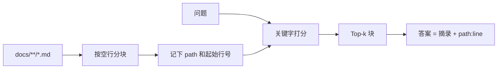

# 第 3 周 · 短记忆、长记忆，以及吃自己的文档

模型的「记得」有两种，经常被广告混成一种。

- **短记忆**：这次对话里的 messages。窗口满了就丢。
- **长记忆**：你写在磁盘上的文件、数据库、笔记。下次进程起来还在。

RAG（检索再生成）只是长记忆的一种用法：先找出可能有用的段落，再允许模型说话。
本周你要强制另一件事：**说话必须带引用，格式是 `path:line`。**

## 目标

- 分清 messages 和文件，各解决什么问题。
- 用简单分块 + 关键字（或 sqlite）检索本仓库的 `docs/`。
- 每条命中都能指回文件和行号。
- 知道 LangChain 不是本周的必需品。

## 你将做出的东西

```
code/week3/mini_rag.py
code/week3/test_mini_rag.py
```

对仓库自己的教材做检索。这叫 dogfood：我们吃自己做的饭，引用坏了立刻疼。

## 本周时间 · 6 小时（日历第 4 周）

工作日 / 周末怎么拆：两晚各 1.5 小时（短/长记忆 + 跑检索）；周末 3 小时把 `path:line` 测绿。向量库不在这 6 小时里。

## 图文步骤



### 短记忆什么时候够用

第 1–2 周的循环，把最近若干步的 thought / observation 塞进 messages，就够了。
用户改口、工具失败、步数记录，都属于短记忆。

短记忆的死法很具体：你把整本教材粘进提示，账单先死；或者窗口截断，模型忘掉工具刚返回的错误码。

### 长记忆为什么是文件

问学堂要把「第 4 周的目标」答对，靠的不是模型预训练里有没有这句话，
而是磁盘上 `docs/weeks/04-mcp-and-skills.md` 还在不在。

文件的好处：你可以 diff，可以在 PR 里被审查，可以在没有 Key 时仍然被检索。

### 分块规则（请保持无聊）

1. 读 `docs/` 下所有 `.md`。
2. 按空行切开。一块太长（例如超过 80 行）就再按标题切。
3. 每一块保存：`path`（相对仓库根）、`start_line`、`end_line`、`text`。
4. 打分：查询里的中文词和英文词，在 `text` 里出现就加分。可用 `sqlite` 建 FTS，也可以纯 Python。本周两种都算合格。

不要在这周引入向量库。向量会把「我检索失败」变成「我不太理解 embedding」。先把引用做对。

### 引用格式

```
docs/weeks/04-mcp-and-skills.md:12
```

行号指向块的起始行即可。问学堂的测试会检查：这个文件存在，且行号不超过文件行数。

没有命中时，诚实说「教材里没找到」，不要生成一段听起来像教材的话。

### 跑起来

```bash
python code/week3/mini_rag.py --query "第几周写 MCP"
python code/week3/mini_rag.py --query "问学堂有哪些角色"
python -m pytest code/week3 -q
```

预期输出类似：

```
[hit] docs/weeks/04-mcp-and-skills.md:1  score=3
[hit] docs/weeks/06-askhall.md:1         score=2
[quote] 学习者跑一个二十行 MCP stdio 服务器……
```

### 可选伙伴：CiteKit

如果你后面想把「引用必须可点」做成更严的库，可以看同作者的
[CiteKit](https://github.com/SabreKeyZ/citekit)。
本周**不要求**安装它。本仓库的 `mini_rag.py` 必须独立可跑。

## 对应视频

[视频课表 · 第 3 周](../videos.md)

- 李宏毅 HW1 RAG（YouTube）：https://youtu.be/0ylc6rnoTOM
- 李宏毅 2026 Agent / Context / Multi-Agent（B 站，中文搬运/课程录像以页面标注为准）：https://www.bilibili.com/video/BV1Sdw7zREka/
- 课程主页：https://speech.ee.ntu.edu.tw/~hylee/ml/2025-spring.php

## 练习

1. 查询「岗位地图」，确认能命中 `docs/jobs/roles.md` 而不是某一周的口误。
2. 把 `docs/` 换成一个空目录跑脚本，输出必须是「无命中」，退出码非零或字段 `hits=[]`。
3. 在一块引文里改一个错别字，重新检索，确认行号仍能让你用编辑器跳转。

## 验收标准

- [ ] 对「MCP」的查询，命中第 4 周文件。
- [ ] 每一条 hit 都能用编辑器打开到附近行。
- [ ] `pytest code/week3` 离线绿。
- [ ] 你能向同学解释：为什么本周不做向量库。

## 常见坑

- 用绝对路径当引用，换一台机器全部失效。引用从仓库根算。
- 按字节切块，把一个汉字切成两半。按行切。
- 检索 0 条仍然让模型「凭印象」答。这是第 6 周问学堂抽取式回退要挡住的事。

## 延伸阅读

- 李宏毅 HW1：https://youtu.be/0ylc6rnoTOM
- CiteKit（可选）：https://github.com/SabreKeyZ/citekit
- hello-agents 中记忆相关章节（延伸，勿搬正文）：https://github.com/datawhalechina/hello-agents
- 下一周：[MCP 与 Skill](04-mcp-and-skills.md)
