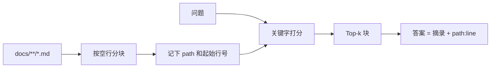

# 第 3 周 · 短记忆、长记忆，以及吃自己的文档

模型的「记得」有两种，经常被广告混成一种。

- **短记忆**：这次对话里的 messages。窗口满了就丢。
- **长记忆**：你写在磁盘上的文件、数据库、笔记。下次进程起来还在。

RAG（检索再生成）只是长记忆的一种用法：先找出可能有用的段落，再允许模型说话。
本周你要强制另一件事：**说话必须带引用，格式是 `path:line`。**
工单台和理赔台把这句话印在脸上：没有引用，就先不答。

## 目标

- 分清 messages 和文件，各解决什么问题。
- 用简单分块 + 关键字（或 sqlite）检索本仓库的 `docs/`。
- 每条命中都能指回文件和行号。
- 知道 LangChain 不是本周的必需品。

## 你将做出的东西

```
code/week3/mini_rag.py
code/week3/test_mini_rag.py
```

对仓库自己的教材做检索。这叫 dogfood：我们吃自己做的饭，引用坏了立刻疼。

## 预计 4–6 小时

读文档 1 小时；跑检索 1 小时；加一条「必须引用」的测试 1 小时；看 RAG 作业视频建立词汇 1–2 小时。

## 图文步骤



### 短记忆什么时候够用

第 1–2 周的循环，把最近若干步的 thought / observation 塞进 messages，就够了。
短记忆的死法很具体：你把整本教材粘进提示，账单先死；或者窗口截断，模型忘掉工具刚返回的错误码。

### 长记忆为什么是文件

工单台要把「活动期补偿」答对，靠的不是模型预训练里有没有这句话，
而是磁盘上 `docs/weeks/04-mcp-and-skills.md` 还在不在。

### 对着我们的检索器

| 行 | 它在干什么 |
| --- | --- |
| [`21:22:code/week3/mini_rag.py`](../../code/week3/mini_rag.py) | `Chunk.citation` → `path:start_line` |
| [`37:59:code/week3/mini_rag.py`](../../code/week3/mini_rag.py) | 按空行分块，太长再按 80 行切；相对仓库根 |
| [`85:105:code/week3/mini_rag.py`](../../code/week3/mini_rag.py) | 关键字打分：正文命中 + 路径命中 |
| [`147:155:code/week3/mini_rag.py`](../../code/week3/mini_rag.py) | 打印 `[hit]` 和 `[quote]`；零命中输出 `{"hits": []}` |
| [`178:186:code/week3/mini_rag.py`](../../code/week3/mini_rag.py) | 没有块或没有命中 → 退出码 1 |

不要在这周引入向量库。向量会把「我检索失败」变成「我不太理解 embedding」。先把引用做对。

```bash
python code/week3/mini_rag.py --query "第几周写 MCP"
python code/week3/mini_rag.py --query "工单台有哪些角色"
python -m pytest code/week3 -q
```

本机跑「第几周写 MCP」：

```text
[hit] docs/weeks/04-mcp-and-skills.md:1  score=14
[quote] # 第 4 周 · 工具、MCP、Skill：三件不同的事
[hit] docs/weeks/04-mcp-and-skills.md:8  score=14
[quote] | 词 | 它是什么 | 本周你摸到的实物 |
[hit] docs/weeks/04-mcp-and-skills.md:14  score=14
[quote] 不是「MCP 比工具高级」。是「谁在哪个进程里」。
[hit] docs/weeks/04-mcp-and-skills.md:34  score=14
[quote] 读 + 画图 1 小时；跑服务器 2 小时；写 Skill 和权限句 1 小时；看 MCP for Beginners 目录 1–2 小时。
```

分数会随教材改字而变，**路径必须仍是第 4 周文件**。行号要能在编辑器里跳转。

没有命中时，诚实说「教材里没找到」，不要生成一段听起来像教材的话。

### 可选伙伴：CiteKit

[CiteKit](https://github.com/SabreKeyZ/citekit) 把「引用必须可点」做更严。本周**不要求**安装。`mini_rag.py` 必须独立可跑。

## 失败对照 · 空目录

**现场。** `--docs` 指到一个没有 `.md` 的目录：

```text
$ mkdir -p /tmp/empty-docs
$ python code/week3/mini_rag.py --query "MCP" --docs /tmp/empty-docs
{"hits": []}
```

退出码 `1`。

**原因。** [`178:180:code/week3/mini_rag.py`](../../code/week3/mini_rag.py)：corpus 为空就打印 `hits=[]`，不当成「模型没印象」。

**修复。** 作业路径不要传空目录。你要留下这张零命中的输出，第 6 周工单台的红条「没有引用，就先不答」就是从这里长出来的。

## 对应视频

[视频课表 · 第 3 周](../videos.md)

- 李宏毅 HW1 RAG（YouTube）：https://youtu.be/0ylc6rnoTOM
- 李宏毅 2026 Agent / Context / Multi-Agent（B 站，中文搬运/课程录像以页面标注为准）：https://www.bilibili.com/video/BV1Sdw7zREka/
- 课程主页：https://speech.ee.ntu.edu.tw/~hylee/ml/2025-spring.php

## 练习

1. 查询「岗位地图」，确认能命中 `docs/jobs/roles.md` 而不是某一周的口误。
2. 把 `docs/` 换成一个空目录跑脚本，输出必须是「无命中」，退出码非零或字段 `hits=[]`。
3. 在一块引文里改一个错别字，重新检索，确认行号仍能让你用编辑器跳转。

## 验收标准

- [ ] 对「MCP」的查询，命中第 4 周文件。
- [ ] 每一条 hit 都能用编辑器打开到附近行。
- [ ] `pytest code/week3` 离线绿。
- [ ] 你能向同学解释：为什么本周不做向量库。

## 常见坑

- 用绝对路径当引用，换一台机器全部失效。引用从仓库根算。
- 按字节切块，把一个汉字切成两半。按行切。
- 检索 0 条仍然让模型「凭印象」答。这是第 6 周工单台抽取式回退要挡住的事。

## 延伸阅读

- 李宏毅 HW1：https://youtu.be/0ylc6rnoTOM
- CiteKit（可选）：https://github.com/SabreKeyZ/citekit
- hello-agents 中记忆相关章节（延伸，勿搬正文）：https://github.com/datawhalechina/hello-agents
- 下一周：[MCP 与 Skill](04-mcp-and-skills.md)
