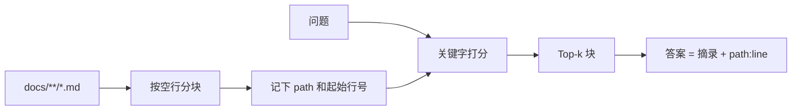

# 第 3 周 · 短记忆、长记忆，以及吃自己的文档

模型的「记得」有两种，经常被广告混成一种。

- **短记忆**：这次对话里的 messages。窗口满了就丢。
- **长记忆**：你写在磁盘上的文件、数据库、笔记。下次进程起来还在。

RAG（检索再生成）只是长记忆的一种用法：先找出可能有用的段落，再允许模型说话。
本周你要强制另一件事：**说话必须带引用，格式是 `path:line`。**
工单台和理赔台把这句话印在脸上：没有引用，就先不答。

## 本周你要带走什么

- [ ] 对「MCP」的查询，命中第 4 周文件。
- [ ] 对「岗位地图」的查询，命中 `docs/jobs/roles.md`。
- [ ] 每一条 hit 都能用编辑器打开到附近行。
- [ ] 空目录 / 零命中时输出 `{"hits": []}`，退出码非零，不编一段教材。
- [ ] `pytest code/week3` 离线绿。你能解释本周为什么不做向量库。

## 目标

- 分清 messages 和文件，各解决什么问题。
- 用简单分块 + 关键字（或 sqlite）检索本仓库的 `docs/`。
- 每条命中都能指回文件和行号。
- 知道 LangChain 不是本周的必需品。

## 先修 / 预计时间 / 对应视频

**先修。** 第 2 周评测绿。本周不打网。

读文档 1 小时；跑检索 1 小时；加一条「必须引用」的测试 1 小时；看 RAG 作业视频建立词汇 1–2 小时。

**对应视频：** [docs/videos.md](../videos.md)「第 3 周」

- 李宏毅 HW1 RAG：https://youtu.be/0ylc6rnoTOM
- 李宏毅 2026 Agent / Context（B 站）：https://www.bilibili.com/video/BV1Sdw7zREka/
- 课程主页：https://speech.ee.ntu.edu.tw/~hylee/ml/2025-spring.php

看 HW1 是为了听清「引用从哪来」，不是重写一份向量作业。

## 概念：定义 + 一个反例

**定义。** 本课的 RAG = 对 `docs/` 分块 + 关键字打分 + 每条 hit 带 `path:start_line`。没有命中就不生成。

**反例。** 「我检索了，但 0 条命中，模型根据常识把售后政策写完了。」那不是本课。工单台政策员在零命中时亮红条，见 [`policy.py:49`](../../projects/ticketdesk/src/ticketdesk/agents/policy.py)。无引用的 RAG 广告，下周起一律当反例。

## 图文步骤



### 短记忆什么时候够用

第 1–2 周的循环，把最近若干步的 thought / observation 塞进 messages，就够了。
短记忆的死法很具体：你把整本教材粘进提示，账单甚至先于窗口死；或者窗口截断，模型忘掉工具刚返回的错误码。

### 长记忆为什么是文件

工单台要把「活动期补偿」答对，靠的不是模型预训练里有没有这句话，
而是磁盘上 `projects/ticketdesk/docs/policy/promo-2026-summer.md` 还在不在。

### 对着我们的检索器

| 行 | 它在干什么 |
| --- | --- |
| [`21:22:code/week3/mini_rag.py`](../../code/week3/mini_rag.py) | `Chunk.citation` → `path:start_line` |
| [`37:59:code/week3/mini_rag.py`](../../code/week3/mini_rag.py) | 按空行分块，太长再按 80 行切；相对仓库根 |
| [`85:105:code/week3/mini_rag.py`](../../code/week3/mini_rag.py) | 关键字打分：正文命中 + 路径命中 |
| [`147:155:code/week3/mini_rag.py`](../../code/week3/mini_rag.py) | 打印 `[hit]` 和 `[quote]`；零命中输出 `{"hits": []}` |
| [`178:186:code/week3/mini_rag.py`](../../code/week3/mini_rag.py) | 没有块或没有命中 → 退出码 1 |

不要在这周引入向量库。向量会把「我检索失败」变成「我不太理解 embedding」。先把引用做对。

## 本机实录

```bash
python code/week3/mini_rag.py --query "第几周写 MCP"
python code/week3/mini_rag.py --query "岗位地图"
python code/week3/mini_rag.py --query "工单台有哪些角色"
python -m pytest code/week3 -q
```

「第几周写 MCP」（分数随教材改字会变，**路径必须仍是第 4 周**）：

```text
[hit] docs/weeks/04-mcp-and-skills.md:1  score=14
[quote] # 第 4 周 · 工具、MCP、Skill：三件不同的事
```

### 练习 1 的期望 hit

查询「岗位地图」必须能指到求职文档，而不是某一周的口误。测试已经钉死：

[`test_roles_query_hits_jobs`](../../code/week3/test_mini_rag.py) 断言 hits 里有 `jobs/roles.md`。

本机应看到类似：

```text
[hit] docs/jobs/roles.md:1  score=…
[quote] # 岗位地图
```

行号以你机器为准，**文件名必须是 `docs/jobs/roles.md`**。

## 失败对照 · 空目录

```text
$ mkdir -p /tmp/empty-docs
$ python code/week3/mini_rag.py --query "MCP" --docs /tmp/empty-docs
{"hits": []}
```

退出码 `1`。

**原因。** [`178:180`](../../code/week3/mini_rag.py)：corpus 为空就打印 `hits=[]`，不当成「模型没印象」。

## 失败画廊（三张必须拒绝）

### 1. 绝对路径当引用

坏：`/Users/you/agent-xuetang/docs/weeks/04-mcp-and-skills.md:1`  
好：`docs/weeks/04-mcp-and-skills.md:1`

[`chunk_file`](../../code/week3/mini_rag.py) 用 `path.relative_to(repo)`。工单台 `read_snippet` 看见 `/` 开头或 `..` 直接拒（[`rag.py:188`](../../projects/ticketdesk/src/ticketdesk/rag.py)）。

换一台机器，绝对路径全部 404。这不是风格问题，是引用死了。

### 2. 按字节切开汉字

坏：按 500 字节切，把「智能」切成 `\xe6` 和 `\x99`。  
好：按行切，空行分段，单段超过 80 行再切（[`37:59`](../../code/week3/mini_rag.py)）。

本周禁止「先上 tokenizer 再上向量」来掩盖切块错误。引用行号对不上，先怀疑切块。

### 3. 0 hits 仍然作答

坏：`hits=[]` 之后让模型写「根据常识，MCP 大概在第 3 周」。  
好：打印 `{"hits": []}`，退出码 1；产品侧亮红条「没有引用，就先不答」。

工单台政策员：[`policy.py:49-59`](../../projects/ticketdesk/src/ticketdesk/agents/policy.py)。  
理赔台条款员：[`clause.py:20-29`](../../projects/claimdesk/src/claimdesk/agents/clause.py)。

本周作业路径不要传空目录装成功。留下零命中输出。

## 易混表 · 为什么本周不用向量库

| 说法 | 本周立场 |
| --- | --- |
| 向量更准 | 教材只有几十个 md。关键字打分已经能命中第 4 周和 `roles.md`。准不准先看 `path:line` 能不能跳转。 |
| 不上向量就不叫 RAG | 本课定义是「检索 + 必须引用」。工单台、理赔台产品版仍是关键字 + 生效窗口。 |
| embedding 能解决幻觉 | 0 命中仍生成，换了向量照样幻觉。闸门在「有没有芯片」，不在「像不像」。 |
| 明年要上 Qdrant | 可以。先把相对路径、行号、空库拒绝做硬。问数 / 混合检索不在本仓。 |

[CiteKit](https://github.com/SabreKeyZ/citekit) 把「引用必须可点」做更严。本周**不要求**安装。

## 练习

1. 查询「岗位地图」，确认 hit 的文件是 `docs/jobs/roles.md`（见上面期望）。
2. 把 `docs/` 换成空目录，必须 `hits=[]`。
3. 在一块引文里改一个错别字，重新检索，确认行号仍能跳转。
4. 故意构造一条绝对路径引用，写清工单台 `read_snippet` 会回什么错。
5. 用三行向同学讲：为什么 0 hits 还作答不是本课的 RAG。

## 本周词汇表

| 词 | 一句话 |
| --- | --- |
| path:line | 相对根的引用 |
| 分块 | 按空行，不按字节 |
| 零命中 | `hits=[]` 或红条 |
| 抽取式 | 没 Key 只摘原文 |

[引用纸](../cheatsheets/path-line.md)

## 面试追问

「工单台活动期引用了日常不赔运费，这是哪一类错？改提示还是改拒绝？」

希望听到：这是生效窗口 / 引用落点错，不是文采。指第 3 周 `citation` 和第 6 周 [`rag.py:119`](../../projects/ticketdesk/src/ticketdesk/rag.py) `_in_force`。修复是「没有命中生效政策就拒绝生成」，不是换更贵的模型。

## 常见坑

- 绝对路径当引用。
- 按字节切汉字。
- 检索 0 条仍然让模型凭印象答。

## 延伸阅读

- 李宏毅 HW1：https://youtu.be/0ylc6rnoTOM
- CiteKit（可选）：https://github.com/SabreKeyZ/citekit
- hello-agents 记忆相关章（勿搬正文）：https://github.com/datawhalechina/hello-agents
- HF Agents Course：https://huggingface.co/learn/agents-course/unit1/introduction
- 下一周：[MCP 与 Skill](04-mcp-and-skills.md)
