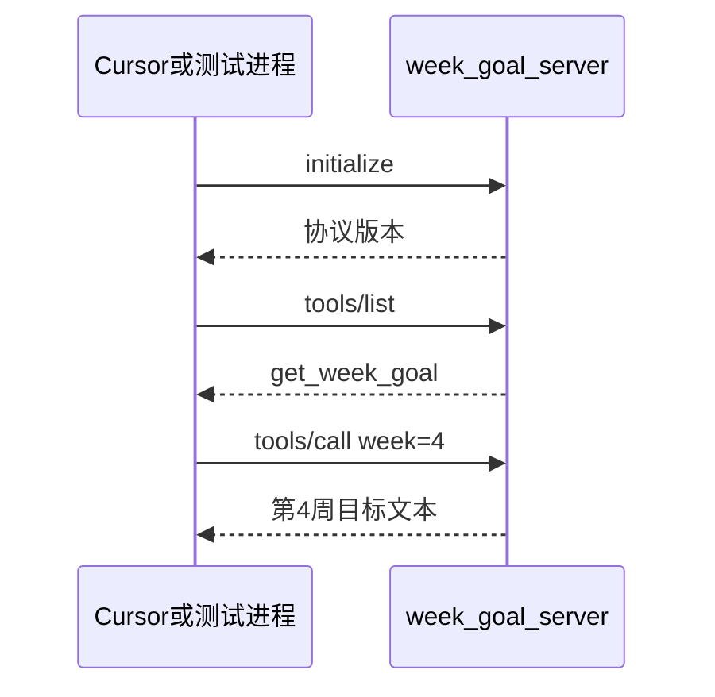

# 第 4 周 · 工具、MCP、Skill：三件不同的事

上周的检索器是**进程里的一个函数**。
这周你要把它（以及任意一个小能力）变成**别的程序也能调用的服务器**，并写一段给套件看的说明书。

三个词经常被堆在同一张幻灯片上。我们拆开。

| 词 | 它是什么 | 本周你摸到的实物 |
| --- | --- | --- |
| 工具 tool | 当前进程里的函数，Agent 循环直接 `call` | 第 2 周的 `calculator` |
| MCP | 一种约定：用 JSON-RPC 在 stdio 或 HTTP 上暴露工具 | `code/week4/week_goal_server.py` |
| Skill | 给套件（Cursor / Claude Code 一类）看的短文：何时用、何时先问人 | 文末那段 YAML + Markdown |

不是「MCP 比工具高级」。是「谁在哪个进程里」。

## 目标

- 用自己的话区分上面三列。
- 跑一个大约二十行量级的 stdio 服务器，暴露 `get_week_goal`。
- 写一段可粘贴的 Skill 片段，声明权限。
- 仍然不引入 LangChain。

## 你将做出的东西

```
code/week4/week_goal_server.py
code/week4/test_week_goal_server.py
```

以及你自己笔记里的一份 Skill 拷贝（仓库里有示例，见本页底部）。

## 本周时间 · 5 小时（日历第 5 周）

工作日 / 周末怎么拆：两晚各 1.5 小时（画图 + 跑 `get_week_goal`）；周末 2 小时写 Skill 的「不得」和一条测试。
微软仓库只看目录，不要整仓复制。

## 图文步骤



### 为什么要多一个进程

第 2 周的工具和循环写在同一个文件里。换一个编辑器、换一个聊天窗口，那个函数就看不见了。
MCP 把「能力」留在一个小服务器里。编辑器、命令行、以后的问学堂，理论上可以共用同一份。

本周我们只做 stdio：一边读一行 JSON，一边写一行 JSON。不监听端口，防火墙少一件事。

### 协议只实现三支

作业允许「像 MCP 的最小子集」，不必实现官方规范的每一个字段。

1. `initialize`
2. `tools/list` —— 返回 `get_week_goal`，参数是 `week`（0–8 的整数）
3. `tools/call` —— 读本仓库 `docs/weeks/` 对应文件的「目标」小节，返回纯文本

读文件失败时返回 JSON-RPC 错误，不要返回模型编的目标。

### 跑起来

```bash
python code/week4/week_goal_server.py --once --week 4
python -m pytest code/week4 -q
```

`--once` 是给人类用的快捷方式：不走 stdio，直接打印第 4 周目标。
测试会走真正的 stdin/stdout，防止你只写了快捷方式。

和服务器对话的示意：

```
> {"jsonrpc":"2.0","id":1,"method":"tools/list","params":{}}
< {"jsonrpc":"2.0","id":1,"result":{"tools":[{"name":"get_week_goal",...}]}}
```

### Skill 片段（可粘贴）

把下面拷进 Cursor 的 skill 目录或 Claude 的 skill 说明。这是**说明书**，不是服务器。

```markdown
---
name: agent-xuetang-week-goal
description: 当学员问「这周学什么 / 第 N 周目标」时使用。先调用 MCP 工具 get_week_goal。
---

# 第 N 周目标

1. 调用 `get_week_goal`，参数 `week` 为 0 到 8。
2. 只用工具返回的文本回答。不要用预训练记忆改写目标。
3. 权限：本 Skill **不得**删除文件、**不得**提交 git、**不得**发送邮件。
4. 学员没说周数时，先问人，再调用工具。
```

「先问人」就是人在回路的最小形态。
learn-claude-code 把套件理解成循环 + 工具 + 权限；我们这周用四行权限把第三项写死。

## 对应视频

[视频课表 · 第 4 周](../videos.md)

- Microsoft MCP for Beginners（官方）：https://github.com/microsoft/mcp-for-beginners
- LangChain Academy Deep Agents（官方）：https://academy.langchain.com/courses/foundation-introduction-to-deepagents
- HF Agents Course（官方）：https://huggingface.co/learn/agents-course/unit0/introduction

微软那份仓库的目标是「你自己写一个很小的服务器」。看完目录就回来写 `get_week_goal`，不要整仓复制。

## 练习

1. 给 `tools/list` 再加一个只读工具 `list_weeks`，返回 0–8 的标题行。补测试。
2. 把 Skill 里的权限改成「可以写一个 `notes/week4.md`，但不能写别的路径」。你还不需要真的实现写入，先把句子写清楚。
3. 用错误周数 `99` 调用，确认是协议错误而不是一段假目标。

## 验收标准

- [ ] 你能向同学用「进程内函数 / 对外协议 / 说明书」解释三个词。
- [ ] `pytest code/week4` 离线绿，且覆盖 stdio 路径。
- [ ] `get_week_goal(4)` 的返回值能在 `04-mcp-and-skills.md` 里搜到对应句子。
- [ ] Skill 文本里至少有一条「不得」。

## 常见坑

- 把 Skill 写成又一个系统提示，塞了 200 行。Skill 越长，套件越不当真。
- 在 MCP 服务器里直接调用云端模型。本周服务器应当是确定性的读文件。
- 实现了 WebSocket、鉴权、十种 transport，却还没让 `tools/list` 稳定。

## 延伸阅读

- MCP for Beginners：https://github.com/microsoft/mcp-for-beginners
- Deep Agents 课：https://academy.langchain.com/courses/foundation-introduction-to-deepagents
- learn-claude-code（结构参考，不克隆）：https://github.com/shareAI-lab/learn-claude-code
- 下一周：[多智能体](05-multi-agent.md)
