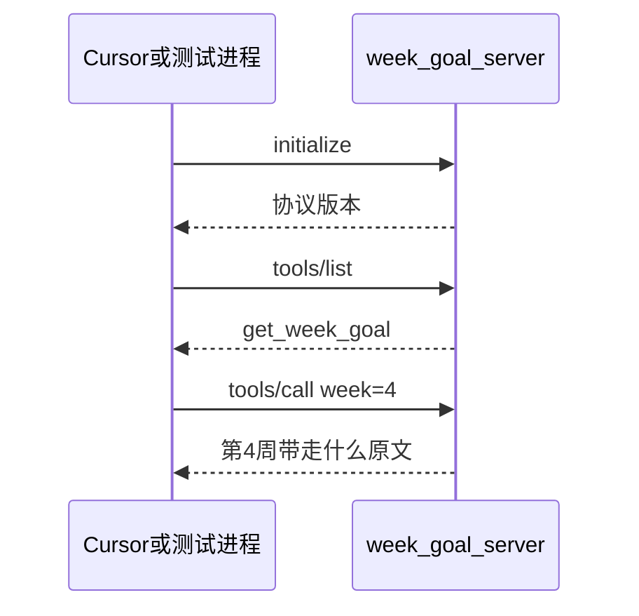

# 第 4 周 · 工具、MCP、Skill：三件不同的事

上周的检索器是**进程里的一个函数**。
这周你要把它（以及任意一个小能力）变成**别的程序也能调用的服务器**，并写一段给套件看的说明书。

三个词经常被堆在同一张幻灯片上。我们拆开。

| 词 | 它是什么 | 本周你摸到的实物 |
| --- | --- | --- |
| 工具 tool | 当前进程里的函数，Agent 循环直接 `call` | 第 2 周的 `calculator`；工单台 `lookup_order` |
| MCP | 一种约定：用 JSON-RPC 在 stdio 或 HTTP 上暴露工具 | `code/week4/week_goal_server.py` |
| Skill | 给套件（Cursor / Claude Code 一类）看的短文：何时用、何时先问人 | 文末那段 YAML + Markdown |

不是「MCP 比工具高级」。是「谁在哪个进程里」。

## 本周你要带走什么

- [ ] 你能向同学用「进程内函数 / 对外协议 / 说明书」解释三个词，并且用工单台「查订单」举同一动作的三种形态。
- [ ] `pytest code/week4` 离线绿，且覆盖 stdio 路径。
- [ ] `get_week_goal(4)` 的返回值能在本文件里搜到对应句子（含 MCP / stdio）。
- [ ] 你见过周数 `99` 的 JSON-RPC 错误，以及坏 JSON 的 traceback。
- [ ] Skill 文本里至少有一条「不得」。

## 目标

- 用自己的话区分上面三列。
- 跑一个大约二十行量级的 stdio 服务器，暴露 `get_week_goal`。
- 写一段可粘贴的 Skill 片段，声明权限。
- 仍然不引入 LangChain。

## 先修 / 预计时间 / 对应视频

**先修。** 第 3 周 `path:line` 能跳转。本周服务器是读文件，不打模型。

读 + 画图 1 小时；跑服务器 2 小时；写 Skill 和权限句 1 小时；看 MCP for Beginners 目录 1–2 小时。

**对应视频：** [docs/videos.md](../videos.md)「第 4 周」

- Microsoft MCP for Beginners：https://github.com/microsoft/mcp-for-beginners
- LangChain Academy Deep Agents：https://academy.langchain.com/courses/foundation-introduction-to-deepagents
- HF Agents Course：https://huggingface.co/learn/agents-course/unit0/introduction
- 模块3 MCP（第 18 分 P）：https://www.bilibili.com/video/BV11Y49zCEuk/?p=18

看完目录就回来写 `get_week_goal`，不要整仓复制。

## 概念：定义 + 一个反例

**定义。** 工具在本进程；MCP 把同一能力留在另一个进程，用 JSON-RPC 说话；Skill 是给人/套件看的「何时调用、何时先问人」。

**反例。** 「我们上了 MCP，所以更智能。」协议不会让模型突然会引用。工单台查订单可以一直是进程内函数；不上 MCP 也能毕业。把 Skill 写成 200 行系统提示，套件不当真。

## 图文步骤



### 为什么要多一个进程

第 2 周的工具和循环写在同一个文件里。换一个编辑器，那个函数就看不见了。
MCP 把能力留在一个小服务器里。本周只做 stdio：一边读一行 JSON，一边写一行 JSON。

### 协议只实现三支

作业允许「像 MCP 的最小子集」。纸：[../cheatsheets/jsonrpc-three.md](../cheatsheets/jsonrpc-three.md)

1. `initialize`
2. `tools/list` —— 返回 `get_week_goal`，参数是 `week`（0–8 的整数）
3. `tools/call` —— 读本仓库 `docs/weeks/` 对应文件的「本周你要带走什么」小节，返回纯文本

读文件失败时返回 JSON-RPC 错误，不要返回模型编的目标。

### 对着我们的服务器

| 行 | 它在干什么 |
| --- | --- |
| [`50:59:code/week4/week_goal_server.py`](../../code/week4/week_goal_server.py) | `get_week_goal`：按周打开文件，切「本周你要带走什么」（否则「目标」） |
| [`92:134:code/week4/week_goal_server.py`](../../code/week4/week_goal_server.py) | `handle`：三支方法 + 错误通道 `-32000` |
| [`137:144:code/week4/week_goal_server.py`](../../code/week4/week_goal_server.py) | `serve_stdio`：一行 JSON 进，一行 JSON 出 |
| [`152:158:code/week4/week_goal_server.py`](../../code/week4/week_goal_server.py) | `--once`：给人看的快捷方式，测试仍走 stdin |

## 本机实录

```bash
python code/week4/week_goal_server.py --once --week 4
python -m pytest code/week4 -q
```

`--once --week 4` 会打印本页「本周你要带走什么」原文（含 MCP / stdio），不是模型改写。

和服务器对话（本机 `tools/list`）：

```text
$ printf '%s\n' '{"jsonrpc":"2.0","id":1,"method":"tools/list","params":{}}' \
    | python code/week4/week_goal_server.py
{"jsonrpc": "2.0", "id": 1, "result": {"tools": [{"name": "get_week_goal", ...}, {"name": "list_weeks", ...}]}}
```

### JSON-RPC 错误码盒

| code | 名字 | 本仓谁抛 | 金样 |
| --- | --- | --- | --- |
| `-32700` | parse error | 练习：你给 `json.loads` 包 try | 见下「坏 JSON 金样」 |
| `-32000` | server error | `handle` 的 `except`（约 129–133 行） | 周数 99 |
| （无） | 编造目标 | 禁止 | — |

### 金样 · 周数非法（已经包好）

```text
$ python code/week4/week_goal_server.py --once --week 99
week 必须是 0-8，收到 99
```

stdio / `handle` 等价：

```json
{"jsonrpc":"2.0","id":7,"error":{"code":-32000,"message":"week 必须是 0-8，收到 99"}}
```

复现：

```bash
python - <<'PY'
import json
from pathlib import Path
import sys
sys.path.insert(0, "code/week4")
from week_goal_server import handle
print(json.dumps(handle({
    "jsonrpc":"2.0","id":7,"method":"tools/call",
    "params":{"name":"get_week_goal","arguments":{"week":99}}
}), ensure_ascii=False))
PY
```

## 失败对照 · 一行不是 JSON

**现场。** 往 stdin 塞 `not-json`：

```text
$ printf '%s\n' 'not-json' | python code/week4/week_goal_server.py
Traceback (most recent call last):
  File "code/week4/week_goal_server.py", line 164, in <module>
    raise SystemExit(main())
  ...
  File "code/week4/week_goal_server.py", line 142, in serve_stdio
    message = json.loads(line)
json.decoder.JSONDecodeError: Expecting value: line 1 column 1 (char 0)
```

**原因。** [`142:142`](../../code/week4/week_goal_server.py) 对 stdin 直接 `json.loads`。协议错误没有进 `handle` 的 error 通道。`99` 则是 `get_week_goal` 抛出、被 `handle` 接住。

**修复（练习，不是必须改主分支）。** 在 `serve_stdio` 里把 `json.loads` 包进 `try`，解析失败时写回金样，不要让进程炸死。

### 金样 · 坏 JSON（练习应写成这样）

```json
{"jsonrpc":"2.0","id":null,"error":{"code":-32700,"message":"parse error: Expecting value"}}
```

「解析失败」和「周数非法」不是同一种错。

## 同一动作三形态：查青匣记订单

不要讲课，看三份代码对同一件事。

**1. 进程内函数。** 分类员要核对单号，直接 call：

[`projects/ticketdesk/src/ticketdesk/tools/orders.py`](../../projects/ticketdesk/src/ticketdesk/tools/orders.py) `lookup_order`（约 7–19 行）。空单号 → `missing_order_id`。和循环在同一个进程。

**2. 若做成 MCP。** 把 `lookup_order` 挪进一个 stdio 服务器，方法名还叫 `lookup_order`，参数 `order_id`。工单台分类员变成：`tools/call` → 等一行 JSON → 读 `result`。失败必须是 JSON-RPC error 或 `reason=not_found`，不能编一个 QX 单号。本仓 v1 **没有**真的把订单查询做成 MCP——这是对照，不是作业要求。

**3. Skill。** 给套件的说明书，不是服务器：

```markdown
---
name: qingxia-lookup-order
description: 学员或客服问「这单是不是青匣记的」时使用。先调用订单查询。
---
1. 没有单号先问人，再调用工具。
2. 只用工具返回的 reason / order。不要用预训练编单号。
3. 不得改订单、不得打款、不得把他店单号当成青匣记。
```

同一动作：函数做事，MCP 把函数借出去，Skill 规定何时开口。工单台 v1 只用第一列，已经够毕业。

### Skill 片段（本周可粘贴）

```markdown
---
name: agent-xuetang-week-goal
description: 当学员问「这周学什么 / 第 N 周目标」时使用。先调用 MCP 工具 get_week_goal。
---

# 第 N 周目标

1. 调用 `get_week_goal`，参数 `week` 为 0 到 8。
2. 只用工具返回的文本回答。不要用预训练记忆改写目标。
3. 权限：本 Skill **不得**删除文件、**不得**提交 git、**不得**发送邮件。
4. 学员没说周数时，先问人，再调用工具。
```

「先问人」就是人在回路的最小形态。

## 练习

1. 确认 `tools/list` 里有 `list_weeks`，测例覆盖它。
2. 把 Skill 权限改成「可以写 `notes/week4.md`，不能写别的路径」。先把句子写清楚。
3. 用错误周数 `99` 调用，确认是协议错误而不是一段假目标。
4. 把 `not-json` 的 traceback 和上面 `-32700` 金样对照，写三句差在哪。
5. 向同学只用「查订单」这一动作，过一遍函数 / MCP / Skill。

## 本周词汇表

| 词 | 一句话 |
| --- | --- |
| JSON-RPC | 一行请求，一行响应 |
| `-32000` | 周数非法 / 未知工具 |
| `-32700` | 根本不是 JSON |
| Skill | 说明书，不是服务器 |

## 面试追问

「第 4 周既写了 MCP 又写了 Skill，不是同一件事吗？」

希望听到：指本页三形态。工具 = [`orders.py:7`](../../projects/ticketdesk/src/ticketdesk/tools/orders.py)；MCP = [`week_goal_server.py:92`](../../code/week4/week_goal_server.py)；Skill = 文末 YAML。不希望听到只背字段名。

## 常见坑

- Skill 塞 200 行。
- 在 MCP 服务器里直接调用云端模型。
- 实现了十种 transport，却还没让 `tools/list` 稳定。

## 延伸阅读

- MCP for Beginners：https://github.com/microsoft/mcp-for-beginners
- Deep Agents：https://academy.langchain.com/courses/foundation-introduction-to-deepagents
- HF unit2（框架对照，晚上看）：https://huggingface.co/learn/agents-course/unit2/introduction
- hello-agents（MCP 相关章，勿抄）：https://github.com/datawhalechina/hello-agents
- learn-claude-code（不克隆）：https://github.com/shareAI-lab/learn-claude-code
- 下一周：[多智能体](05-multi-agent.md)
