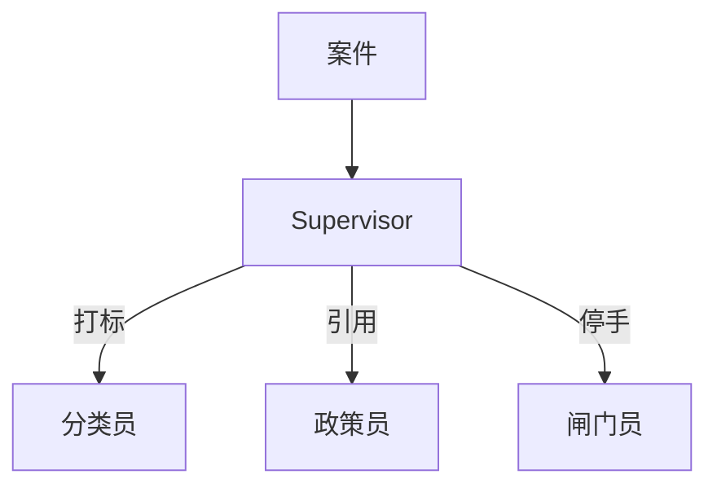

# 第 5 周 · 多个角色，以及何时不要加角色

到第 4 周，你已经有一个循环、两只手、一份长记忆、一个对外的小服务器。
有人会说：下一步当然是「上多智能体」。

先泼冷水。多一个角色，就是多一次完整的提示、多一轮等待、多一个会说错话的出口。
本周的上半场用来建立三种结构；下半场跑一份**可选教室实验**。问学堂 / 值班台已降级，不是毕业作品。

## 目标

- 分清主管（supervisor）、交接（handoff）、辩论（debate）。
- 能用费用和延迟解释「为什么两个角色够了」。
- 给工单台选定三个角色和一条路由规则。
- 仍然用字典状态机，不强制 LangGraph。

## 你将做出的东西

- 一张你自己画的路由图（可以画在纸上，拍照留着写第 8 周作品集）。
- `python code/week5/classroom_lab.py demo` 的抽取式路径（完整产品在第 6–7 周）。

## 预计 4–6 小时

读三种结构 2 小时；算一笔「多一次交接」的账 1 小时；跑教室实验 1 小时；看一节多 Agent 视频 1–2 小时。

## 图文步骤

### 主管

一个角色只做分流，不做长篇讲解。



优点：入口唯一，日志好读。
缺点：主管自己也会分错。分错的修复是改路由规则或加评测，不是再加一个「超级主管」。

### 交接

A 做完把整包状态交给 B，A 不再说话。像工单流转。


理赔台更接近这种。质检的结论是缺件清单，不是给用户看的散文。

### 辩论

两个角色互相挑错，第三个角色（或规则）投票。

适合：高风险、值得付双倍延迟的判断（要不要合并一条会删库的指令）。
不适合：给物流延误写催件草稿。那会变成两个人抢话筒。

### 费用和延迟（请写在笔记里）

假设一次模型调用 2 秒、0.01 元：

| 结构 | 最少调用次数 | 大概等待 | 大概钱 |
| --- | --- | --- | --- |
| 单循环 + 检索 | 1 | 2s | 0.01 |
| 主管 + 一个专家 | 2 | 4s | 0.02 |
| 主管 + 三专家串行 | 4 | 8s | 0.04 |
| 两专家辩论 + 裁判 | 3+ | 6s+ | 0.03+ |

数字是示意。你用自己的账单页替换。
结论应当是句子，不是口号：**先问「一个循环是不是做不完」，再问「第二个角色负责哪一种失败」。**

### 工单台为什么是三个角色

| 角色 | 只做 | 不做 |
| --- | --- | --- |
| 分类员 | 类型 + 紧急度，引用相似夹具 | 不改订单 |
| 政策员 | 检索生效中的售后政策 | 零命中还写补偿 |
| 闸门员 | 停在人：超 ¥200、夜间无人、危险正文 | 不打款 |

第四个「情绪安抚」不在 v1。语气用模板，比再付一次调用便宜。

### 可选教室实验

```bash
python code/week5/classroom_lab.py demo
```

demo 必须打印：路由结果、至少一条 `path:line`、空答或未知词的拒绝。
问学堂 / 值班台的完整代码不再维护为产品，说明见 [labs/week5/README.md](../../labs/week5/README.md)。

第 6 周会把工单队列和页面收完。本周只要求你能指着 demo 说：现在是谁在说话。

## 对应视频

[视频课表 · 第 5–7 周](../videos.md)

- 李宏毅 2026 Agent / Context / Multi-Agent：https://www.bilibili.com/video/BV1Sdw7zREka/
- LangChain Academy Intro to LangGraph：https://academy.langchain.com/courses/intro-to-langgraph
- LangGraph 多智能体实战（实战向）：https://www.bilibili.com/video/BV13roYBXELs/
- LangGraph 入门到实战（实战向）：https://www.bilibili.com/video/BV1EGc7zwEkR/

框架课放到晚上。白天请先用本仓库的 demo 建立「角色 = 函数 + 检索」的直觉。

## 练习

1. 写四条工单原话，标你会交给哪个角色。其中一条必须是「退款 486 元」。
2. 假设政策员平均 800 token、闸门员平均 400 token，计算「先引再用闸门」和「只闸门」的输入差。不必精确到分。
3. 反对题：给工单台加「情绪安抚 Agent」。用第 8 周面试题 D 的结构写六句反对或支持。

## 验收标准

- [ ] 三种结构各有一个你自己的生活例子（可以是请假、code review、家庭争论）。
- [ ] `python code/week5/classroom_lab.py demo` 退出码 0，输出里有引用或红条。
- [ ] 你能说出 v1 不加第四个角色的理由，且理由包含费用或失败面。

## 常见坑

- 把三个角色做成三个相同提示，只改名字。那是一个人戴三顶帽子，账单按三个人收。
- 主管提示里写「你可以决定再调用自己」。递归主管是无限循环的亲戚。
- 看完 B 站实战视频后，把别人的图框架配置贴进工单台。v1 不允许硬依赖。

## 延伸阅读

- Deep Agents 课（子 Agent、HITL）：https://academy.langchain.com/courses/foundation-introduction-to-deepagents
- 吴恩达 Agentic AI 的 Multi-agent 周：https://www.deeplearning.ai/courses/agentic-ai
- 下一周：[工单台收完](06-ticketdesk.md)
