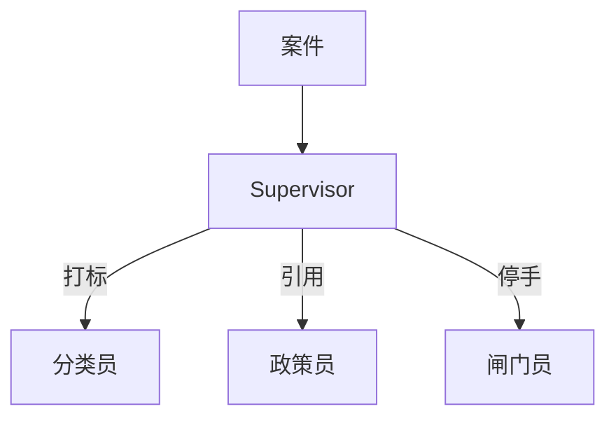
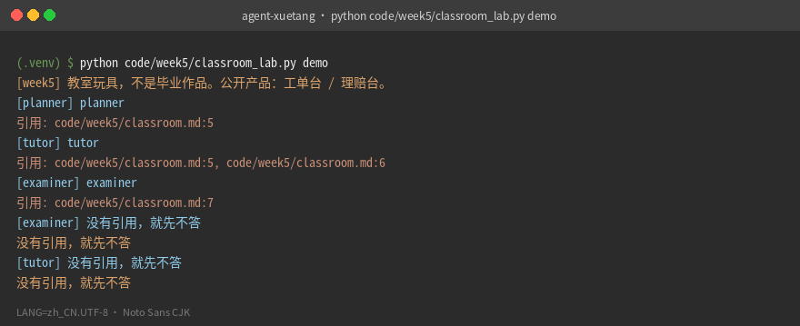
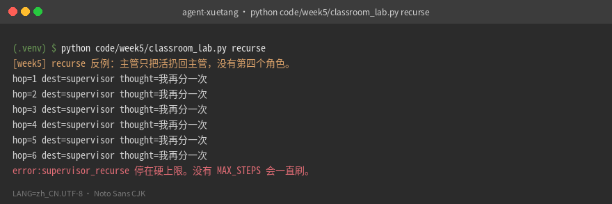

# 第 5 周 · 多个角色，以及何时不要加角色

> **本班属于 1 个月路径的第 2 周**（后半，约 day 5–7）。同周前半是 [03](03-memory-rag.md)、[04](04-mcp-and-skills.md)。

到第 4 周，你已经有一个循环、两只手、一份长记忆、一个对外的小服务器。
有人会说：下一步当然是「上多智能体」。

先泼冷水。多一个角色，就是多一次完整的提示、多一轮等待、多一个会说错话的出口。
本周的上半场用来建立三种结构；下半场跑一份**可选教室实验**。问学堂 / 值班台已降级，不是毕业作品。

工单台三个角色是 **分类员 / 政策员 / 闸门员**。理赔台是 **质检 / 条款 / 核赔**。不是五人教育网。

## 本周你要带走什么

- [ ] 三种结构各有一个你自己的生活例子。
- [ ] `python code/week5/classroom_lab.py demo` 退出码 0，输出里有引用或红条。
- [ ] 你跑过 `recurse`，看见主管把自己当下一跳。
- [ ] 你能说出 v1 不加第四个角色的理由，且理由包含费用或失败面（六句）。
- [ ] 路由图画在纸上，留给第 8 周作品集。

## 目标

- 分清主管（supervisor）、交接（handoff）、辩论（debate）。
- 能用**本机 demo 的真实数字**解释「为什么两个角色够了」。
- 给工单台选定三个角色和一条路由规则。
- 仍然用字典状态机，不强制 LangGraph。

## 先修 / 预计时间 / 对应视频

**先修。** 第 1–4 周循环和引用。本周教室玩具不打网。

本班约 3 小时（周末一块）。读三种结构 1 小时；算一笔「多一次交接」的账 0.5 小时；跑教室实验 1 小时。框架课放到晚上。同周三班合计约 8–10 小时。

**对应视频：** [docs/videos.md](../videos.md)「第 5–7 周」

- 李宏毅 2026 Multi-Agent：https://www.bilibili.com/video/BV1Sdw7zREka/
- Intro to LangGraph：https://academy.langchain.com/courses/intro-to-langgraph
- LangGraph 实战向（晚上）：https://www.bilibili.com/video/BV13roYBXELs/

框架课放到晚上。白天先用本仓库 demo。

## 概念：定义 + 一个反例

**定义。** 本仓「多角色」= 出口分开、共用案件对象。主管只分流。理赔台是交接：质检做完把结构交给条款员，不再回头互聊。

**反例。** 把三个角色做成三个相同提示，只改名字——一个人戴三顶帽子，账单按三个人收。下面有串台实录。五人 Mesh、苏格拉底导师、BKT 是别人的产品，本周不写进作业。

## 图文步骤

### 主管（工单台）



优点：入口唯一，日志好读。
缺点：主管自己也会分错。分错的修复是改路由规则或加评测，不是再加一个「超级主管」。

### 交接（理赔台）


质检的结论是缺件清单，不是给用户看的散文。

### 辩论

两个角色互相挑错，第三个角色（或规则）投票。
适合高风险指令。不适合给物流延误写催件草稿。

### 工单台为什么是三个角色

| 角色 | 只做 | 不做 |
| --- | --- | --- |
| 分类员 | 类型 + 紧急度，引用相似夹具 | 不改订单 |
| 政策员 | 检索生效中的售后政策 | 零命中还写补偿 |
| 闸门员 | 停在人：超 ¥200、夜间无人、危险正文 | 不打款 |

第四个「情绪安抚」不在 v1。语气用模板。

## 本机实录 · 教室玩具

```bash
python code/week5/classroom_lab.py demo
```

```text
[week5] 教室玩具，不是毕业作品。公开产品：工单台 / 理赔台。
[planner] planner
引用: code/week5/classroom.md:5
[tutor] tutor
引用: code/week5/classroom.md:5, code/week5/classroom.md:6
[examiner] examiner
引用: code/week5/classroom.md:7
[examiner] 没有引用，就先不答
没有引用，就先不答
[tutor] 没有引用，就先不答
没有引用，就先不答
```



你应当看见：先打 `[week5] 教室玩具…`，再出现 `引用: code/week5/classroom.md:…` 或「没有引用，就先不答」。

[`route`](../../code/week5/classroom_lab.py) 第 19–25 行：考 / 计划 / 其余进导师。空答和 FlipFlop 拒。这不是毕业作品，说明见 [labs/week5/README.md](../../labs/week5/README.md)。

### 真实 demo 数字（填进费用表）

本机抽取式，无 Key，墙钟用 `time` 量过：

| 动作 | 墙钟 | 体量 | 云端 token |
| --- | --- | --- | --- |
| `classroom_lab.py demo` | **102 ms** | stdout **264 B** | **0**（没打网） |
| 便签 `classroom.md` | — | **127 字**（汉字 91） | 0 |
| `ticketdesk demo` 14 夹具 | **407 ms** | stdout **13 KB** | **0** |
| `claimdesk demo` | **243 ms** | stdout **12 KB** | **0** |

结论用句子写：**先问一个循环是不是做不完，再问第二个角色负责哪一种失败。** 不要抄别人的 85%。若你开 Key 把便签当 system，输入大约就是这 127 字量级——先用本机字数，再看账单页。

示意对照（把「一次调用 2s / 0.01 元」换成你自己的账单，下表只帮你数次数）：

| 结构 | 最少调用次数 | 用本机 demo 墙钟外推 |
| --- | --- | --- |
| 单循环 + 检索 | 1 | ≈ 教室一次 handle |
| 主管 + 一个专家 | 2 | 约 2×，不是 2 倍智能 |
| 主管 + 三专家串行 | 4 | 工单台 v1 的形状 |
| 两专家辩论 + 裁判 | 3+ | 催件草稿不配付这份 |



你应当看见：`recurse` 连续 6 次 `dest=supervisor thought=我再分一次`，最后 `error:supervisor_recurse`。

## 失败对照 · 主管递归

提示里写「你可以再调用自己」：

```text
$ python code/week5/classroom_lab.py recurse
[week5] recurse 反例：主管只把活扔回主管，没有第四个角色。
hop=1 dest=supervisor thought=我再分一次
hop=2 dest=supervisor thought=我再分一次
hop=3 dest=supervisor thought=我再分一次
hop=4 dest=supervisor thought=我再分一次
hop=5 dest=supervisor thought=我再分一次
hop=6 dest=supervisor thought=我再分一次
error:supervisor_recurse 停在硬上限。没有 MAX_STEPS 会一直刷。
```

退出码 1。[`recurse_supervisor`](../../code/week5/classroom_lab.py)。工单台主管**不会**把自己当下一跳：[`supervisor.py:43-46`](../../projects/ticketdesk/src/ticketdesk/agents/supervisor.py) 写死分类 → 政策 → 闸门。

## 串台实录 · 三角色同一份提示

反例：三个角色系统提示只改名字。下面是手工串的台本，用的是工单台真实夹具 `refund-over-200`（¥486），不是五人网。

```text
[classifier] 系统提示=「你是客服，尽量帮顾客解决问题」
             出口=「好的，486 我帮你退」          ← 越权，分类员不该碰钱
[policy]     系统提示=「你是客服，尽量帮顾客解决问题」
             出口=「好的，486 我帮你退」          ← 没芯片，同一句话
[gate]       系统提示=「你是客服，尽量帮顾客解决问题」
             出口=「好的，486 我帮你退」          ← 闸门失职
```

本仓真实出口（同一夹具，本机 demo）：

```text
[classifier] 退款 · 高  labels=['退款', 'P1', '高']
[policy]     政策摘录
引用: docs/policy/refund-and-risk.md:10, ...
[gate]       退款超 ¥200 · 只许草稿  verdict=refuse_exec
红条: 闸门员拒绝执行。人复核后再点执行。
executed=False
payment.status=confirm_required
```

三个出口必须能在日志里分开。相同提示 = 一个人戴三顶帽子。

## 「何时不加角色」六句（先自己写，再对答案）

对着工单台，用六句话回答「要不要加情绪安抚 Agent」。希望听到在 [answers/05.md](answers/05.md)，必须点到延迟、费用、失败面里至少两项。面试题 D 同源。

## 练习

1. 写四条工单原话，标你会交给哪个角色。其中一条必须是「退款 486 元」。
2. 用上面真实数字表，写「先引再用闸门」和「只闸门」的输入差。不必精确到分。
3. 反对题：给工单台加「情绪安抚 Agent」。写六句。
4. 跑 `recurse`，把 hop=6 抄进笔记。
5. 把串台台本和真实 `refund-over-200` stdout 并排贴进笔记。

## 本周词汇表

| 词 | 一句话 |
| --- | --- |
| 主管 | 只分流，不互叫 |
| 交接 | A 做完整包交给 B |
| 串台 | 三个出口同一句话 |
| 递归主管 | 无限循环的亲戚 |

[工单三角色](../cheatsheets/ticketdesk-roles.md) · [理赔禁止项](../cheatsheets/claimdesk-roles.md)

## 面试追问

「为什么工单台要多个角色，却只要一个主管？」

希望听到：指 [`supervisor.py:43`](../../projects/ticketdesk/src/ticketdesk/agents/supervisor.py)。分类失败面是打错标，政策是没引用，闸门是误打款。不要讲 Mesh。被问 LangGraph：去向固定，图框架的收益盖不过「学员还没见过自己的循环」。

## 常见坑

- 三个角色同一份提示。
- 主管提示里写「你可以再调用自己」。
- 看完 B 站把别人的图框架贴进工单台。v1 不允许硬依赖。

## 延伸阅读

- Deep Agents（子 Agent、HITL）：https://academy.langchain.com/courses/foundation-introduction-to-deepagents
- 吴恩达 Agentic AI：https://www.deeplearning.ai/courses/agentic-ai
- HF unit2：https://huggingface.co/learn/agents-course/unit2/introduction
- hello-agents 多智能体章（勿抄，勿搬五人网）：https://github.com/datawhalechina/hello-agents
- 下一班（日历第 3 周前半）：[对着助手搭最小工单台](vibe.md)
- 第 3 周后半：[工单台收完](06-ticketdesk.md)
