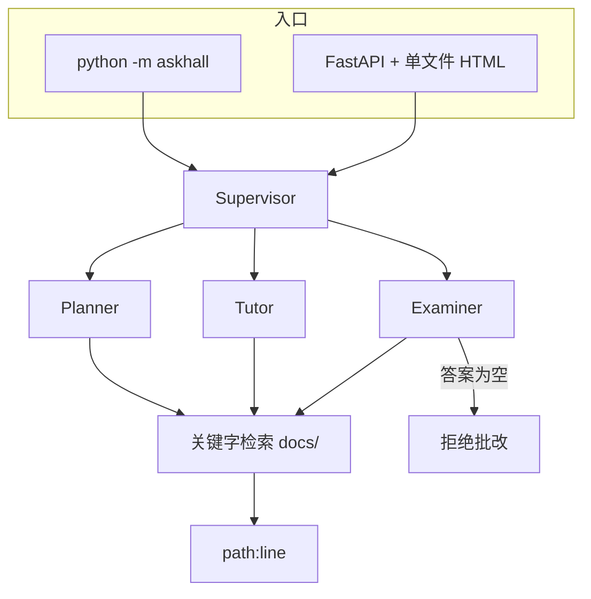

# 第 6 周 · 收完问学堂

这周没有新理论。你要把问学堂从「能 demo」收到「别人能打开浏览器用」。

产品定义在 [projects/askhall/README.md](../../projects/askhall/README.md)。
本页是学徒视角的 0 到 1，怕你打开项目目录时不知道先看哪个文件。

## 目标

- 按 README 的顺序，从 clone 到 `serve`，中间每一步都自己敲。
- 看懂主管如何分流，以及抽取式在没有 Key 时如何仍然给引用。
- 跑项目测试：路由、引用存在、考试官拒绝空答案。
- （可选）用 Docker 再走一遍，为第 8 周热身。

## 你将做出的东西

一台跑在 localhost 的深色中文页面，以及一段你可以录给作品集的演示。

```
+-----------------------------------------------+
| 问学堂 AskHall                      抽取式模式 |
|-----------------------------------------------|
| 学员: 第几周会写 MCP?                         |
|                                               |
| planner                                       |
|  1. 读第 4 周目标                             |
|  2. 对照第 5 周「要不要加角色」               |
|  3. 用考试官出一道工具/协议辨析题             |
|  引用 docs/weeks/04-mcp-and-skills.md:1       |
|                                               |
|  [_] 继续问...                     [发送]     |
+-----------------------------------------------+
```

实际跑出来的界面：


## 预计 4–6 小时

跟 README 走 2 小时；读 `supervisor` / `rag` 1.5 小时；跑测试和故意写空答案 1 小时；截图 0.5–1 小时。

## 图文步骤



### 0. 安装

在仓库根目录（你应该已经在 venv 里）：

```bash
python -m pip install -e projects/askhall
cp projects/askhall/.env.example .env   # 若根目录还没有
```

问学堂会向上寻找带 `docs/weeks/` 的目录。不要把包拷到别处再抱怨找不到教材。

### 1. 离线 demo

```bash
python -m askhall demo
```

验收眼睛：

- 打印了本次路由到谁。
- 至少一条引用能用编辑器打开。
- 考试官对空字符串说「拒绝」，而不是 100 分。

### 2. 浏览器

```bash
python -m askhall serve
```

打开 http://127.0.0.1:8000 。页面是单文件 HTML，深色，中文。
先问：「短记忆和长记忆有什么不同？」再点「考我」。

没有 Key 时，讲解应是教材摘录，不是通顺的长作文。通顺但无引用，是失败。

### 3. 读代码的顺序

1. `askhall/rag.py` —— 你在第 3 周写过的东西的产品版。
2. `askhall/agents/supervisor.py` —— 关键字 + 明确去向，不是神秘的「智能路由」。
3. `askhall/agents/examiner.py` —— 空答案分支。把它当产品功能，不当角落。
4. `askhall/web.py` 和 `static/index.html` —— 路由结果如何变成颜色块。

可选文件 `askhall/langgraph_extra.py` 只有在它仍然很短时才存在，用来对照，不作为安装硬依赖。

### 4. 测试

```bash
python -m pytest projects/askhall/tests -q
```

三条必须绿的承诺：

| 测试 | 失败时意味着 |
| --- | --- |
| 路由 | 「考我」没有进 examiner |
| 引用存在 | 编造了磁盘上没有的路径 |
| 空答拒绝 | 考试官在讨好用户 |

### 5. Docker（能做就做）

```bash
cd projects/askhall
docker compose up --build
```

浏览器同样走 `:8000`。这是第 8 周「我会交付」的预习。

## 对应视频

本周以自己的产品为主。需要对照框架时再看：

- Intro to LangGraph：https://academy.langchain.com/courses/intro-to-langgraph
- Deep Agents：https://academy.langchain.com/courses/foundation-introduction-to-deepagents
- LangGraph 入门到实战（实战向）：https://www.bilibili.com/video/BV1EGc7zwEkR/

完整列表：[docs/videos.md](../videos.md)

## 练习

1. 问一个教材里**没有**的问题，例如某家公司内部工具名。系统应检索空或明确说没找到，而不是编一周课。
2. 把 `docs/weeks/03-memory-rag.md` 暂时改名（复制到桌面再删），跑检索测试，看失败是否可读；做完改回去。
3. 给作品集截一张带引用芯片的图。打码你的傻问题可以，打码引用不行。

## 验收标准

- [ ] `python -m askhall demo` 无 Key 成功。
- [ ] 浏览器能完成「提问 → 看到角色名 → 看到引用」。
- [ ] `pytest projects/askhall/tests` 绿。
- [ ] 你能用两分钟向同学讲：Key 为空时数据从哪来。

## 常见坑

- 在项目目录里再 `git init` 一份，教材路径指到空仓库。
- 把 LangChain 加进 `pyproject.toml` 的主依赖。PR 不会被这个课接受。
- 页面能开，但接口 500：看终端，多半是 `ASKHALL_DOCS` 指错。

## 延伸阅读

- 问学堂 README： [projects/askhall/README.md](../../projects/askhall/README.md)
- CiteKit（可选，引用风格）：https://github.com/SabreKeyZ/citekit
- 下一周：[开源值班台](07-issueforge.md)
