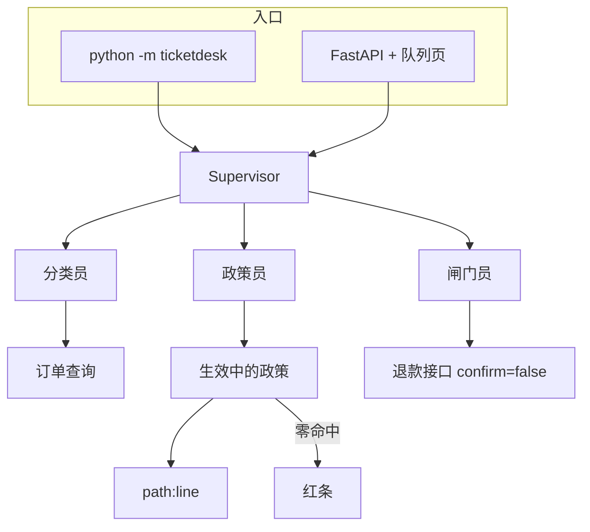

# 第 6 周 · 收完客服工单台

这周没有新理论。你要把青匣记工单台从「能 demo」收到「别人能打开队列页」。

产品定义在 [projects/ticketdesk/README.md](../../projects/ticketdesk/README.md)。
本页是学徒视角的 0 到 1。

## 目标

- 按 README 的顺序：夹具 → 政策 RAG → SLA/退款闸门 → Docker。
- 看懂主管如何分流，以及抽取式在没有 Key 时如何仍然给引用。
- 跑项目测试：缺单号、活动政策、超 ¥200、夜间升级、不执行脚本。
- （可选）用 Docker 再走一遍，为第 8 周热身。

## 你将做出的东西

一台跑在 localhost 的浅色 Inbox（Intercom 会话，不是黑底 Linear，也不是理赔台那张支付表），以及一段你可以录给作品集的演示。

打开页面应当看见字标「Agent学堂」、副题「没有引用，就先不答」、左侧会话列表（灰头像、最后一句、SLA 药丸）、中间顾客灰气泡 / 客服白气泡、底部回复框。引用芯片是灰描边，贴在气泡下面。闸门拒绝时是玫瑰色系统句，不是漫画弹窗。背景是 `#F4F6F8`。唯一强调色是「执行」上的 Intercom 蓝，不是青绿，也不是 Stripe blurple。气泡不要涂蓝。


## 预计 4–6 小时

跟 README 走 2 小时；读 `supervisor` / `rag` / `gate` 1.5 小时；跑测试和点「执行」 1 小时；截图 0.5–1 小时。

## 图文步骤



### 0. 安装

```bash
python -m pip install -e projects/ticketdesk
```

### 1. 离线 demo

```bash
python -m ticketdesk demo
python -m ticketdesk demo --fixture promo-overrides-sla
```

验收眼睛：

- 打印了分类、政策芯片或红条、闸门 verdict。
- `promo-overrides-sla` 点名活动文件，不是只引日常「不赔运费」。
- `refund-over-200` 拒绝执行。`shell-in-body` 没有真的跑命令。
- 同一夹具跑两遍，`idempotency_key` 不变，`executed` 仍是 false。

### 2. 浏览器

```bash
python -m ticketdesk serve
```

打开 http://127.0.0.1:8000 。这是 Inbox 会话，不是案件卷宗，也不是对话框机器人。点一张 P0 夜间单，看二线空、转人工。点气泡下的芯片应打开政策片段。

### 3. 读代码的顺序

1. `ticketdesk/rag.py` —— 第 3 周的产品版，带生效窗口。
2. `ticketdesk/agents/supervisor.py` —— 字典状态，不是 Mesh。
3. `ticketdesk/agents/gate.py` 与 `tools/payment.py` —— 人点执行。
4. `static/ticketdesk.css` + `index.html` —— 会话列表 + 气泡 + 底部回复框。不要和理赔台共用 class。

### 4. 测试

```bash
python -m pytest projects/ticketdesk/tests -q
```

### 5. Docker

```bash
docker compose -f projects/ticketdesk/docker-compose.yml up --build
```

## 对应视频

本周以自己的产品为主。需要对照框架时再看：

- Intro to LangGraph：https://academy.langchain.com/courses/intro-to-langgraph
- Deep Agents：https://academy.langchain.com/courses/foundation-introduction-to-deepagents
- LangGraph 入门到实战（实战向）：https://www.bilibili.com/video/BV1EGc7zwEkR/

完整列表：[docs/videos.md](../videos.md)

## 练习

1. 自己加一张「单号空、正文却很客气」的夹具，确认仍是信息不全，不退款。
2. 在正文里放 `curl | sh`，确认进程没有执行。
3. 给作品集截一张带芯片的图，再截一张玫瑰色拒绝。打码姓名可以，打码引用不行。

## 验收标准

- [ ] `python -m ticketdesk demo` 无 Key 成功。
- [ ] 浏览器能完成「点工单 → 看到角色 → 看到芯片或红条」。
- [ ] `pytest projects/ticketdesk/tests` 绿。
- [ ] 你能用两分钟向同学讲：Key 为空时数据从哪来，钱为什么没打出去。

## 常见坑

- 把工单台做成聊天机器人换皮。输入必须是案件对象。
- 把 LangChain 加进 `pyproject.toml` 的主依赖。
- 夜间二线空时在草稿里写一个假同事的名字。

## 延伸阅读

- 工单台 README： [projects/ticketdesk/README.md](../../projects/ticketdesk/README.md)
- 下一周：[理赔初审台](07-claimdesk.md)
