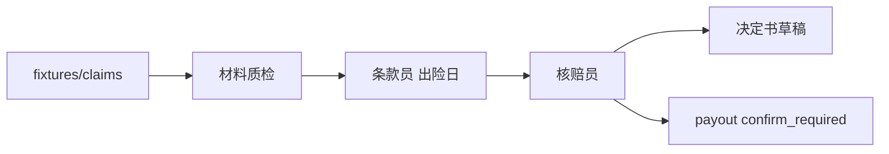
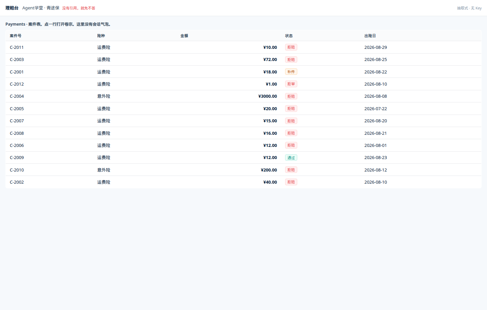
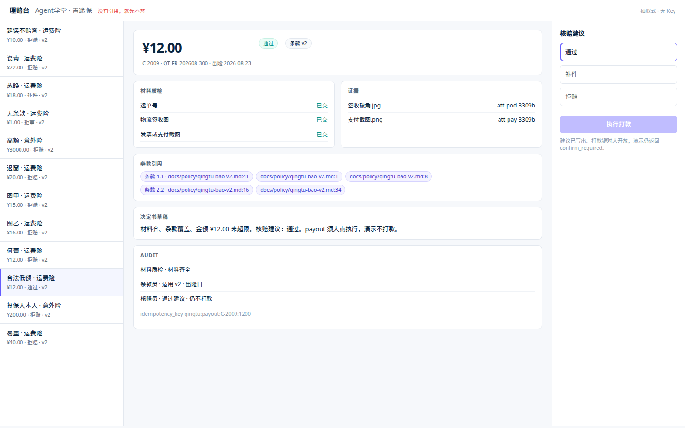
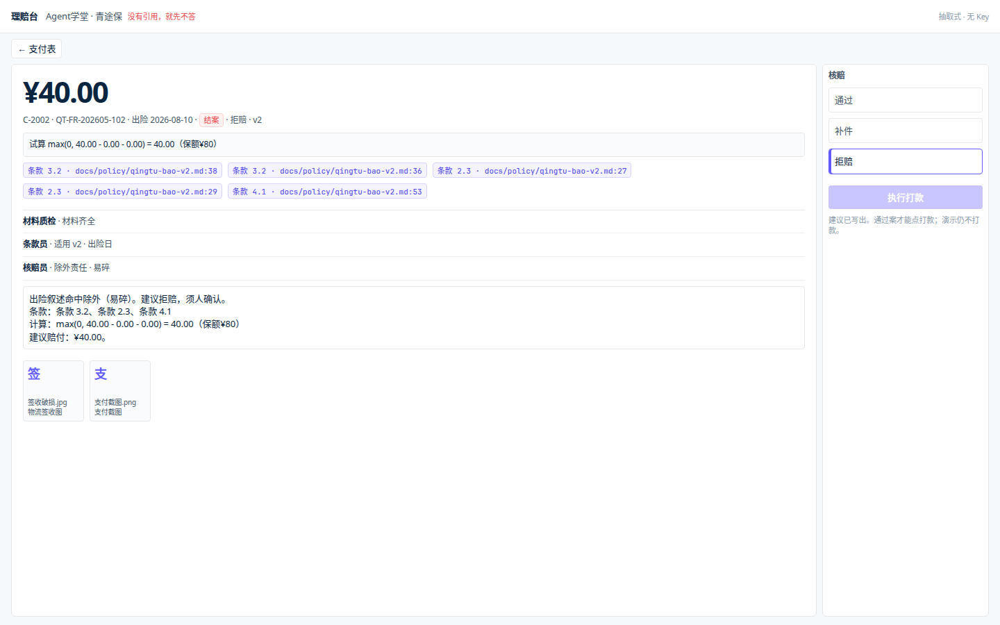

# 第 7 周 · 理赔初审台

第二个产品面对的不是售后闲聊，是一份案件。
你要练习的是：**在不触发打款的前提下**，做材料质检、引用正确版本条款、写出决定书草稿。

项目说明：[projects/claimdesk/README.md](../../projects/claimdesk/README.md)。本页比第 6 周短，但实录和失败对照必须跑完。

## 本周你要带走什么

- [ ] `python -m claimdesk demo` 对夹具退出码 0。
- [ ] `wrong-policy-version` 引用 v2、不引用 v1；`no-clause` 红条；`valid-low` 建议通过且 `executed=false`。
- [ ] 新夹具对照过：免赔试算、店铺部分退差额、复议（有 8.1 也不默示通过）。
- [ ] 你能指出「按出险日滤版本」的 path:line。
- [ ] 你能说出决定书几个字段，以及 `confirm=True` 会挂哪条 pytest。
- [ ] `pytest projects/claimdesk/tests` 绿。

## 目标

- 跑通 demo，并打开支付表 / 卷宗。
- 分清三个角色各自允许写什么。
- 写清「为什么按出险日而不是投保日」。
- 知道 payout 接口为什么存在，以及演示为什么永远 `confirm_required`。

## 先修 / 预计时间 / 对应视频

**先修。** 第 6 周 Inbox 和闸门。本周画面是 Payments 表，不要画成气泡。

跑夹具 1 小时；读三份角色代码 2 小时；自己加一条夹具 1 小时；截图 1 小时。

**对应视频：** 多智能体结构回看第 5 周课表。没有「理赔台官方视频」。

- Deep Agents：https://academy.langchain.com/courses/foundation-introduction-to-deepagents
- 实战向：https://www.bilibili.com/video/BV13roYBXELs/

[docs/videos.md](../videos.md)

## 概念：定义 + 一个反例

**定义。** 理赔台按出险日检索条款版本；缺件只出清单；无条款命中亮红条；核赔员只出建议。

**反例。** 5 月投保、8 月墨水瓶碎，用投保日 v1「可赔 50%」放行——那是用错版本。聊天式「我帮你赔了」且 `executed=true`，不是本课。

## 图文步骤



```
出险日 >= 2026-07-01 → v2（易碎除外，窗口 15 日）
出险日 <  2026-07-01 → v1（易碎可赔 50%，窗口 7 日）
投保日不参与这行。
```

| 角色 | 输入 | 输出 | 禁止 |
| --- | --- | --- | --- |
| 材料质检 | 应交清单 vs 附件 | 缺件勾选 | 缺件还审结 |
| 条款员 | 出险日 + 叙述 | `条款 3.2 · path:line` | 用投保日版本 |
| 核赔员 | 前两步结构 | 通过 / 补件 / 拒赔 / 差额 / 复议 + 试算 | 调用成功 payout |







```bash
python -m pip install -e projects/claimdesk
ls projects/claimdesk/fixtures/claims
```

## 本机实录三张

### 1. `wrong-policy-version` · 必须引 v2 不引 v1

夹具：易墨，投保 2026-05-12（v1 窗口），出险 2026-08-10，叙述要求「按投保日赔」。

```bash
python -m claimdesk demo --fixture wrong-policy-version
```

```text
===== C-2002  wrong-policy-version  ¥40.0 =====
[docs] 材料齐全 missing=[]
[clause] 适用 v2 · 出险日
引用: 条款 3.2 · docs/policy/qingtu-bao-v2.md:36, 条款 2.3 · docs/policy/qingtu-bao-v2.md:27, docs/policy/qingtu-bao-v2.md:38, 条款 4.1 · docs/policy/qingtu-bao-v2.md:53, docs/policy/qingtu-bao-v2.md:1
[adjudicator] 拒赔  除外责任 · 易碎
状态: 结案
试算: max(0, 40.00 - 0.00 - 0.00) = 40.00（保额¥80）
决定书: 出险叙述命中除外（易碎）。建议拒赔，须人确认。
条款：条款 3.2、条款 2.3、条款 4.1
计算：max(0, 40.00 - 0.00 - 0.00) = 40.00（保额¥80）
建议赔付：¥40.00。
idempotency_key=qingtu:payout:C-2002:4000 executed=False
```

芯片里**没有** `qingtu-bao-v1.md`。测试：[`test_incident_date_uses_v2_not_v1`](../../projects/claimdesk/tests/test_clauses.py)。

### 2. `no-clause` · 红条

叙述里塞「比特币 / FlipFlopZetaQueue」，条款员主动清空 hits。

```bash
python -m claimdesk demo --fixture no-clause
```

```text
===== C-2012  no-clause  ¥1.0 =====
[docs] 材料齐全 missing=[]
[clause] 没有引用，就先不答
没有引用，就先不答
[adjudicator] 拒审  没有引用，就先不答
状态: 结案
红条: 没有引用，就先不答
idempotency_key=qingtu:payout:C-2012:100 executed=False
```

[`clause.py:12`](../../projects/claimdesk/src/claimdesk/agents/clause.py)。卷宗右侧核赔键应锁定。对照 [claimdesk-refuse.png](../images/claimdesk-refuse.png)。

### 3. `valid-low` · 通过建议仍不打款

```bash
python -m claimdesk demo --fixture valid-low
```

```text
===== C-2009  valid-low  ¥12.0 =====
[docs] 材料齐全 missing=[]
[clause] 适用 v2 · 出险日
引用: 条款 2.3 · docs/policy/qingtu-bao-v2.md:27, 条款 4.1 · docs/policy/qingtu-bao-v2.md:53, ...
[adjudicator] 通过  通过建议 · 仍不打款
状态: 待人打款
试算: max(0, 12.00 - 0.00 - 0.00) = 12.00（保额¥80）
决定书: 材料齐、条款覆盖、金额 ¥12.00 未超限。免赔 ¥0.00。核赔建议：通过。payout 须人点执行，演示不打款。
条款：条款 2.3、条款 4.1、条款 2.2
计算：max(0, 12.00 - 0.00 - 0.00) = 12.00（保额¥80）
建议赔付：¥12.00。
idempotency_key=qingtu:payout:C-2009:1200 executed=False
```

`executed=False` 不是漏写，是纪律。

扫一眼即可：`missing-docs` 补件清单；`shop-already-refunded` 足额退仍拒（试算冲减至 0）；`shared-photo-b` 重复图 `sha256-scene-77ab`。

token = 0。墙钟以你机器为准。

## 夹具实录 · 初审缺口

### 4. `accident-deductible` · 免赔试算

```bash
python -m claimdesk demo --fixture accident-deductible
```

```text
===== C-2111  accident-deductible  ¥80.0 =====
[docs] 材料齐全 missing=[]
[clause] 适用 v2 · 出险日
引用: 条款 2.3 · docs/policy/qingtu-bao-v2.md:27, ...
[adjudicator] 通过  通过建议 · 仍不打款
状态: 待人打款
试算: max(0, 80.00 - 50.00 - 0.00) = 30.00（保额¥500）
决定书: …免赔 ¥50.00。核赔建议：通过。
条款：条款 2.3、条款 4.1
计算：max(0, 80.00 - 50.00 - 0.00) = 30.00（保额¥500）
建议赔付：¥30.00。
idempotency_key=qingtu:payout:C-2111:3000 executed=False
```

**芯片必须含条款 2.3。** 公式在 [`settle.py:10`](../../projects/claimdesk/src/claimdesk/settle.py)。支付表巨型 ¥ 显示建议赔付，下面有 `cd-math` 试算。

### 5. `shop-partial-offset` · 部分退不是整单拒

店铺退 ¥8、申请 ¥20 → 差额 ¥12，状态「待人打款」，仍不打款。对照 `shop-already-refunded`：店铺退 ¥128 ≥ 申请 ¥12，仍拒赔、冲减至 0。

### 6. `appeal-after-deny` · 有复议条款也不默示通过

```text
===== C-2116  appeal-after-deny  ¥22.0 =====
引用: 条款 2.3 · …, 条款 8.1 · docs/policy/qingtu-bao-v2.md:77, …
[adjudicator] 复议  复议受理 · 待核赔
状态: 待核赔
决定书: 已引用复议条款。进入待核赔，不因新证据默示改判通过。须人审。
```

再扫：`reject-unsigned` 芯片 3.4；`signed-damaged` 芯片 3.5；`delay-only` 仍除外；`supplement-returned` 补件回传入「待人打款」；`photo-signed-track-unsigned` 轨迹 `in_transit` → 补件，不通过。

## 出险日 vs 投保日（path:line）

| 代码 | 做什么 |
| --- | --- |
| [`clause.py:45-47`](../../projects/claimdesk/src/claimdesk/agents/clause.py) | `_expected_version`：`incident_at[:10] >= 2026-07-01` → v2 |
| [`clause.py:15`](../../projects/claimdesk/src/claimdesk/agents/clause.py) | `retrieve(query, at=claim.incident_at)` |
| [`rag.py:108-117`](../../projects/claimdesk/src/claimdesk/rag.py) | `_in_force` 用出险日滤生效/失效 |
| [`clause.py:16-18`](../../projects/claimdesk/src/claimdesk/agents/clause.py) | 再钉一次，丢掉 `version != expected` |
| v2 条款 0.2 [`qingtu-bao-v2.md:10`](../../projects/claimdesk/docs/policy/qingtu-bao-v2.md) | 适用出险当日，投保日不得主张 v1 易碎赔付 |
| v2 条款 2.3 [`qingtu-bao-v2.md:27`](../../projects/claimdesk/docs/policy/qingtu-bao-v2.md) | 免赔：运费 0 / 意外 50 |

投保日字段 `insured_at` 在夹具里存在，**检索函数不读它**。

## 决定书草稿字段

核赔员返回值 [`adjudicator.py:92-109`](../../projects/claimdesk/src/claimdesk/agents/adjudicator.py)：

| 字段 | 含义 | `valid-low` | `no-clause` |
| --- | --- | --- | --- |
| `recommendation` | 通过 / 补件 / 拒赔 / 拒审 | 通过 | 拒审 |
| `title` | 一行结论 | 通过建议 · 仍不打款 | 没有引用，就先不答 |
| `decision_letter` | 给人看的草稿，须带条款号+计算式 | 材料齐…建议赔付 ¥12 | （空，红条优先） |
| `case_status` | 状态机 | 待人打款 | 结案 |
| `settlement.formula` | 免赔试算 | max(0, 12-0-0)=12 | 有数但不审 |
| `next_action` | 下一步 | `wait_human_confirm` | `refuse` |
| `banner` | 红条 | 空 | 没有引用，就先不答 |
| `idempotency_key` | `qingtu:payout:{id}:{分}` | `…C-2009:1200` | `…C-2012:100` |
| `payout.status` | 探测 | `confirm_required` | 同左 |
| `executed` | 是否打款 | `False` | `False` |

CLI 把 `decision_letter` 印成「决定书:」。

## 失败对照 · `confirm=True` 会挂哪条

有人把核赔员改成 `payout(..., confirm=True)` 并指望 `executed=True`。

即使传入 `confirm=True`，[`payment.py:8`](../../projects/claimdesk/src/claimdesk/tools/payment.py) 仍因 `NEVER_PAYOUT` / `DEMO_FORBIDS_CONFIRM` 返回 `confirm_required`。

若你再改掉这两面旗、让 `executed=True`：

**会挂** [`test_valid_low_recommend_pass_no_payout`](../../projects/claimdesk/tests/test_decision.py)（断言 `executed is False` 且 `payout.status == confirm_required`）。  
`set8` 的 `cd-7`（`executed_must_be_false`）也会红。  
人点打款：[`web.py:63`](../../projects/claimdesk/src/claimdesk/web.py) 仍写 `executed=False`。

v1 禁止为了「自动赔付」去把 `confirm=True` 写进核赔员。

## 浏览器

```bash
python -m claimdesk serve
```

http://127.0.0.1:8001 。先支付表（案件号 / 险种 / ¥ / 状态机 / 出险日），再点进卷宗。巨型金额（建议赔付）、试算式、条款标签、核赔三键在无芯片时是灰的。强调色 blurple，不是 Inbox 蓝。状态机：已报案 → 立案 → 补件中 → 待核赔 → 待人打款 / 结案。

```bash
python -m pytest projects/claimdesk/tests -q
python -m claimdesk eval --set projects/claimdesk/evals/set8.json
```

set8 仍是 8 行闸门评测；新夹具由 `pytest projects/claimdesk/tests` 钉死。Docker：`docker compose -f projects/claimdesk/docker-compose.yml up --build`

## 练习

1. 新增夹具：出险日在 v1 窗口，确认检索不到 v2 除外。
2. 把同一 `file_id` 贴进第三起案件，测试是否仍升级人工。
3. 把决定书里的「通过」改成直接打款函数调用，看 `test_valid_low_recommend_pass_no_payout` 是否失败。
4. 对照 `wrong-policy-version` 的引用列表，用笔划掉任何带 `v1` 的路径（应当没有）。
5. 打开卷宗截一张条款芯片、一张红条。打码姓名，留下 `条款 3.2`。

## 本周词汇表

| 词 | 一句话 |
| --- | --- |
| 出险日 | 检索 `at=` 的那天 |
| 条款版本 | v1 / v2，不是投保日印象 |
| 拒审 | 无芯片，不给建议 |
| 决定书 | `decision_letter`，须条款号 + 计算式 |
| 免赔试算 | `max(0, 申请 - 免赔 - 冲减)`，运费 0 / 意外 50 |
| 状态机 | 补件中 / 待核赔 / 待人打款 / 结案 |

[禁止项纸](../cheatsheets/claimdesk-roles.md)

## 面试追问

「上线第二天用投保日 v1 给 8 月易碎案写了可赔 50%，哪一层本该拦住？」

希望听到：[`clause.py:45`](../../projects/claimdesk/src/claimdesk/agents/clause.py) `_expected_version`、[`rag.py:108`](../../projects/claimdesk/src/claimdesk/rag.py) `_in_force`、核赔员不得在无正确版本时通过。评测加一行「不得引用失效条款」。不要只处分提示词。

## 常见坑

- 核赔员里写 `confirm=True`。
- 用投保日版本让易碎案通过。
- 把工单台售后政策硬塞进理赔检索。

## 延伸阅读

- 理赔台 README：[projects/claimdesk/README.md](../../projects/claimdesk/README.md)
- 面试题：[docs/jobs/interview.md](../jobs/interview.md)
- 吴恩达 Agentic AI：https://www.deeplearning.ai/courses/agentic-ai
- HF bonus 观测：https://huggingface.co/learn/agents-course/bonus-unit2/introduction
- hello-agents（勿搬）：https://github.com/datawhalechina/hello-agents
- 下一周：[上线与求职](08-ship-and-job.md)
