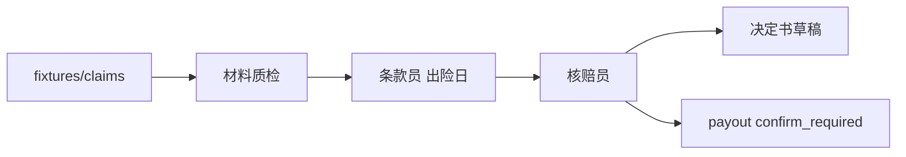

# 第 7 周 · 理赔初审台

第二个产品面对的不是售后闲聊，是一份案件。
你要练习的是：**在不触发打款的前提下**，做材料质检、引用正确版本条款、写出决定书草稿。

项目说明：[projects/claimdesk/README.md](../../projects/claimdesk/README.md)。

## 目标

- 跑通 `python -m claimdesk demo`，并打开案件页。
- 分清三个角色各自允许写什么。
- 写清「为什么按出险日而不是投保日」。
- 知道 payout 接口为什么存在，以及演示为什么永远 `confirm_required`。

## 你将做出的东西

两屏浅色财务页（Stripe Payments，不是 Inbox）：先是案件表（案件号 / 险种 / ¥ / 状态 / 出险日），点进卷宗后是巨型表格数字金额、金额下的条款标签、时间线、证据缩略图、右侧叠放的核赔键（无芯片则禁用）。圆角 4–6px，字号 13，强调色 blurple。


## 预计 4–6 小时

跑夹具 1 小时；读三份角色代码 2 小时；自己加一条夹具 1 小时；截图 1 小时。

## 图文步骤



### 0. 安装并看夹具

```bash
python -m pip install -e projects/claimdesk
ls projects/claimdesk/fixtures/claims
```

至少八种脏数据：缺件、版本用错、除外、超保额、超窗口、店铺已退、重复现场图、代索赔。另有低额通过建议。

### 1. demo

```bash
python -m claimdesk demo
python -m claimdesk demo --fixture wrong-policy-version
python -m claimdesk demo --fixture no-clause
python -m pytest projects/claimdesk/tests -q
```

你要检查的不是文采，是：

- `wrong-policy-version` 引用 v2，不引用 v1。
- `missing-docs` 只出补件，不审结。
- `no-clause` 红条「没有引用，就先不答」。
- `valid-low` 建议通过，`executed=false`。

### 2. 三个角色

| 角色 | 输入 | 输出 | 禁止 |
| --- | --- | --- | --- |
| 材料质检 | 应交清单 vs 附件 | 缺件勾选 | 缺件还审结 |
| 条款员 | 出险日 + 叙述 | `条款 3.2 · path:line` | 用投保日版本 |
| 核赔员 | 前两步结构 | 通过 / 补件 / 拒赔 | 调用成功 payout |

### 3. 浏览器

```bash
python -m claimdesk serve
```

http://127.0.0.1:8001 。先看见支付表，再点进卷宗。核赔三键在无芯片时是灰的。

### 4. Docker

```bash
docker compose -f projects/claimdesk/docker-compose.yml up --build
```

## 对应视频

多智能体结构回看第 5 周课表。本周没有单独的「理赔台官方视频」。

- Deep Agents（人在回路、子 Agent）：https://academy.langchain.com/courses/foundation-introduction-to-deepagents
- LangGraph 多智能体实战（实战向）：https://www.bilibili.com/video/BV13roYBXELs/

[docs/videos.md](../videos.md)

## 练习

1. 新增夹具：出险日在 v1 窗口，确认检索不到 v2 除外。
2. 把同一 `file_id` 贴进第三起案件，测试是否仍升级人工。
3. 把决定书里的「通过」改成直接打款函数调用，看测试是否失败。

## 验收标准

- [ ] `python -m claimdesk demo` 对夹具退出码 0。
- [ ] `pytest projects/claimdesk/tests` 绿。
- [ ] 你能指出代码里「按出险日滤版本」的位置。
- [ ] 你能向同学解释 payout 为什么默认关。

## 常见坑

- 为了「自动赔付」去把 `confirm=True` 写进核赔员。v1 禁止。
- 用投保日版本让易碎案通过。
- 把工单台的售后政策硬塞进理赔检索。两套产品请保持边界。

## 延伸阅读

- 理赔台 README： [projects/claimdesk/README.md](../../projects/claimdesk/README.md)
- 面试题：[docs/jobs/interview.md](../jobs/interview.md)
- 下一周：[上线与求职](08-ship-and-job.md)
