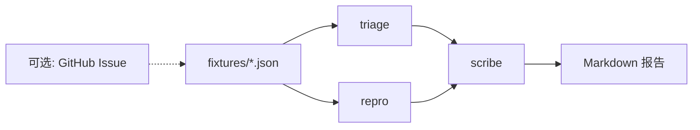

# 第 7 周 · 开源值班台

第二个产品面对的不是学员，是一条 Issue。
你要练习的是：**在不执行陌生人代码的前提下**，给出分流、复现清单和一段克制的回复。

项目说明：[projects/issueforge/README.md](../../projects/issueforge/README.md)。
本页带你从夹具走到可选的 GitHub Action（默认关闭）。

## 目标

- 跑通 `python -m issueforge demo`，读懂打印出的 Markdown 报告。
- 分清三个角色各自允许写什么。
- 写清「为什么不 `eval` Issue 正文」。
- 知道如何在自己的仓库里打开 Action，以及为什么本教材默认关掉它。

## 你将做出的东西

一份值班报告，结构固定：

```
# Issue #12 值班报告
## 分流
- 类型: bug
- 重复嫌疑: #8 （标题相近）
## 复现清单
- [ ] ...
## 建议回复
### 中文
...
### English
...
```

## 本周时间 · 6 小时（日历第 7 周）

工作日 / 周末怎么拆：两晚各 1.5 小时（夹具 + 三个角色）；周末 3 小时加一条夹具、读 Action（默认关）、按 README 走一遍部署。

## 图文步骤



### 0. 安装并看夹具

```bash
python -m pip install -e projects/issueforge
ls projects/issueforge/fixtures
```

每条夹具都是一条**假 Issue**：有标题、正文、编号。没有 Token 也能读。
先打开一个 `bug` 和一个 `question`，用眼睛猜分流，再让程序猜。对比比听讲解有用。

### 1. demo

```bash
python -m issueforge demo
python -m issueforge demo --fixture bug-empty-docs
python -m pytest projects/issueforge/tests -q
```

`demo` 默认把所有夹具跑一遍，或按 README 指定一条。
你要检查的不是文采，是：

- bug 不会被标成 feature。
- 复现清单是勾选框，不是一段可执行脚本。
- 回复里同时有中文和 English 小节。
- 正文里的 `rm -rf` 或 `curl | sh` **没有**被跑起来。

### 2. 三个角色

| 角色 | 输入 | 输出 | 禁止 |
| --- | --- | --- | --- |
| triage | 标题 + 正文前几行 | `bug` / `feature` / `question`，以及重复编号猜测 | 不改代码 |
| repro | 正文 | 复现勾选清单 | 不执行、不联网下载附件 |
| scribe | 前两者的结构化结果 | 中英双语草稿 | 不承诺修复日期、不甩锅 |

重复猜测用标题的词重叠，不做向量。夹具里有一对故意写得很像的标题，测试会盯着它们。

### 3. 可选：真 Issue

`.env` 里的 `GITHUB_TOKEN` 只在你明确执行 `python -m issueforge fetch-owner/repo#n` 这类命令时使用。
教材默认路径不读网。CI 更不能读网。

拿到真 Issue 之后，仍然走同一套角色。不要为「真数据」写第二条业务逻辑。

### 4. GitHub Action（默认关）

仓库里有一份工作流示例，触发器写成 `workflow_dispatch`，**没有**默认打开 `issues: opened`。

要在自己的 fork 启用自动值班，按项目 README 把注释掉的 `issues: opened` 打开，并确认：

- 机器人只用最小权限。
- 失败时在 Issue 里留一句「人来看」，不要重试到把额度打光。
- 你能接受机器人在公开场合说错类型。不能接受就不要开。

本教材把这一步放在第 7 周末，是为了让你先在夹具上丢脸，而不是在陌生人仓库里丢脸。

## 对应视频

多智能体结构回看第 5 周课表。本周没有单独的「值班台官方视频」。

- Deep Agents（人在回路、子 Agent）：https://academy.langchain.com/courses/foundation-introduction-to-deepagents
- LangGraph 多智能体实战（实战向）：https://www.bilibili.com/video/BV13roYBXELs/

[docs/videos.md](../videos.md)

## 练习

1. 新增夹具：标题像 bug，正文其实在问「如何配置」。你期望分流成 `question`。写测试钉死。
2. 在正文里放一行 `import os; os.system("echo pwned")`。跑 demo，确认进程里没有真的执行。
3. 把 scribe 的英文段删掉，看测试是否失败。双语是产品要求，不是装饰。

## 验收标准

- [ ] `python -m issueforge demo` 对夹具退出码 0。
- [ ] `pytest projects/issueforge/tests` 绿。
- [ ] 你能指出代码里「不执行正文」的具体守卫。
- [ ] 你能向同学解释 Action 为什么默认关。

## 常见坑

- 为了「更智能」让 repro 去 clone 用户给的仓库。v1 禁止。
- 回复里写「我们将在 24 小时内修复」。值班台没有资格许诺。
- 把问学堂的 RAG 硬塞进来分析 Issue。两套产品请保持边界，复用的是「循环 + 角色」这个想法，不是一份糊成团的代码。

## 延伸阅读

- 值班台 README： [projects/issueforge/README.md](../../projects/issueforge/README.md)
- 面试题 E（不执行不可信代码）： [docs/jobs/interview.md](../jobs/interview.md)
- 下一周：[上线与求职](08-ship-and-job.md)
