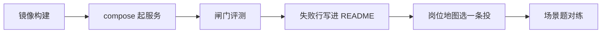

# 第 8 周 · 发出去，并准备一次诚实的谈话

代码能在你的笔记本上跑，不等于别人能收。
这周做四件很土的事：容器、日志、闸门评测、作品集。然后看岗位地图，对着场景题开口。

我们不承诺薪资。能讲清一次取舍，比背齐框架名更接近「可被雇用」。

## 目标

- 用 Docker 把工单台再起一次（理赔台可选）。
- 给循环加上你能回放的结构化日志。
- 跑两台的 `evals/set8.json`，允许其中一行你知道会扎手并写明原因。
- 写出作品集 README，并走完三份求职文档。

## 你将做出的东西

- 一张 `docker compose up` 成功的终端记录（自己留着）。
- 一份准备对外的项目 README（可以就是 ticketdesk / claimdesk，加上你自己的复盘段）。
- 面试题 A、D、E 的口头答案，计时。

## 预计 4–6 小时

Docker 1–2 小时；评测 1 小时；作品集 1.5 小时；对练 1 小时。

## 图文步骤



### 1. Docker

```bash
docker compose -f projects/ticketdesk/docker-compose.yml up --build
```

打开 http://127.0.0.1:8000 ，再点一张超 ¥200 的单。
若你只给一个容器，给工单台——它有队列 UI，审阅者省事。

构建失败先看是不是 `TICKETDESK_ROOT` 指错。镜像里必须看得到 `docs/policy` 和 `fixtures`。

### 2. 日志

第 1 周的字段不要丢：`step`、`thought`、`action`、`observation`，再加 `role`、`citations`、`idempotency_key`。

工单台在 `serve` 时会把每一案打到 stderr（一行 JSON）。
练习：处理一案，把那一行拷进笔记，向同学解释每个键。

### 3. 评测

```bash
python -m ticketdesk eval --set projects/ticketdesk/evals/set8.json
python -m claimdesk eval --set projects/claimdesk/evals/set8.json
```

不要删掉失败行来让分数变满。第 2 周我们就反对过。

### 4. 作品集和岗位

1. [docs/jobs/portfolio.md](../jobs/portfolio.md)
2. [docs/jobs/roles.md](../jobs/roles.md)
3. [docs/jobs/interview.md](../jobs/interview.md) —— A / D / E 各讲一遍。

不要写「精通 Multi-Agent」。写「三个角色、退款闸门、出险日版本」。

### 5. 生产阶段的瘦身版

对照 [kevinten-ai/ai-agent-langgraph](https://github.com/kevinten-ai/ai-agent-langgraph) 的生产意识，本周只收三样：

- 观测：结构化日志能回放一步。
- 评测：闸门夹具，进 CI 更好。
- 容器：别人不用复制你的笔记本路径。

不要在这周突然上 K8s。

## 对应视频

[视频课表 · 第 8 周](../videos.md)

- 吴恩达 Agentic AI：https://www.deeplearning.ai/courses/agentic-ai
- HF Agents Course：https://huggingface.co/learn/agents-course/unit0/introduction

求职话术以 `docs/jobs/` 为准。

## 练习

1. 把工单台的日志拷一行，删掉 `citations` 再看你还能不能做事故复盘。
2. 用面试题 H 的结构，给自己的 demo 写 8 行复盘（可以假设一次「用错条款版本」）。
3. 请同学只看 README 前两屏，计时 15 分钟，问他能不能跑起来。

## 验收标准

- [ ] `docker compose up --build` 能打开工单台，或你在笔记里写明本机无 Docker 以及替代。
- [ ] 两台评测跑得出来。
- [ ] 作品集 README 有「我没有做什么」。
- [ ] 岗位地图里圈了一个方向。
- [ ] 面试题 A、D、E 你能不看稿讲完。

## 常见坑

- 为了作品集加第五个 Agent。
- 把本仓库整份 fork 当作品，却写「我独立完成了 Agent学堂教材」。
- 在 README 写薪资。删掉。

## 延伸阅读

- 岗位 / 作品集 / 面试： [docs/jobs/](../jobs/roles.md)
- CONTRIBUTING： [CONTRIBUTING.md](../../CONTRIBUTING.md)

八周到这里可以停。后面是重复：更干净的日志、更狠的评测、更克制的角色。
