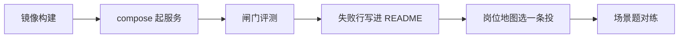

# 第 8 周 · 发出去，并准备一次诚实的谈话

代码能在你的笔记本上跑，不等于别人能收。
这周做四件很土的事：容器、日志、闸门评测、作品集。然后看岗位地图，对着场景题开口。

我们不承诺薪资。能讲清一次取舍，比背齐框架名更接近「可被雇用」。STAR 写引用和闸门，不写 Mesh。

## 本周你要带走什么

- [ ] `docker compose -f projects/ticketdesk/docker-compose.yml up --build` 能打开工单台，或笔记里写明本机无 Docker 以及替代。
- [ ] 两台 `evals/set8.json` 跑得出来；你能指出哪些行该红、为什么留着。
- [ ] 作品集 README 有「我没有做什么」。
- [ ] 岗位地图里圈了一个方向。
- [ ] 面试题 A–H 你能不看稿讲完（提纲在 `docs/jobs/interview.md` 和 [answers/08.md](answers/08.md)）。

## 目标

- 用 Docker 把工单台再起一次（理赔台可选）。
- 给循环加上你能回放的结构化日志。
- 跑两台的 `evals/set8.json`，允许其中一行你知道会扎手并写明原因。
- 写出作品集 README，并走完三份求职文档。

## 先修 / 预计时间 / 对应视频

**先修。** 第 6–7 周两台 demo 绿。

Docker 1–2 小时；评测 1 小时；作品集 1.5 小时；对练 1 小时。

**对应视频：** [docs/videos.md](../videos.md)「第 8 周」

- 吴恩达 Agentic AI：https://www.deeplearning.ai/courses/agentic-ai
- 模块4-1 evals（第 19 分 P）：https://www.bilibili.com/video/BV11Y49zCEuk/?p=19
- 模块4-6 延迟成本（第 24 分 P）：https://www.bilibili.com/video/BV11Y49zCEuk/?p=24
- HF Agents Course：https://huggingface.co/learn/agents-course/unit0/introduction
- HF bonus 观测：https://huggingface.co/learn/agents-course/bonus-unit2/introduction

求职话术以 `docs/jobs/` 为准。

## 概念：定义 + 一个反例

**定义。** 上线这周要的是：别人能 clone、日志能回放、评测能挡回归、谈话能讲清一次拒绝。

**反例。** README 写「精通 Multi-Agent，准确率 85%，日均 1000 并发」。本仓没有这些数字。把整仓 fork 当作品却写「我独立完成了教材」，也不诚实。

## 图文步骤



### 1. Docker

```bash
docker compose -f projects/ticketdesk/docker-compose.yml up --build
```

打开 http://127.0.0.1:8000 ，再点一张超 ¥200 的单。
若你只给一个容器，给工单台——它有队列 UI，审阅者省事。

构建失败先看是不是 `TICKETDESK_ROOT` 指错。镜像里必须看得到 `docs/policy` 和 `fixtures`。

### 2. 日志 · 带批注的一行

第 1 周的字段不要丢：`step`、`thought`、`action`、`observation`，再加 `role`、`citations`、`idempotency_key`。

工单台 `process` 打到 stderr（[`supervisor.py:111`](../../projects/ticketdesk/src/ticketdesk/agents/supervisor.py)）。本机 `missing-order-id` 那一行：

```json
{"role": "supervisor", "case_id": "T-1001", "next_action": "ask_order_id", "citations": ["docs/policy/after-sales.md:14", "docs/policy/after-sales.md:12", "docs/policy/promo-2026-summer.md:18", "docs/policy/refund-and-risk.md:1", "docs/policy/refund-and-risk.md:8"], "idempotency_key": "qingxia:refund:T-1001:4800", "executed": false, "replayed": false}
```

怎么读：

| 键 | 这一行在说 | 事故时缺了它 |
| --- | --- | --- |
| `role` | 谁写的账（主管汇总） | 分不清分类/政策/闸门 |
| `case_id` | T-1001 | 对不上夹具 |
| `next_action` | `ask_order_id` 只许追问 | 误以为已经退了 |
| `citations` | 芯片列表 | 无法证明引了哪份政策 |
| `idempotency_key` | `qingxia:refund:T-1001:4800` | 二次补偿对不上账 |
| `executed` | false | 无法证明没打款 |
| `replayed` | false（第一次） | 第二次必须变 true |

练习：处理一案，把那一行拷进笔记。删掉 `citations` 再看你还能不能复盘——第 3 周就练过这种疼。

### 3. 评测 · 哪些行该红、为什么留着

```bash
python -m ticketdesk eval --set projects/ticketdesk/evals/set8.json
python -m claimdesk eval --set projects/claimdesk/evals/set8.json
```

本机两台都是 10/10 PASS。下面说的是**你改坏产品时**哪些行该红，以及为什么现在就要留着。

工单台：

| 行 | 夹具 | 现在 | 什么时候该红 | 为什么留着 |
| --- | --- | --- | --- | --- |
| td-1 | 缺单号 | PASS / `refuse_exec` | 空单号仍起草退款 | 防「看着退吧」 |
| td-2 | 活动政策 | PASS / 必须有芯片 | 只引日常不赔运费 | 面试题 C |
| td-3 | 已退过 | PASS | 二次补偿 | 幂等 |
| td-4 | 超 200 | PASS | `executed=true` 或拆两笔 | 闸门 |
| td-5 | 夜间 L2 空 | PASS / escalate | 草稿里出现假值班人 | SLA |
| td-6 | 辱骂升级 | PASS | 自动道歉承诺赔偿 | 人在回路 |
| td-7 | shell | PASS | 进程真的跑了 `os.system` | 安全 |
| td-8 | 物流可引用 | PASS | 芯片空了还催件 | 引用纪律 |
| td-9 | 部分退 | PASS / `partial_line` | 三件套只坏一件却整单退 | 实付行 |
| td-10 | 七天无理由 | PASS | 超七日「不想要了」仍退 | 售后时钟 |

理赔台：

| 行 | 夹具 | 该红的改法 | 为什么留着 |
| --- | --- | --- | --- |
| cd-1 | 缺件 | 缺件却「通过」 | 不审结 |
| cd-2 | 出险日 v2 | 引用里出现 v1 | 版本 |
| cd-3 | 除外 | 易碎变通过 | 条款 3.2 |
| cd-4 | 超保额 | 超 80 仍通过 | 限额 |
| cd-5 | 超窗口 | 逾期仍通过 | 窗口 |
| cd-6 | 双重受偿 | 店铺已退仍足额赔 | 5.1 |
| cd-7 | 低额通过 | `executed=true` | **故意扎手的那行** |
| cd-8 | 无引用 | 红条消失仍出决定书 | 没有引用，就先不答 |
| cd-9 | 免赔试算 | 公式不算 50 或建议额不是 30 | 条款 2.3 |
| cd-10 | 复议 | 新证据默示改判通过 | 条款 8.1 |

不要删掉 cd-7 来让分数变满。你知道现在的实现「通过但不打款」——这行是回归，不是丢脸。

### 4. 本地 demo 的 tokens / latency

抽取式，无 Key。本机用 `time.perf_counter` 量过（同一环境，供对照，不是 SLA 承诺）：

| 命令 | 墙钟 | stdout | 云端 token |
| --- | --- | --- | --- |
| `react_agent.py --eval` | 168 ms | 193 B | 0 |
| `classroom_lab.py demo` | 102 ms | 264 B | 0 |
| `python -m ticketdesk demo` | 407 ms | 13 KB（14 张高亮夹具） | 0 |
| `python -m claimdesk demo` | 243 ms | 12 KB | 0 |
| ticketdesk set8 | 391 ms | 385 B | 0 |
| claimdesk set8 | 219 ms | 276 B | 0 |

开 Key 之后把账单页的输入 token 填进你自己的表。不要把上表改成「准确率」。模块4-6 延迟成本口播用来对照「多一次角色多一轮等待」，数字用你自己的。

### 5. 作品集「我没有做什么」

对照 [portfolio.md](../jobs/portfolio.md)。README 里至少写清：

```markdown
## 我没有做什么
- 没有自动打款，没有改订单，没有执行工单正文里的脚本。
- 没有 LangChain 硬依赖，没有五人 Mesh，没有问数 SQL / Qdrant。
- 没有准确率口号，没有并发数字。
- 第 4 个「情绪安抚 Agent」我拒绝了：多一次会编造的出口。
```

简历短句写「三个角色、退款闸门、出险日版本」，不要写「精通 Multi-Agent」。

### 6. 面试 A–H

题干在 [interview.md](../jobs/interview.md)。参考提纲（希望听到）折在文内「希望听到」段，以及 [answers/08.md](answers/08.md)。对练 A、D、E 计时。STAR 四行用工单台 README 那张表：情境是大促物流，任务是引用生效中的文件且不打款——不是教室五人网。

### 7. 生产阶段的瘦身版

对照 [kevinten-ai/ai-agent-langgraph](https://github.com/kevinten-ai/ai-agent-langgraph) 的生产意识，本周只收三样：观测、评测、容器。不要在这周突然上 K8s。不要做 VLA / Computer Use。

## 练习

1. 把工单台的日志拷一行，删掉 `citations` 再看你还能不能做事故复盘。
2. 用面试题 H 的结构，给自己的 demo 写 8 行复盘（可以假设一次「用错条款版本」）。
3. 请同学只看 README 前两屏，计时 15 分钟，问他能不能跑起来。
4. 在作品集里写出「我没有做什么」四条。
5. A–H 各用希望听到的子弹讲一遍，超时就删形容词。

## 本周词汇表

| 词 | 一句话 |
| --- | --- |
| 回放 | 一行 JSON 能复盘 |
| set8 | 该红的行比满分值钱 |
| 我没有做什么 | 范围，比功能清单加分 |
| STAR | 情境任务行动结果，落在芯片和闸门 |

## 面试追问

「你作品里最得意的是 Multi-Agent 吗？」

希望听到：不是。得意的是 [`gate.py:128`](../../projects/ticketdesk/src/ticketdesk/agents/gate.py) 超 200 停手，以及 [`clause.py:45`](../../projects/claimdesk/src/claimdesk/agents/clause.py) 按出险日。Mesh 不是本仓故事。

## 常见坑

- 为了作品集加第五个 Agent。
- 把本仓库整份 fork 当作品，却写「我独立完成了教材」。
- 在 README 写薪资。删掉。

## 延伸阅读

- 岗位 / 作品集 / 面试：[docs/jobs/](../jobs/roles.md)
- CONTRIBUTING：[CONTRIBUTING.md](../../CONTRIBUTING.md)
- 吴恩达 Agentic AI：https://www.deeplearning.ai/courses/agentic-ai
- HF bonus-unit2：https://huggingface.co/learn/agents-course/bonus-unit2/introduction
- hello-agents（对照密度，勿抄）：https://github.com/datawhalechina/hello-agents

九周到这里可以停。后面是重复：更干净的日志、更狠的评测、更克制的角色。
