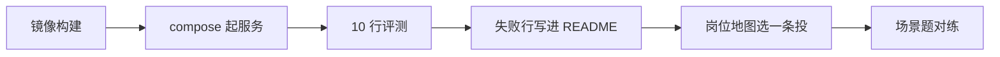

# 第 8 周 · 发出去，并准备一次诚实的谈话

代码能在你的笔记本上跑，不等于别人能收。
这周做四件很土的事：容器、日志、十行评测、作品集。然后看岗位地图，对着场景题开口。

我们不承诺薪资。能讲清一次取舍，比背齐框架名更接近「可被雇用」。

## 目标

- 用 Docker 把问学堂再起一次。
- 给循环加上你能回放的结构化日志。
- 准备一份 10 行评测，允许其中一行故意失败并写明原因。
- 写出作品集 README，并走完三份求职文档。

## 你将做出的东西

- 一张 `docker compose up` 成功的终端记录（自己留着）。
- `evals/set10.json`（问学堂仓库已有模板，你可以改问题，不许删「空答案」那一行）。
- 一份准备对外的项目 README（可以就是 askhall / issueforge，加上你自己的复盘段）。
- 面试题 A、D、E 的口头答案，计时。

## 本周时间 · 5 小时（日历第 8 周）

工作日 / 周末怎么拆：两晚各 1.5 小时（Docker + 十行评测）；周末 2 小时写作品集并对练 A/D/E。
不承诺薪资。能讲清一次取舍，比背齐框架名更接近「可被雇用」。

## 图文步骤



### 1. Docker

问学堂目录：

```bash
cd projects/askhall
docker compose up --build
```

打开 http://127.0.0.1:8000 ，再跑一次「考我」。
值班台的镜像是可选。若你只给一个容器，给问学堂——它有 UI，审阅者省事。

构建失败先看是不是复制 `docs/` 时路径写错。镜像里必须看得到教材，抽取式才能工作。

### 2. 日志

第 1 周的字段不要丢：`step`、`thought`、`action`、`observation`，再加 `role`、`latency_ms`、`citations`。

问学堂在 `serve` 时会把每一轮打到 stderr（一行 JSON）。
练习：提问一次，把那一行拷进笔记，向同学解释每个键。解释不了的键，删掉或改名。

生产系统还会要追踪 ID、用户 ID。本周只要你不再用 `print("ok")` 当观测。

### 3. 十行评测

文件：`projects/askhall/evals/set10.json`。

建议覆盖：

| 行 | 类型 |
| --- | --- |
| 1–3 | 能在教材里找到的概念题 |
| 4–5 | 路由：计划 / 考试 |
| 6 | 空答案 |
| 7 | 教材没有的专有名词 |
| 8 | 引用格式 |
| 9 | 超短输入（一个「？」） |
| 10 | 你知道目前会失败的刁钻题 |

跑：

```bash
python -m askhall eval --set projects/askhall/evals/set10.json
```

第 10 行失败时，把它写进作品集「我还不会什么」。
删掉失败行让分数变 10/10，是第 2 周我们就反对过的事。

### 4. 作品集和岗位

按顺序打开，不要跳着刷：

1. [docs/jobs/portfolio.md](../jobs/portfolio.md) —— 对照清单打勾。
2. [docs/jobs/roles.md](../jobs/roles.md) —— 选一条轨道，用一句话说明为什么是它。
3. [docs/jobs/interview.md](../jobs/interview.md) —— A / D / E 各讲一遍，录音或请人听。

简历上的项目描述，用 portfolio 里「好一点的例子」那种密度。
不要写「精通 Multi-Agent」。写「三个角色、四种去向、空答拒绝」。

### 5. 生产阶段的瘦身版

对照 [kevinten-ai/ai-agent-langgraph](https://github.com/kevinten-ai/ai-agent-langgraph) 的生产意识，本周只收三样：

- 观测：结构化日志能回放一步。
- 评测：10 行，进 CI 更好，至少进你的发布检查单。
- 容器：别人不用复制你的笔记本路径。

不要在这周突然上 K8s。那是另一份学徒路线。

## 对应视频

[视频课表 · 第 8 周](../videos.md)

- 吴恩达 Agentic AI：https://www.deeplearning.ai/courses/agentic-ai （回看评测讨论）
- HF Agents Course：https://huggingface.co/learn/agents-course/unit0/introduction （观测加分单元，当延伸）

求职话术以 `docs/jobs/` 为准，不要去背付费课的「薪资谈判话术」。

## 练习

1. 把问学堂的日志拷一行，删掉 `citations` 再看你还能不能做事故复盘。你会立刻把它加回去。
2. 用面试题 H 的结构，给自己的 demo 写 8 行复盘（可以假设一次「编造周数」）。
3. 请同学只看 README 前两屏，计时 15 分钟，问他能不能跑起来。他说不能的那一步，就是你今晚要改的句子。

## 验收标准

- [ ] `docker compose up --build` 能打开问学堂，或你在笔记里写明本机无 Docker 以及你用的替代（说明原因，不是跳过）。
- [ ] 十行评测跑得出来，失败行列得出来。
- [ ] 作品集 README 有「我没有做什么」。
- [ ] 岗位地图里圈了一个方向。
- [ ] 面试题 A、D、E 你能不看稿讲完。

## 常见坑

- 为了作品集加第五个 Agent。审阅者会问延迟，你答不上来会更糟。
- 把本仓库整份 fork 当作品，却写「我独立完成了 Agent学堂教材」。教材是 SabreKeyZ 的，你的作品是你改过、讲得清的那两个产品。
- 在 README 写薪资。删掉。

## 延伸阅读

- 岗位 / 作品集 / 面试： [docs/jobs/](../jobs/roles.md)
- kevinten-ai/ai-agent-langgraph：https://github.com/kevinten-ai/ai-agent-langgraph
- CONTRIBUTING（你若把坑补回来）： [CONTRIBUTING.md](../../CONTRIBUTING.md)

八周到这里可以停。后面是重复：更干净的日志、更狠的评测、更克制的角色。
