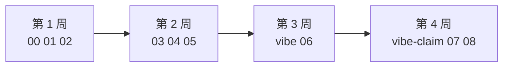

# 学徒工期目录

默认 **1 个月 / 4 个日历周**，每周约 8–12 小时（工作日晚上 + 周末）。材料仍是原来的班文件，一篇不删，只是排得更密。做不完就停在当周验收，不要跳周。

只有 2 小时、先见面：走 [2 小时路径](two-hour.md)。那是走读脚本，不是这 1 个月路径。

敢慢跟：仍按 `00`–`08` 文件一周一篇。默认是下面这张 4 周表。

词表：[../glossary.md](../glossary.md) · 一页纸：[../cheatsheet.md](../cheatsheet.md) · 分册：[../cheatsheets/](../cheatsheets/) · 参考答案：[answers/](answers/)（做完题再打开）

## 1 个月日历

文件名没改。旧链 `00-setup.md` … `08-ship-and-job.md` 仍指向同一篇。

### 第 1 周 · 环境 + Agent 循环 + 工具/ReAct · 约 8–12h

| 班 | 文档 | 这周里哪几天 | 约几小时 |
| --- | --- | --- | --- |
| 00 | [把桌子摆好](00-setup.md) | 前半，工作日 1–2 晚 | 2h 核心（Key 可选另算） |
| 01 | [Agent 是循环](01-what-is-an-agent.md) | 中段 | 约 3h |
| 02 | [工具与 ReAct](02-tools-and-react.md) | 后半，周末 | 约 3–4h |

### 第 2 周 · RAG + MCP + 多 Agent · 约 8–12h

| 班 | 文档 | 这周里哪几天 | 约几小时 |
| --- | --- | --- | --- |
| 03 | [记忆与 RAG](03-memory-rag.md) | 前半，约 day 1–2 | 约 3h |
| 04 | [MCP 与 Skill](04-mcp-and-skills.md) | 中段，约 day 3–4 | 约 3h |
| 05 | [多智能体](05-multi-agent.md) | 后半，约 day 5–7 | 约 3h |

### 第 3 周 · vibe 迷你台 + 客服工单台 · 约 8–12h

| 班 | 文档 | 这周里哪几天 | 约几小时 |
| --- | --- | --- | --- |
| vibe | [对着助手搭最小工单台](vibe.md) | 前半 | 约 2–3h |
| 06 | [客服工单台](06-ticketdesk.md) | 后半 | 约 5–6h |

### 第 4 周 · vibe-claim + 理赔台 + 上线求职 · 约 8–12h

| 班 | 文档 | 这周里哪几天 | 约几小时 |
| --- | --- | --- | --- |
| vibe-claim | [对着助手搭最小理赔台](vibe-claim.md) | 最先，约一个晚上 | 约 2–3h |
| 07 | [理赔初审台](07-claimdesk.md) | 中段，约 day 2–4 | 约 4–5h |
| 08 | [上线与求职](08-ship-and-job.md) | 后半，约 day 5–7；紧一点或挤进晚上 | 约 3–4h |

## 资料怎么用

顺序反了，这套包会变成「我看懂了但写不出来」。请按这个走：

1. **先打开当班文档的「本周你要带走什么」**，用铅笔在纸上抄勾选框。这是验收，不是目录装饰。
2. **先做带练命令，再看视频。** 视频课表在 [../videos.md](../videos.md)。口播用来补直觉，作业以本仓库脚本的 stdout 为准。看不完不要自责。
3. **先自己做练习题，再打开 `answers/`。** 正文故意不写答案。抄答案过验收，第 4 周 / [08](08-ship-and-job.md) 面试会穿。
4. **失败对照比成功路径更重要。** 错 Key、空目录、除零、坏 JSON、无条款命中，都是本班要亲手跑的。
5. **卡超过 40 分钟，去 [FAQ](../faq.md) 搜报错关键字。** 还不行按 [卡住了](../../.github/ISSUE_TEMPLATE/stuck.yml) 开 Issue。不要先换框架。
6. **第 3–4 周以两个队列为作业。** 教室玩具、问学堂、五人教育网不是毕业作品。第 3 周前半 [vibe](vibe.md) 用助手搭最小工单台，再走读工单台。第 4 周最先 [vibe-claim](vibe-claim.md) 搭最小理赔台，再走读理赔台。

班对照（不是别人仓的「理解原理→面试」四段，是本仓工期；文件名没改）：

| 班 | 打开哪篇 | 改哪份代码 | 手上能演示什么 |
| --- | --- | --- | --- |
| 00 | [00-setup](00-setup.md) | 两台 demo；可选 `hello_chat.py` | 芯片或红条；可选 `[ok] reply=` |
| 01 | [01-what-is-an-agent](01-what-is-an-agent.md) | `code/week1/echo_agent.py` | 一行一条 JSON 循环 |
| 02 | [02-tools-and-react](02-tools-and-react.md) | `code/week2/react_agent.py` | `--eval` 三条 PASS |
| 03 | [03-memory-rag](03-memory-rag.md) | `code/week3/mini_rag.py` | `path:line` 命中 |
| 04 | [04-mcp-and-skills](04-mcp-and-skills.md) | `code/week4/week_goal_server.py` | stdio `get_week_goal` |
| 05 | [05-multi-agent](05-multi-agent.md) | `code/week5/classroom_lab.py` | 画路由、决定不加第四人 |
| vibe | [vibe](vibe.md) | `labs/vibe-minidesk`（自跑评测） | 助手 + 引用 + 人确认闸门 |
| 06 | [06-ticketdesk](06-ticketdesk.md) | `projects/ticketdesk` | 芯片 + 闸门红条 |
| vibe-claim | [vibe-claim](vibe-claim.md) | `labs/vibe-miniclaim`（自跑评测） | 助手 + 条款引用 + 人确认闸门 |
| 07 | [07-claimdesk](07-claimdesk.md) | `projects/claimdesk` | 条款芯片 + 决定书 |
| 08 | [08-ship-and-job](08-ship-and-job.md) | README / 评测 / Docker | 两分钟讲清两个队列 |

视频：[../videos.md](../videos.md) · 求职：[../jobs/roles.md](../jobs/roles.md) · 坑：[../faq.md](../faq.md) · 延伸：[../resources.md](../resources.md)
