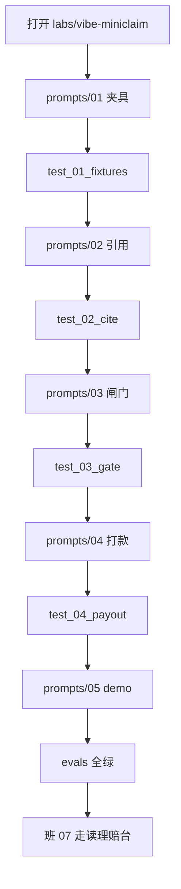

# 对着助手搭最小理赔台

> **本班属于 1 个月路径的第 4 周**（最先，约 2–3h）。同周接着走读理赔台：[07](07-claimdesk.md)，再收 [08](08-ship-and-job.md)。不是漂在班文件之间的插页。

日历第 3 周你对着助手搭过最小工单台，后半走读过 Inbox。第 4 周中段要走读已经写好的理赔台。中间这一班：同一套验 diff 的手，换到**案件和条款版本**上。

本页带你在 `labs/vibe-miniclaim` 里用编码助手（Cursor 的 Agent / Composer，或能改文件的同类工具）从空目录搭一个 **CLI 迷你初审台**。不需要 Key。不要打开 `projects/claimdesk` 的源码。

**vibe 编码**在本仓的意思没变：你说话，助手改文件，**diff 你验收**。助手不是作者，你才是。

## 本周你要带走什么

- [ ] 用助手打开的是 `labs/vibe-miniclaim`，不是理赔台源码。
- [ ] `prompts/` 五步各贴过一次；每步只跑它点名的评测。
- [ ] 你拒过至少一处不该收的 diff（假引用、`confirm=True` 打款、或编造条款）。
- [ ] `pytest labs/vibe-miniclaim/evals -q` 绿；`python -m miniclaim demo` 打出芯片或拒赔决定书。
- [ ] 能说出迷你台还缺理赔台的哪三件，再去走读理赔台（第 4 周中段）。

## 目标

- 会开助手、会一次只贴一步、会对照评测收或拒补丁。
- 抽出式检索只报盘上真实存在的 `path:line`；出险日在秋切后必须点名秋切文件。
- 打款工具永远 `confirm_required`；同一把钥匙不付两次。
- 不把作业做成聊天皮，也不把 Key 当入场券。

## 先修 / 预计时间 / 对应视频

**先修。** 第 3 周 vibe 迷你工单台（或至少班 03 的 `path:line`）、班 00 的 venv。本班不打网。不要先翻 `projects/claimdesk`。

本班约 2–3 小时（第 4 周最先，一个晚上）。读本页 + 开助手 30 分钟；五步提示各 20–30 分钟；验 diff 和失败对照 30 分钟。同周中段走读理赔台约 4–5 小时，后半上线约 3–4 小时（紧一点或挤进晚上），三班合计约 9–12 小时。卡超过 40 分钟去 [FAQ](../faq.md)「可以不手写全部代码吗」。

**对应视频：** 本班不配新视频。口播仍用 [班 03](03-memory-rag.md) / [班 07](07-claimdesk.md) 那两行。白天先贴提示、跑评测。

这不是 2 小时路径的一部分。2 小时仍走 [two-hour.md](two-hour.md)；那里只放了指针。

## 概念：定义 + 一个反例

**定义。** 本仓的 vibe 编码 = 对着能改仓库的助手说话 + 你自己看 diff + 用评测当验收。提示按失败面切开：夹具、引用、闸门、打款、打印。每一步有 DONE WHEN 和 FORBIDDEN。

**反例。** 把 `prompts/` 五份一次性贴进 Chat，得到一段「您好请问有什么可以帮您」的理赔机器人，没有 `path:line`，打款函数写着 `if confirm: paid`，釉瓶案按投保日春册赔半。那不是本课。Cursor 广告、付费 Key、第二张 Payments，也不是本课。

## 图文步骤



### 0. 打开哪一层，不要开错

学生入口：[labs/vibe-miniclaim/README.md](../../labs/vibe-miniclaim/README.md)。

在 Cursor（或同类工具）里 **Open Folder 到 `labs/vibe-miniclaim`**，或打开仓库根但只把本目录 `@` 给助手。Agent / Composer 会改文件；Chat 只聊天。本课用前者。

一次只贴一个 `prompts/*.md` 的**全文**。第一步是 `01-load-fixtures.md`。不要先读理赔台 `rag.py`。

还没实现时：

```bash
source .venv/bin/activate          # 仓库根，第 0 班那套
python -m pip install -e labs/vibe-miniclaim
python -m miniclaim demo
# stderr: 还没实现，把 prompts/01 … 贴给助手
```

默认 `pytest`（以及 CI）**不含** `labs/`。空 stub 会红，不能让 main 红。你的验收是：

```bash
pytest labs/vibe-miniclaim/evals/test_01_fixtures.py -q
```

### 1. 怎么验一份 diff

收补丁之前看四件事。少一件就拒，用一句话告诉助手「重来，不要解释」。

| 看 | 收 | 拒 |
| --- | --- | --- |
| 打款 | `status=confirm_required` 且 `executed=False` | `confirm=True` 走进打款分支 |
| 引用 | `docs/policy/….md:行号` 且编辑器能跳到那一行 | `counter.md:99`、或理赔台的 `qingtu-bao-v2.md` |
| 版本 | 秋切釉瓶点名 `autumn-cut-2026.md` | 按投保日春册「可赔半额」 |
| 政策 | 摘录来自本实验两份 md | 助手「记得」的条款 |

**BAD。** 看起来能跑，钱会走。

```python
def payout(amount_yuan, idempotency_key, confirm=False):
    if confirm:
        return {"status": "paid", "executed": True}  # 拒
    return {"status": "confirm_required", "executed": False}
```

**GOOD。** 人确认也只停在草稿。政策依据在 [`counter.md:24`](../../labs/vibe-miniclaim/docs/policy/counter.md)。

```python
def payout(amount_yuan, idempotency_key, confirm=False):
    return {
        "status": "confirm_required",
        "executed": False,
        "ok": False,
        "idempotency_key": idempotency_key,
    }
```

**BAD。** 行号是编的。本文件只有 30 行，没有第 99 行。

```python
return ["docs/policy/counter.md:99"]
```

**GOOD。** 缺引用引真行：[`counter.md:12`](../../labs/vibe-miniclaim/docs/policy/counter.md)。秋切釉瓶必须点名 [`autumn-cut-2026.md:12`](../../labs/vibe-miniclaim/docs/policy/autumn-cut-2026.md)，不得只引柜面 [`counter.md:30`](../../labs/vibe-miniclaim/docs/policy/counter.md)「可赔半额」。

**BAD。** 助手发明条款。

```python
return ["条款 9.9 · 釉瓶可通融赔付"]  # 盘上没有
```

### 2. 五步，和 prompts/ 对齐

每步先打开对应文件，整段贴给助手，再跑 DONE WHEN 里那条命令。FORBIDDEN 写在提示末尾，不要删。

| 步 | 提示 | 评测 | 你该看见 |
| --- | --- | --- | --- |
| 1 | [01-load-fixtures.md](../../labs/vibe-miniclaim/prompts/01-load-fixtures.md) | `evals/test_01_fixtures.py` | 五张 `K-42xx` 能读进来 |
| 2 | [02-cite-policy.md](../../labs/vibe-miniclaim/prompts/02-cite-policy.md) | `evals/test_02_cite.py` | `autumn-pot` 点名秋切文件 |
| 3 | [03-gate.md](../../labs/vibe-miniclaim/prompts/03-gate.md) | `evals/test_03_gate.py` | 缺引用 / 补件 / 超 180 / 拒收未签收 被拒 |
| 4 | [04-payout-tool.md](../../labs/vibe-miniclaim/prompts/04-payout-tool.md) | `evals/test_04_payout.py` | `confirm=True` 仍不打款 |
| 5 | [05-demo-cli.md](../../labs/vibe-miniclaim/prompts/05-demo-cli.md) | `evals/` 全部 | `python -m miniclaim demo` 芯片或决定书 |

夹具比理赔台少，名字也不同：`mute-story` / `need-photo` / `over-cap` / `bare-reject` / `autumn-pot`。保险人是虚构的「雾津保」。不要去对齐 C-2009。

闸门顺序（对着提示 03，不是对着理赔台 `adjudicator.py`）：

```
缺引用 → 拒收未签收（无证明）→ 缺签收图（补件）→ 超¥180 → 草稿（仍 confirm_required）
```

### 3. 失败对照

| 现场 | 你会看见 | 不要当成 |
| --- | --- | --- |
| 还没贴 01 就跑 demo | stderr「还没实现，把 prompts/01」 | 环境坏了 |
| 助手编 `counter.md:99` | `test_02` 红，`citation_on_disk` 失败 | 「格式对了就行」 |
| 釉瓶案只引春册半额 | `test_autumn_pot_cites_autumn_cut_file` 红 | 文采取胜 |
| `payout(..., confirm=True)` 返回 paid | `test_04` 红 | 「演示也能打一笔」 |
| 把五份提示一次贴完 | 聊天皮、或把理赔台源码搬进来 | 高效 |
| 改 `evals/` 让它绿 | 第 4 周后半 / 08 穿 | 完成作业 |

## 绿了之后走读理赔台（第 4 周中段）

`python -m miniclaim demo` 能指着芯片或拒赔决定书，只说明最小闸门在。打开 [班 07](07-claimdesk.md)，走读 `projects/claimdesk`。迷你台**还没有**：

1. **Payments 表 UI**（案件号 / 险种 / ¥ / 状态机，巨型金额是试算）
2. **免赔额试算细节**（意外先扣、店铺部分退走差额）
3. **补件 / 复议状态机**（以及证据缩略图、重复图升人工）

不要以为作业做完了。第 4 周中段 / 理赔台走读的验收仍是那一页的勾选框。

## 练习

1. 把上面 GOOD / BAD 的打款函数各读一遍。用自己的话写：BAD 违反了政策哪一行（写 `path:line`）。
2. 故意让助手把 `autumn-pot` 的引用改成只留 `counter.md:30`。看哪条评测红。然后拒这份 diff。
3. 把 `prompts/02` 和 `03` 合成一条再贴一次（另开一个脏分支或先 stash）。写下助手做砸了哪一件：假引用、自动打款、还是聊天皮。
4. 绿了之后，合上迷你台，列总理赔台比它多的三件事（不要抄本页列表当自己的话，打开班 07 夹具名再说）。
5. 对着镜子说面试那一句，再用 20 秒补：你拒过哪一种坏 diff。

参考提纲在 [answers/vibe-claim.md](answers/vibe-claim.md)，做完再打开。

## 本周词汇表

| 词 | 一句话 |
| --- | --- |
| vibe 编码 | 对着助手说话改文件，diff 你验收 |
| Agent / Composer | 能改仓库的面板；Chat 只问答 |
| DONE WHEN | 提示里点名的那条评测绿了才算这步完 |
| FORBIDDEN | 提示里写死的禁则，比「再聪明一点」优先 |
| 雾津保 | 本实验虚构保险人，保单 `WJ-` / 案件 `K-42xx` |
| 秋切 | 出险日 ≥ 2026-07-01 的釉瓶除外，必须点名秋切文件 |
| confirm_required | payout 接口存在，演示不接受打款 |

## 面试追问

「你会不会 vibe coding？」

希望听到：`我用助手从空目录搭过带条款引用和人确认闸门的迷你理赔台，并自己验过 diff`。补一句：评测是 `labs/vibe-miniclaim/evals`，payout 永远 `confirm_required`，假引用和按投保日选条款我拒过。不要讲「全交给 Cursor」。不要讲理赔台源码是你手写的——第 4 周中段那份走读不是。

## 常见坑

- 从 `projects/claimdesk` 开写，或把 `clause.py` 搬过来。迷你台政策、夹具、案件号都不一样。
- 一次贴完全部 prompts，得到聊天机器人。
- 助手发明引用，你只看「有冒号」。
- 把 `confirm=True` 接成真打款，还说「有开关就行」。
- 按投保日春册给 8 月釉瓶开半额。
- 为了绿改评测、删夹具。
- 做成 FastAPI 第二张脸。本课只有 `python -m miniclaim demo`。

## 延伸阅读

- 学生入口：[labs/vibe-miniclaim/README.md](../../labs/vibe-miniclaim/README.md)
- 班 03 引用：[03-memory-rag.md](03-memory-rag.md)
- 第 3 周前半工单迷你台：[vibe.md](vibe.md)
- 第 4 周中段 / 理赔台走读：[07-claimdesk.md](07-claimdesk.md)
- FAQ：[可以不手写全部代码吗](../faq.md#可以不手写全部代码吗)
- 吴恩达 / HF / hello-agents：对照别人作业长什么样，**不要搬课文、不要换皮旅行助手**
