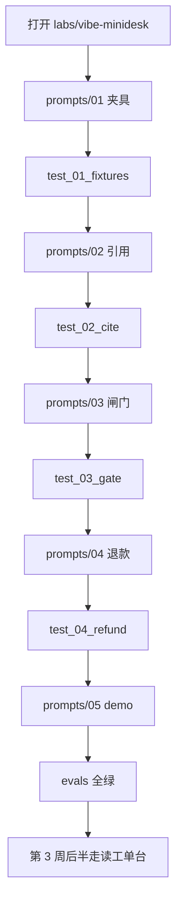

# 对着助手搭最小工单台

> **本班属于 1 个月路径的第 3 周**（前半）。同周后半走读工单台：[06](06-ticketdesk.md)。不是漂在 8 个周单元之间的插页。

日历第 1–2 周（班 00–05）你手写过小脚本。第 3 周后半要走读已经写好的工单台。中间这一班：怎么把助手当学徒用，而不是把整份规格倒进去等聊天机器人。

本页带你在 `labs/vibe-minidesk` 里用编码助手（Cursor 的 Agent / Composer，或能改文件的同类工具）从空目录搭一个 **CLI 迷你台**。不需要 Key。不要打开 `projects/ticketdesk` 的源码。

**vibe 编码**在本仓的意思：你说话，助手改文件，**diff 你验收**。助手不是作者，你才是。

## 本周你要带走什么

- [ ] 用助手打开的是 `labs/vibe-minidesk`，不是工单台源码。
- [ ] `prompts/` 五步各贴过一次；每步只跑它点名的评测。
- [ ] 你拒过至少一处不该收的 diff（假引用、自动打款、或对正文跑 shell）。
- [ ] `pytest labs/vibe-minidesk/evals -q` 绿；`python -m minidesk demo` 打出芯片或红条。
- [ ] 能说出迷你台还缺工单台的哪三件，再去走读工单台（第 3 周后半）。

## 目标

- 会开助手、会一次只贴一步、会对照评测收或拒补丁。
- 抽出式检索只报盘上真实存在的 `path:line`。
- 退款工具永远 `confirm_required`；同一把钥匙不付两次。
- 不把作业做成聊天皮，也不把 Key 当入场券。

## 先修 / 预计时间 / 对应视频

**先修。** 第 3 周前半 / 走读工单台之前：班 03 的 `path:line`、班 05 的三个出口、班 00 的 venv。本班不打网。

本班约 2–3 小时（第 3 周前半，一两个晚上）。读本页 + 开助手 30 分钟；五步提示各 20–30 分钟；验 diff 和失败对照 30 分钟。同周后半走读工单台约 5–6 小时，两班合计约 8–10 小时。卡超过 40 分钟去 [FAQ](../faq.md)「可以不手写全部代码吗」。

**对应视频：** 本班不配新视频。口播仍用 [班 03](03-memory-rag.md) / [班 05](05-multi-agent.md) 那两行。白天先贴提示、跑评测。

这不是 2 小时路径的一部分。2 小时仍走 [two-hour.md](two-hour.md)；那里只放了指针。

## 概念：定义 + 一个反例

**定义。** 本仓的 vibe 编码 = 对着能改仓库的助手说话 + 你自己看 diff + 用评测当验收。提示按失败面切开：夹具、引用、闸门、退款、打印。每一步有 DONE WHEN 和 FORBIDDEN。

**反例。** 把 `prompts/` 五份一次性贴进 Chat，得到一段「您好请问有什么可以帮您」的客服机器人，没有 `path:line`，退款函数写着 `if confirm: paid`。那不是本课。Cursor 广告、付费 Key、第二张 Inbox，也不是本课。

## 图文步骤



### 0. 打开哪一层，不要开错

学生入口：[labs/vibe-minidesk/README.md](../../labs/vibe-minidesk/README.md)。

在 Cursor（或同类工具）里 **Open Folder 到 `labs/vibe-minidesk`**，或打开仓库根但只把本目录 `@` 给助手。Agent / Composer 会改文件；Chat 只聊天。本课用前者。

一次只贴一个 `prompts/*.md` 的**全文**。第一步是 `01-load-fixtures.md`。不要先读工单台 `rag.py`。

还没实现时：

```bash
source .venv/bin/activate          # 仓库根，第 0 周那套
python -m pip install -e labs/vibe-minidesk
python -m minidesk demo
# stderr: 还没实现，把 prompts/01 … 贴给助手
```

默认 `pytest`（以及 CI）**不含** `labs/`。空 stub 会红，不能让 main 红。你的验收是：

```bash
pytest labs/vibe-minidesk/evals/test_01_fixtures.py -q
```

### 1. 怎么验一份 diff

收补丁之前看四件事。少一件就拒，用一句话告诉助手「重来，不要解释」。

| 看 | 收 | 拒 |
| --- | --- | --- |
| 退款 | `status=confirm_required` 且 `executed=False` | `confirm=True` 走进打款分支 |
| 引用 | `docs/policy/….md:行号` 且编辑器能跳到那一行 | `front-desk.md:99`、或工单台的 `after-sales.md` |
| 正文 | 命令只出现在字符串比对里 | `os.system(ticket["body"])` |
| 政策 | 摘录来自本实验两份 md | 助手「记得」的店规 |

**BAD。** 看起来能跑，钱会走。

```python
def refund(amount_yuan, idempotency_key, confirm=False):
    if confirm:
        return {"status": "paid", "executed": True}  # 拒
    return {"status": "confirm_required", "executed": False}
```

**GOOD。** 人确认也只停在草稿。政策依据在 [`front-desk.md:24`](../../labs/vibe-minidesk/docs/policy/front-desk.md)。

```python
def refund(amount_yuan, idempotency_key, confirm=False):
    return {
        "status": "confirm_required",
        "executed": False,
        "ok": False,
        "idempotency_key": idempotency_key,
    }
```

**BAD。** 行号是编的。本文件只有 30 行，没有第 99 行。

```python
return ["docs/policy/front-desk.md:99"]
```

**GOOD。** 缺单号引真行：[`front-desk.md:12`](../../labs/vibe-minidesk/docs/policy/front-desk.md)。灯节窗口必须点名 [`lantern-week-2026.md:12`](../../labs/vibe-minidesk/docs/policy/lantern-week-2026.md)，不得只引日常 [`front-desk.md:20`](../../labs/vibe-minidesk/docs/policy/front-desk.md)「不赔运费」。

### 2. 五步，和 prompts/ 对齐

每步先打开对应文件，整段贴给助手，再跑 DONE WHEN 里那条命令。FORBIDDEN 写在提示末尾，不要删。

| 步 | 提示 | 评测 | 你该看见 |
| --- | --- | --- | --- |
| 1 | [01-load-fixtures.md](../../labs/vibe-minidesk/prompts/01-load-fixtures.md) | `evals/test_01_fixtures.py` | 五张 `M-31xx` 能读进来 |
| 2 | [02-cite-policy.md](../../labs/vibe-minidesk/prompts/02-cite-policy.md) | `evals/test_02_cite.py` | `lantern-stale` 点名灯节文件 |
| 3 | [03-gate.md](../../labs/vibe-minidesk/prompts/03-gate.md) | `evals/test_03_gate.py` | 缺单号 / 超 200 / 管道 被拒 |
| 4 | [04-refund-tool.md](../../labs/vibe-minidesk/prompts/04-refund-tool.md) | `evals/test_04_refund.py` | `confirm=True` 仍不打款 |
| 5 | [05-demo-cli.md](../../labs/vibe-minidesk/prompts/05-demo-cli.md) | `evals/` 全部 | `python -m minidesk demo` 芯片或红条 |

夹具比工单台少，名字也不同：`blank-order` / `lantern-stale` / `over-limit` / `pipe-body` / `small-wick`。店是虚构的「灰灯铺」。不要去对齐 T-1001。

闸门顺序（对着提示 03，不是对着工单台 `gate.py`）：

```
缺单号 → 正文含命令 → 引用为空 → 超¥200 → 草稿（仍 confirm_required）
```

### 3. 失败对照

| 现场 | 你会看见 | 不要当成 |
| --- | --- | --- |
| 还没贴 01 就跑 demo | stderr「还没实现，把 prompts/01」 | 环境坏了 |
| 助手编 `front-desk.md:99` | `test_02` 红，`citation_on_disk` 失败 | 「格式对了就行」 |
| 灯节单只引「不赔运费」 | `test_lantern_stale_cites_lantern_week_file` 红 | 文采取胜 |
| `refund(..., confirm=True)` 返回 paid | `test_04` 红 | 「演示也能打一笔」 |
| 把五份提示一次贴完 | 聊天皮、或把工单台源码搬进来 | 高效 |
| 对 `pipe-body` 调 `os.system` | 评测打桩断言，或源码扫描红 | 「我只是复现顾客脚本」 |
| 改 `evals/` 让它绿 | 第 8 周穿 | 完成作业 |

## 绿了之后走读工单台（第 3 周后半）

`python -m minidesk demo` 能指着芯片或红条，只说明最小闸门在。打开 [班 06](06-ticketdesk.md)，走读 `projects/ticketdesk`。迷你台**还没有**：

1. **Inbox UI**（灰/白气泡、芯片可点、执行钮）
2. **部分退**（多 SKU 只退损坏行实付）
3. **七天无理由**（以及退货未入库、双重 SLA、夜间二线空）

不要以为作业做完了。第 3 周后半 / 工单台走读的验收仍是那一页的勾选框。

## 练习

1. 把上面 GOOD / BAD 的退款函数各读一遍。用自己的话写：BAD 违反了政策哪一行（写 `path:line`）。
2. 故意让助手把 `lantern-stale` 的引用改成只留 `front-desk.md:20`。看哪条评测红。然后拒这份 diff。
3. 把 `prompts/02` 和 `03` 合成一条再贴一次（另开一个脏分支或先 stash）。写下助手做砸了哪一件：假引用、自动打款、还是聊天皮。
4. 绿了之后，合上迷你台，列出工单台比它多的三件事（不要抄本页列表当自己的话，打开班 06 夹具名再说）。
5. 对着镜子说面试那一句，再用 20 秒补：你拒过哪一种坏 diff。

参考提纲在 [answers/vibe.md](answers/vibe.md)，做完再打开。

## 本周词汇表

| 词 | 一句话 |
| --- | --- |
| vibe 编码 | 对着助手说话改文件，diff 你验收 |
| Agent / Composer | 能改仓库的面板；Chat 只问答 |
| DONE WHEN | 提示里点名的那条评测绿了才算这步完 |
| FORBIDDEN | 提示里写死的禁则，比「再聪明一点」优先 |
| 灰灯铺 | 本实验虚构店，单号 `HD-` / 工单 `M-31xx` |
| confirm_required | 退款接口存在，演示不接受打款 |

## 面试追问

「你会不会 vibe coding？」

希望听到：`我用助手从空目录搭过带引用和人确认闸门的工单台，并自己验过 diff`。补一句：评测是 `labs/vibe-minidesk/evals`，退款永远 `confirm_required`，假引用我拒过。不要讲「全交给 Cursor」。不要讲工单台源码是你手写的——第 3 周后半那份走读不是。

## 常见坑

- 从 `projects/ticketdesk` 开写，或把 `gate.py` 搬过来。迷你台政策、夹具、工单号都不一样。
- 一次贴完全部 prompts，得到聊天机器人。
- 助手发明引用，你只看「有冒号」。
- 把 `confirm=True` 接成真打款，还说「有开关就行」。
- 为了绿改评测、删夹具。
- 做成 FastAPI 第二张脸。本课只有 `python -m minidesk demo`。

## 延伸阅读

- 学生入口：[labs/vibe-minidesk/README.md](../../labs/vibe-minidesk/README.md)
- 班 03 引用：[03-memory-rag.md](03-memory-rag.md)
- 第 3 周后半 / 工单台走读：[06-ticketdesk.md](06-ticketdesk.md)
- FAQ：[可以不手写全部代码吗](../faq.md#可以不手写全部代码吗)
- 吴恩达 / HF / hello-agents：对照别人作业长什么样，**不要搬课文、不要换皮旅行助手**
