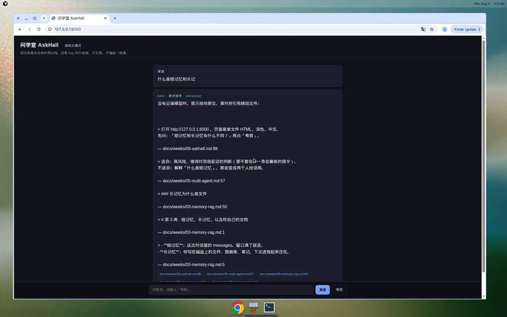
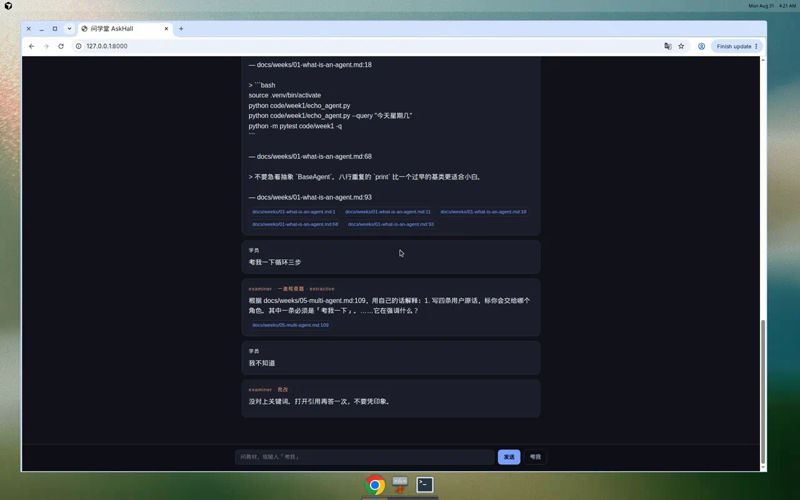
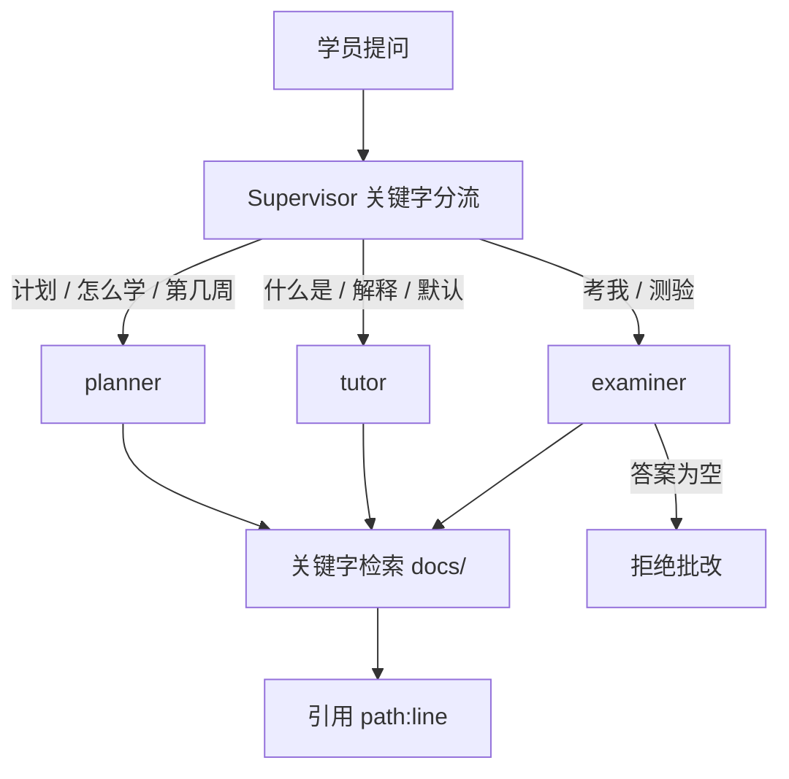

# 问学堂 AskHall

本地多智能体学伴。知识库是 **Agent学堂这份仓库的 `docs/`**，不是网上随便爬的百科。

没有 API Key 时走抽取式：只检索、只引用。`python -m askhall demo` 必须能离线跑完。

我们自己跑出来的页面（深色、中文、引用芯片）：





## 15 分钟从 0 到 1

在仓库根目录：

```bash
python3.11 -m venv .venv
source .venv/bin/activate
python -m pip install -U pip
python -m pip install -e projects/askhall
cp .env.example .env          # Key 可留空
python -m askhall demo        # 离线
python -m askhall serve       # http://127.0.0.1:8000
```

Docker（仍在仓库根，或在本目录）：

```bash
docker compose -f projects/askhall/docker-compose.yml up --build
```

## 三个角色



| 角色 | 只做 | 不做 |
| --- | --- | --- |
| planner | 三步计划，点名周文件 | 不写作文 |
| tutor | 用教材原文解释 | 不编周数 |
| examiner | 一题 + 批改 | 空答直接拒绝 |

v1 不加第四个「鼓励师」。语气用页面上的短句就够。

## 没有 Key 时发生了什么

`askhall.llm.complete` 返回 `None`。规划员、讲师、考试官改用检索块拼答案。
演示仍然打印引用。这和 CiteKit 的「先保证引用还在」是同一类倔强。

可选伙伴：<https://github.com/SabreKeyZ/citekit>

## 我拒绝的设计

- LangChain / LlamaIndex 作为硬依赖。
- 把整本教材塞进一次提示。
- 执行学员粘贴的代码。
- 在抽取式模式里假装自己是通顺的大模型。

## 评测

```bash
python -m askhall eval --set projects/askhall/evals/set10.json
```

第 10 行是故意失败的哨兵，用来提醒你：满分表不可信。CI 里的 pytest **不**跑这一行。

## 测试

```bash
python -m pytest projects/askhall/tests -q
```

承诺：路由、「引用在磁盘上」、空答拒绝。

## 对照 LangGraph

见 `src/askhall/langgraph_extra.py`。那是一张函数表，不是依赖。

## 我还不会什么

路由是关键字，不是语义分类。习钻的问法会走错门，请用评测第 10 行的精神对待它：写下来，而不是藏起来。
