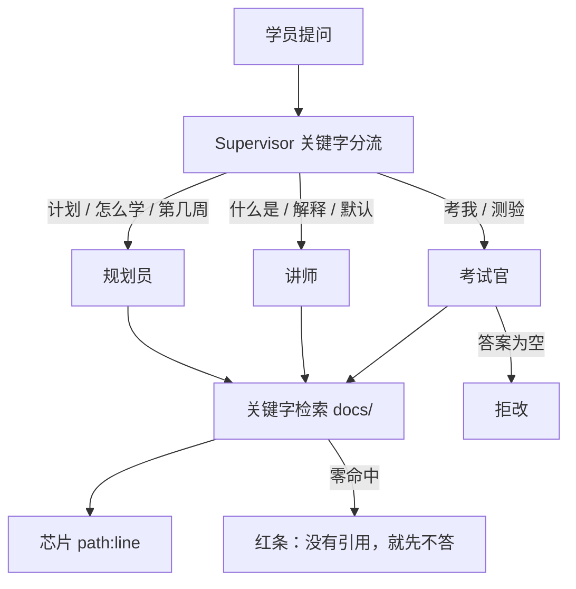

# 问学堂 AskHall

本地多智能体学伴。知识库是 **Agent学堂这份仓库的 `docs/`**。

**没有引用，就先不答。** 教材就是仓库，Agent 只能引用这本教材。

没有 API Key 时走抽取式：只检索、只引用。`python -m askhall demo` 必须能离线跑完。


## 从 0 到 1（三步）

在仓库根目录。

**第 1 步 · 抽取式跑通（无 Key）**

```
projects/askhall/
  src/askhall/agents/{supervisor,planner,tutor,examiner}.py
  src/askhall/rag.py
  src/askhall/static/index.html
  evals/set10.json
```

```bash
python -m pip install -e projects/askhall
python -m askhall demo
python -m askhall serve    # http://127.0.0.1:8000
```

眼睛验收：角色盖章、芯片 `docs/weeks/…:行号`、空答红条。

**第 2 步 · 接上国内模型（可选）**

```bash
cp .env.example .env
# OPENAI_API_KEY / OPENAI_BASE_URL / OPENAI_MODEL
python -m askhall demo     # llm=on 时讲解可以通顺，引用不能丢
```

**第 3 步 · 部署热身**

```bash
docker compose -f projects/askhall/docker-compose.yml up --build
python -m askhall eval --set projects/askhall/evals/set10.json
```

## 三个角色（盖章，不是头像）



| 角色 | 只做 | 不做 |
| --- | --- | --- |
| 规划员 | 三步计划，点名周文件 | 不写作文 |
| 讲师 | 用教材原文解释 | 不编周数 |
| 考试官 | 一题 + 批改 | 空答直接拒绝 |

v1 不加第四个「鼓励师」。

## 为什么是主管，不是一张网

问学堂只有一个学员、一个入口、三种去向。主管读关键字，把状态放在普通字典里（见 `agents/supervisor.py`）。
Mesh 适合角色互相打断的教室。这里互叫只会多一次提示、多一个会编造的出口。路由错了就改规则或加评测，不要再加一个超级主管。

## 没有 Key 时发生了什么

`askhall.llm.complete` 返回 `None`。三个角色改用检索块拼答案。演示仍然打印引用。
可选伙伴：<https://github.com/SabreKeyZ/citekit>

## 我拒绝的设计

- LangChain / LlamaIndex 作为硬依赖。
- 把整本教材塞进一次提示。
- 执行学员粘贴的代码。
- 在抽取式模式里假装自己是通顺的大模型。

## 评测

```bash
python -m askhall eval --set projects/askhall/evals/set10.json
```

第 10 行是故意失败的哨兵。CI 里的 pytest **不**跑这一行。

```bash
python -m pytest projects/askhall/tests -q
```

承诺：路由、「引用在磁盘上」、空答拒绝。

对照 LangGraph：`src/askhall/langgraph_extra.py` 是一张函数表，不是依赖。

## 简历上可以怎么写（没有假数字）

项目：问学堂 AskHall · Python / FastAPI / 自写检索 · 知识库=本课程仓库

- 三个角色共用一份按空行切开的 `docs/` 检索，回答必须带 `path:line` 芯片；零命中或空答直接拒绝，不编一周课。
- 无 Key 走抽取式，`python -m askhall demo` 离线可演示；有 Key 才润色句子，引用仍要落在磁盘上。
- 主管按关键字分流，v1 不用图框架：去向只有计划 / 讲解 / 出题三种。

## STAR（对着空气说两分钟）

| | |
| --- | --- |
| 情境 | 学员问「第几周写 MCP」，模型容易凭印象编周数。 |
| 任务 | 做一本吃自己教材的学伴，演示必须带得走。 |
| 行动 | 主管分流 + 关键字检索 + 芯片；考试官拒空答；十行评测里留一行已知失败。 |
| 结果 | 无 Key 也能看出引用；编造路径会被 `citation_exists` 打掉。没有准确率口号。 |

写进作品集时用自己的话。岗位谈话见 [docs/jobs/interview.md](../../docs/jobs/interview.md)。

## 我还不会什么

路由是关键字，不是语义分类。习钻的问法会走错门，请用评测第 10 行的精神对待它：写下来，而不是藏起来。
