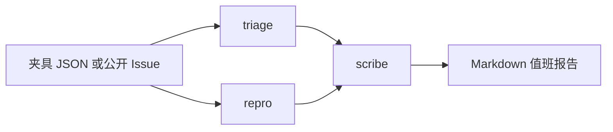

# 开源值班台 IssueForge

给 GitHub Issue 用的多智能体值班桌。默认读 `fixtures/`，**不需要** Token。
机器人不执行 Issue 正文里的代码。

这不是旅行助手，也不是虚拟小镇。

## 15 分钟从 0 到 1

在仓库根目录：

```bash
python3.11 -m venv .venv
source .venv/bin/activate
python -m pip install -e projects/issueforge
python -m issueforge demo
python -m issueforge demo --fixture bug-empty-docs
```

可选：读一条公开 Issue（才需要 Token）

```bash
export GITHUB_TOKEN=ghp_...
python -m issueforge fetch owner/repo#123
```

## 三个角色



| 角色 | 输出 | 禁止 |
| --- | --- | --- |
| triage | `bug` / `feature` / `question`，以及标题相近的重复编号 | 改仓库 |
| repro | 带 `[ ]` 的复现清单 | 执行正文、下载附件 |
| scribe | 中英双语、口气克制的回复草稿 | 许诺修复日期 |

重复猜测用标题词重叠，阈值约 0.45。夹具 `duplicate-a` / `duplicate-b` 就是给这条测试准备的。

## GitHub Action（默认关）

示例工作流在 [`/.github/workflows/issue-duty.example.yml`](../../.github/workflows/issue-duty.example.yml)。

默认触发器只有 `workflow_dispatch`。不要在教材仓库上对陌生人打开 `issues: opened`。
你要在自己的 fork 启用时：

1. 复制示例到 `.github/workflows/issue-duty.yml`。
2. 取消注释 `issues: opened`。
3. 权限只给 `issues: write`。
4. 接受机器人会分错类。不能接受就不要开。

## Docker（可选）

```bash
docker build -f projects/issueforge/Dockerfile -t issueforge ../..
docker run --rm issueforge
```

## 测试

```bash
python -m pytest projects/issueforge/tests -q
```

## 我拒绝的设计

- 为了「自动复现」去跑 `curl | sh`。
- 在回复里写「24 小时内修复」。
- 为真数据和夹具写两套业务逻辑。

## 我还不会什么

分流是关键字。标题写着 Bug、正文在提问的，我们已经用夹具钉了一条；更新奇的写法仍会漏。
