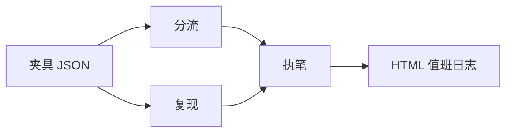

# 开源值班台 IssueForge

给 GitHub Issue 用的多智能体值班桌。默认读 `fixtures/`，**不需要** Token。
机器人不执行 Issue 正文里的代码。

这不是旅行助手，也不是虚拟小镇，也不是问数大屏。
页面是一份**值班日志**：盖章、摘句、勾选、双语草稿。

**没有引用，就先不答。** 值班只引用夹具正文。

```bash
python -m issueforge board
# 打开 demo-out/duty-report.html
```


## 从 0 到 1（三步）

在仓库根目录。

**第 1 步 · 夹具跑通**

```
projects/issueforge/
  fixtures/*.json
  src/issueforge/agents/{triage,repro,scribe}.py
  src/issueforge/report.py
```

```bash
python -m pip install -e projects/issueforge
python -m issueforge demo
python -m issueforge demo --fixture bug-empty-docs
python -m issueforge board --out demo-out/duty-report.html
```

眼睛验收：类型盖章、`fixtures/….json` 芯片、正文摘句、「正文含命令，先不跑」、中英两栏。

**第 2 步 · 读一条真 Issue（可选）**

```bash
export GITHUB_TOKEN=ghp_...
python -m issueforge fetch owner/repo#123
```

仍走同一套角色，不要为真数据写第二套逻辑。

**第 3 步 · 自己的仓才打开 Action**

示例：[issue-duty.example.yml](../../.github/workflows/issue-duty.example.yml)。默认只有 `workflow_dispatch`。教材仓不要对陌生人开 `issues: opened`。

## 三个角色（流水，不回头互聊）



| 角色 | 输出 | 禁止 |
| --- | --- | --- |
| triage | `bug` / `feature` / `question`，标题相近的重复编号 | 改仓库 |
| repro | 带 `[ ]` 的清单 | 执行正文、下载附件 |
| scribe | 中英双语、口气克制的草稿 | 许诺修复日期 |

重复猜测用标题词重叠，阈值约 0.45。夹具 `duplicate-a` / `duplicate-b` 就是给这条测试准备的。

## 为什么是流水，不是一张网

一条 Issue 的夜班顺序是固定的：先定性，再列清单，再起草回复。执笔不需要回头问分流「再想想」。
Mesh 适合课堂上互相打断。这里互叫只会让「有没有执行正文」变得说不清。守卫写在 `agents/repro.py`：`NEVER_EXECUTE = True`。

## GitHub Action（默认关）

要在自己的 fork 启用：复制示例、取消注释 `issues: opened`、权限只给 `issues: write`。接受机器人会分错类。不能接受就不要开。

## Docker（可选）

```bash
docker build -f projects/issueforge/Dockerfile -t issueforge ../..
docker run --rm issueforge
```

## 测试

```bash
python -m pytest projects/issueforge/tests -q
```

## 我拒绝的设计

- 为了「自动复现」去跑 `curl | sh`。
- 在回复里写「24 小时内修复」。
- 为真数据和夹具写两套业务逻辑。
- 做成带图表的值班看板。

## 简历上可以怎么写（没有假数字）

项目：开源值班台 IssueForge · 夹具进、日志出

- 三角色流水：分流盖章、复现勾选、中英草稿；HTML 值班日志可在 30 秒内打开。
- 正文当引文，不当脚本。`os.system` / `curl | sh` 只写入警告清单。
- 无 Token 用 `fixtures/` 演示；真 Issue 走同一套 `process()`。

## STAR（对着空气说两分钟）

| | |
| --- | --- |
| 情境 | 陌生人 Issue 里贴着「跑这段就能复现」，后面是 `curl \| sh`。 |
| 任务 | 给维护者一份当晚能用的草稿，且不能在 CI 里执行正文。 |
| 行动 | 关键字分流 + 清单消毒 + 双语克制回复 + `never_execute`。 |
| 结果 | 夹具全绿；危险线索出现在清单里，不出现在 shell 历史里。 |

[docs/jobs/interview.md](../../docs/jobs/interview.md) 的 E 题就是这条。

## 我还不会什么

分流是关键字。标题写着 Bug、正文在提问的，我们已经用夹具钉了一条；更新奇的写法仍会漏。
