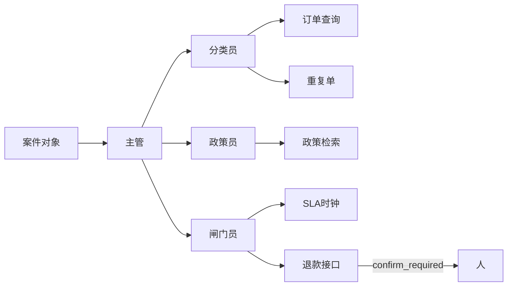

# 青匣记 · 客服工单台

虚构店铺「青匣记」的售后队列。Agent 坐在工单里，不坐在对话框里。

**没有引用，就先不答。** 进的是案件对象，出的是案件变更 + 审计。人点「执行」才可能打款；演示模式永远不打（`NEVER_PAY`）。

## 先听五分钟：售后在干什么

青匣记是一家卖纸墨的小店。顾客进门不是来闲聊的，是来处理一笔已经发生的买卖。没做过售后也没关系，先当听表哥讲店里的规矩。

**三种退法，别混。**

- **仅退款**：货还没出仓库，或根本不用寄回来，只把钱退回去。
- **退货退款**：货已经在顾客手里。必须先寄回店里，仓库点过「到了」才能退钱。
- **换货**：货有问题，换一件同款。不退现金。

**为什么退货没入库不能打款。** 钱退了、货也没回来，店就亏两次。没有回寄单号、仓库没有 `inbound_at`，只能写草稿或追问，不能打款。

**七天无理由。** 从签收那天开始数七天。只因为「不想要了」可以退；过了七天，这句话不够。漏液、摔裂这类质量问题，不受这七天限制。

**实付不是吊牌价。** 原价 ¥128、券后付了 ¥98，最多退 ¥98。三件里只坏了一件，只退那一件的实付，不能整单端走。

**对客稿和对内备注是两盒。** 对客是给顾客看的：请补单号、建议退砚台那一行。对内是给同事看的：疑似刷单、辱骂原文、禁止打款的原因。风控句子不要漏进灰/白气泡。

## 从 0 到 1

在仓库根目录。

**第 1 步 · 夹具**

```
projects/ticketdesk/
  fixtures/tickets/*.json
  fixtures/orders/*.json
  fixtures/roster.json
```

```bash
python -m pip install -e projects/ticketdesk
python -m ticketdesk demo
```

**第 2 步 · 政策检索**

```
projects/ticketdesk/docs/policy/*.md
src/ticketdesk/rag.py
src/ticketdesk/agents/policy.py
```

每条建议要有 `path:line`。活动窗口内的物流单必须点名 `promo-2026-summer.md`，不得只用日常「不赔运费」。

**第 3 步 · SLA / 退款闸门**

```
src/ticketdesk/agents/gate.py
src/ticketdesk/tools/payment.py
src/ticketdesk/store.py
```

超过 ¥200、超过实付、退货未入库、七天无理由、部分退整单、政策零命中、已赔过、完结 SLA 且夜间二线空，都停在人。`idempotency_key` 相同的第二次处理不二次补偿。换货不退现金。活动物流发券，不发现金。

**第 4 步 · Docker**

```bash
docker compose -f projects/ticketdesk/docker-compose.yml up --build
```

浏览器 http://127.0.0.1:8000 。

## 三个角色（主管分流，不是一张网）



| 角色 | 写入案件 | 禁止 |
| --- | --- | --- |
| 分类员 | 类型、紧急度、相似夹具芯片 | 改订单 |
| 政策员 | `docs/policy/…:行号` | 零命中还写补偿 |
| 闸门员 | next_action、草稿、idempotency_key | 自动打款、虚构夜班同事 |

工具长得像生产接口：订单查询、历史工单、政策检索、重复单、SLA 时钟、退款 API。后一个在演示里只返回 `confirm_required`。

## 为什么是主管，不是 Mesh

工单只有一个入口。分类失败面是打错标，政策失败面是没引用，闸门失败面是误打款。三者共用案件字典，不互发事件。五人网会让「有没有打款」说不清。

## 简历三条

- 客服队列吃结构化工单（单号、多 SKU 行、实付、messages、prior_actions），写出标签、双 SLA、对客草稿 / 对内备注和 `path:line`。
- 退款接口存在但必须人确认；部分退只退损坏行实付；同一 `idempotency_key` 不二次补偿。
- 无 Key 抽取式 `python -m ticketdesk demo` 打印芯片或红条。

## STAR

| | |
| --- | --- |
| 情境 | 大促期物流延误要现金；另一张三件套只坏砚台却要整单退。 |
| 任务 | 活动必须点名生效文件且发券不发现金；部分退只许损坏行实付。都不能自动打款。 |
| 行动 | 政策检索带生效窗口；闸门看 `lines[].paid_yuan` 与 `paid_yuan`；退款/发券 `confirm=false`。 |
| 结果 | `promo-coupon-not-cash` 打到 `promo-2026-summer.md` 并写券；`partial-refund-one-line` 只建议砚台小样 ¥72。无准确率口号。 |

## 我拒绝的设计

- 把工单台做成带业务皮的聊天机器人。
- LangChain 硬依赖、五人 Mesh、电商 SQL 问数。
- 执行工单正文里的 `curl \| sh`。
- 夜间二线空时编一个值班人。

```bash
python -m pytest projects/ticketdesk/tests -q
```
