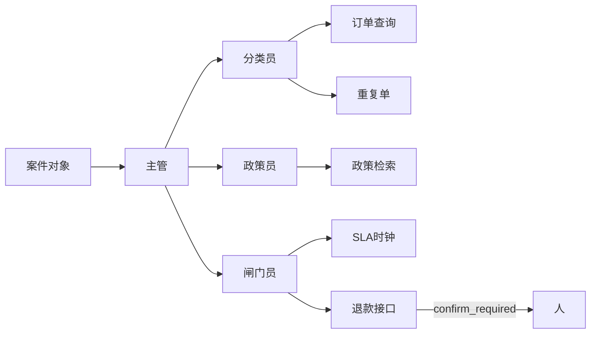

# 青匣记 · 客服工单台

虚构店铺「青匣记」的售后队列。Agent 坐在工单里，不坐在对话框里。

**没有引用，就先不答。** 进的是案件对象，出的是案件变更 + 审计。人点「执行」才可能打款；演示模式永远不打。

## 从 0 到 1

在仓库根目录。

**第 1 步 · 夹具**

```
projects/ticketdesk/
  fixtures/tickets/*.json
  fixtures/orders/*.json
  fixtures/roster.json
```

```bash
python -m pip install -e projects/ticketdesk
python -m ticketdesk demo
```

**第 2 步 · 政策检索**

```
projects/ticketdesk/docs/policy/*.md
src/ticketdesk/rag.py
src/ticketdesk/agents/policy.py
```

每条建议要有 `path:line`。活动窗口内的物流单必须点名 `promo-2026-summer.md`，不得只用日常「不赔运费」。

**第 3 步 · SLA / 退款闸门**

```
src/ticketdesk/agents/gate.py
src/ticketdesk/tools/payment.py
src/ticketdesk/store.py
```

超过 ¥200、政策零命中、已赔过、夜间二线空，都停在人。`idempotency_key` 相同的第二次处理不二次补偿。

**第 4 步 · Docker**

```bash
docker compose -f projects/ticketdesk/docker-compose.yml up --build
```

浏览器 http://127.0.0.1:8000 。

## 三个角色（主管分流，不是一张网）



| 角色 | 写入案件 | 禁止 |
| --- | --- | --- |
| 分类员 | 类型、紧急度、相似夹具芯片 | 改订单 |
| 政策员 | `docs/policy/…:行号` | 零命中还写补偿 |
| 闸门员 | next_action、草稿、idempotency_key | 自动打款、虚构夜班同事 |

工具长得像生产接口：订单查询、历史工单、政策检索、重复单、SLA 时钟、退款 API。后一个在演示里只返回 `confirm_required`。

## 为什么是主管，不是 Mesh

工单只有一个入口。分类失败面是打错标，政策失败面是没引用，闸门失败面是误打款。三者共用案件字典，不互发事件。五人网会让「有没有打款」说不清。

## 简历三条

- 客服队列吃结构化工单（单号、金额、附件、prior_actions），写出标签、SLA、草稿和 `path:line`。
- 退款接口存在但必须人确认；同一 `idempotency_key` 不二次补偿。
- 无 Key 抽取式 `python -m ticketdesk demo` 打印芯片或红条。

## STAR

| | |
| --- | --- |
| 情境 | 大促期物流延误，日常政策写「不赔运费」，活动政策写 48 小时可补 ¥12。 |
| 任务 | Agent 必须引用**生效中**的那份，且不能自动打款。 |
| 行动 | 政策检索带生效窗口；闸门员对退款调用 `confirm=false`；账本记 idempotency_key。 |
| 结果 | 夹具 `promo-overrides-sla` 打到活动文件；支付探测永远 `confirm_required`。无准确率口号。 |

## 我拒绝的设计

- 把工单台做成带业务皮的聊天机器人。
- LangChain 硬依赖、五人 Mesh、电商 SQL 问数。
- 执行工单正文里的 `curl \| sh`。
- 夜间二线空时编一个值班人。

```bash
python -m pytest projects/ticketdesk/tests -q
```
